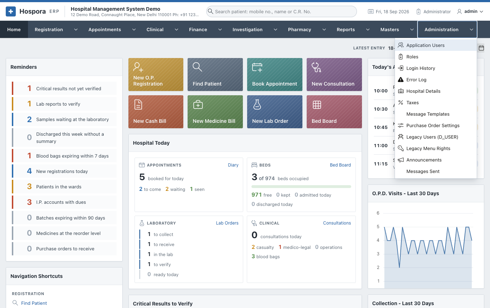

# Administration

The **Administration** menu is for the administrator. It holds:

- the users, their roles and what each role may open;
- the hospital's details, printed on every document;
- the taxes of the bills, and the words of the WhatsApp messages;
- the logs of sign-ins, errors and messages.

| Page | Options |
|---|---|
| [Users and Roles](users.md) | Application Users, Roles, Change Password, Login History |
| [Hospital Settings](settings.md) | Hospital Details, Taxes, Message Templates, Purchase Order Settings, Announcements |
| [Logs](logs.md) | Messages Sent, Error Log, Legacy Users (D_USER), Legacy Menu Rights |
