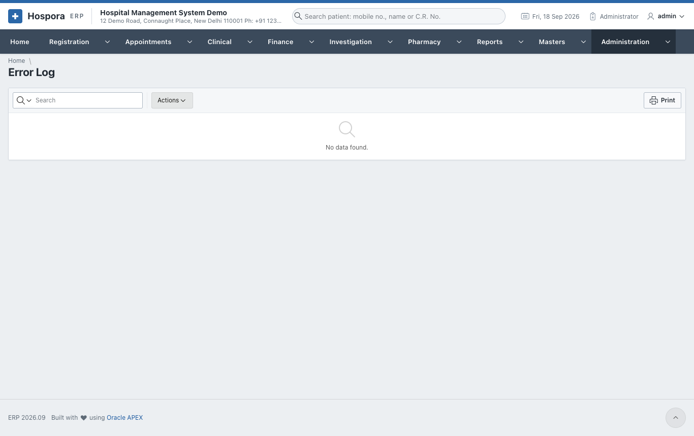
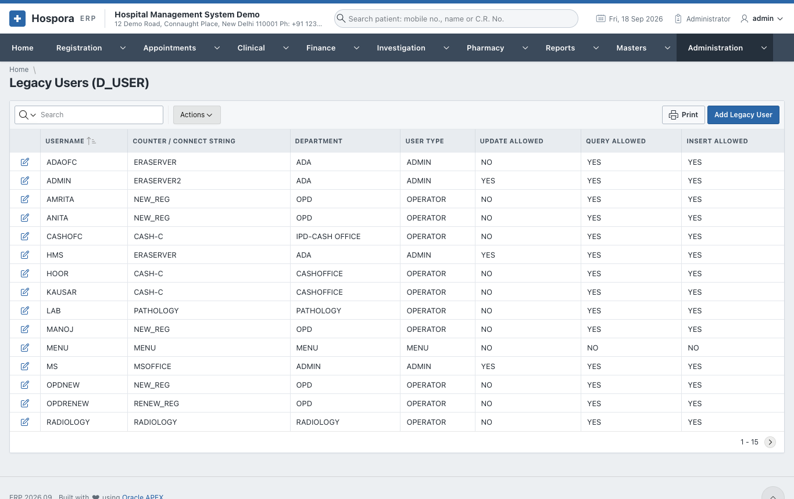

# Logs

## Messages Sent

**Administration > Messages Sent** lists every WhatsApp message opened from Hospora ERP: when, to whom,
for which document, the words, and who sent it.

## Error Log

**Administration > Error Log** lists the errors the application met, with the page and the user. When
something goes wrong, the administrator looks here first, and passes the entry on to whoever supports the
application.

## Legacy Users and Menu Rights

**Administration > Legacy Users (D_USER)** and **Legacy Menu Rights** are the users and rights of the old
hospital system, from before Hospora ERP. They are kept so that old bills still show who made them, and so
that a user can be linked to their old name ([Application Users](users.md#application-users), **Legacy
User**). New users and rights are set in **Application Users** and **Roles**.

