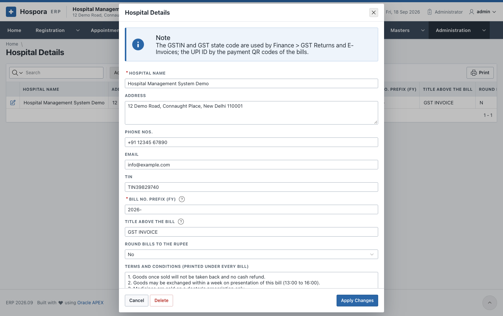
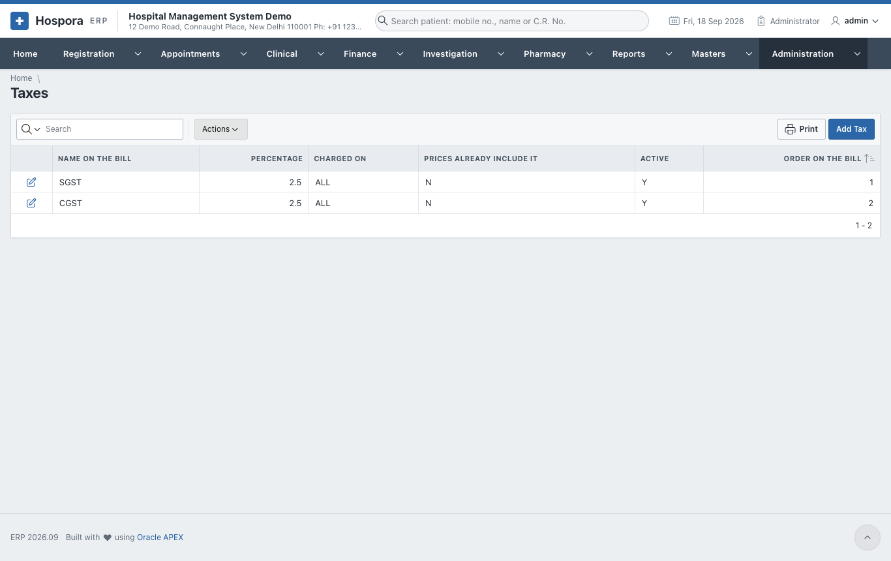
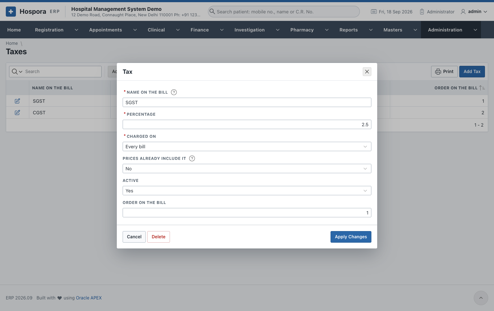
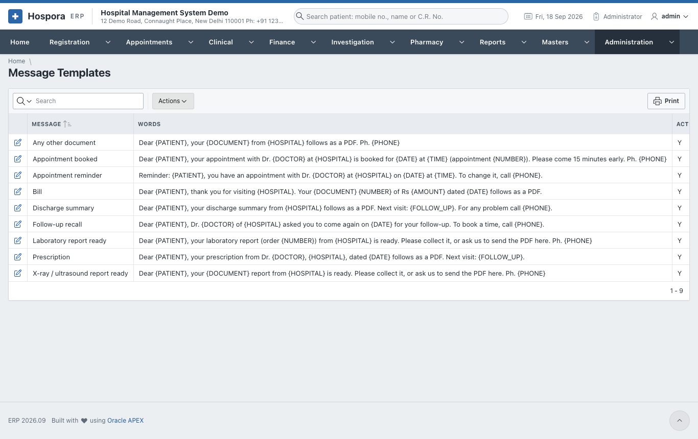
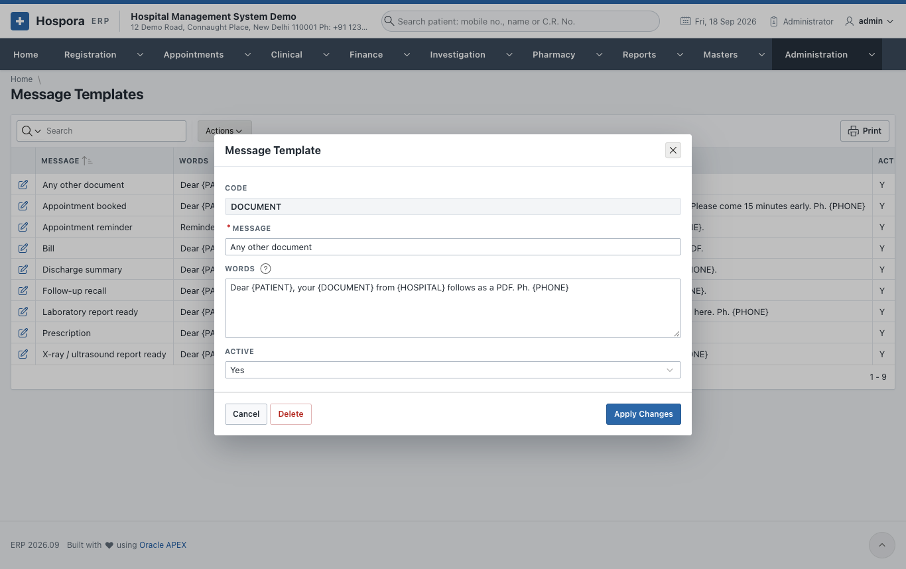
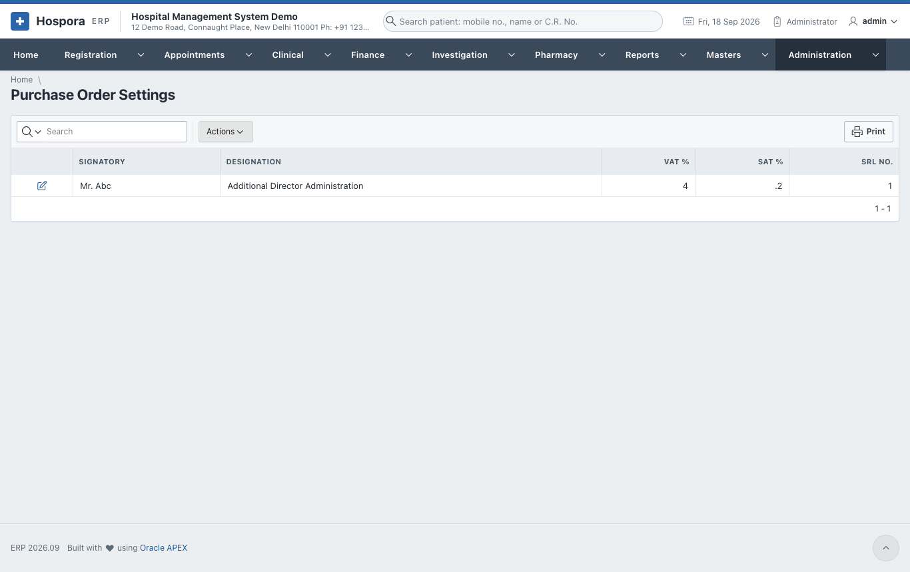
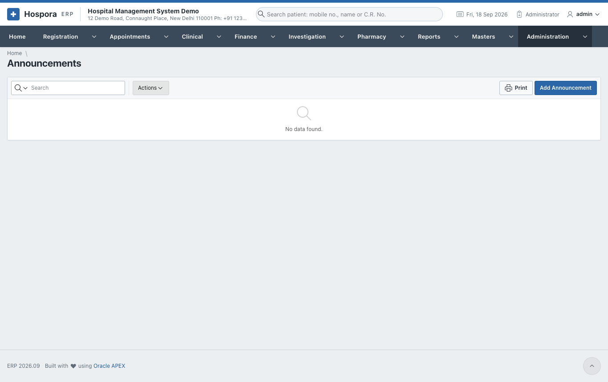

# Hospital Settings

## Hospital Details

**Administration > Hospital Details** holds what is printed on every document, and the settings of
payments and GST. Click the pencil of the one row:

| Field | Meaning |
|---|---|
| **Hospital Name**, **Address**, **Phone Nos.**, **Email** | the letterhead of every printed document |
| **TIN** | the old tax number, if still printed |
| **Bill No. Prefix (FY)** | the prefix of every bill and voucher number, e.g. *2026-* |
| **Title above the Bill** | printed over the hospital's name, e.g. *GST INVOICE*; empty prints nothing |
| **Round Bills to the Rupee** | **Yes** rounds the net amount of every bill |
| **Terms and Conditions** | printed under every bill |
| **Images Viewer (PACS) Address** | the web address that opens the images of one examination, with `{ACCESSION}` where its accession number goes (and `{PATIENT}` for the C.R. No.). Empty: no **View the Images** button. |
| **GSTIN** | the 15-character GSTIN; the GST returns and e-invoices use it |
| **UPI ID of the Hospital** | the UPI address the payment QR codes pay to, e.g. *hospital@sbi*. Empty: no QR code. |
| **Name on the UPI QR Code** | empty: the hospital's name |
| **Default District / City of Patients** and **Default State of Patients** | a new registration starts with them, e.g. *New Delhi* and *DL*. Empty: the district and state of the patient registered last. |
| **GST State Code** | two digits, e.g. *07* for Delhi. Empty: the first two digits of the GSTIN. |
| **PIN Code** | of the hospital |
| **SAC of the Services** | the service code the GST returns and e-invoices give the hospital's services |
| **E-invoices for Company Bills** | **Yes** when the hospital's turnover requires e-invoicing |

Click **Apply Changes**.

## Taxes

**Administration > Taxes** holds the taxes of the bills, each printed as its own line:

- **Name on the Bill**: CGST, SGST, IGST ...
- **Percentage**.
- **Charged on**: **Every bill**, **Medicine bills and returns**, or **Cash and credit bills (services)**.
- **Prices Already Include It**:
    - **Yes** for the M.R.P. of medicines: the tax is shown within the price;
    - **No** adds the tax on top of the amount billed.
- **Active** and the **Order on the Bill**.

## Message Templates

**Administration > Message Templates** holds the words of the WhatsApp messages. There is one for each
occasion:

- an appointment confirmed, and an appointment reminder;
- a lab report ready, and a radiology report ready;
- a bill, a prescription, a discharge;
- a follow-up;
- a document.

- **Words**: the message. The blanks `{PATIENT}`, `{DOCTOR}`, `{HOSPITAL}`, `{PHONE}`, `{DATE}`,
  `{TIME}`, `{NUMBER}`, `{AMOUNT}`, `{DOCUMENT}` and `{FOLLOW_UP}` are filled in when the message is
  sent.
- **Active**: **No** removes the WhatsApp button for that occasion.

WhatsApp messages are sent by hand: the button opens WhatsApp (on the phone, or WhatsApp Web / Desktop
on a computer) with the patient's number and the message typed in, and the staff press Send. No WhatsApp
account or API is needed, and there is no charge.

## Purchase Order Settings

The **Signatory**, **Designation**, **VAT %** and **SAT %** printed on
[medicine purchase orders](../pharmacy/buying.md).

## Announcements

**Administration > Announcements** shows a short message to every user, e.g. *Server maintenance at 10
pm*. Set the **Message**, and its **Status** to 2 to announce it (1 keeps it idle).

