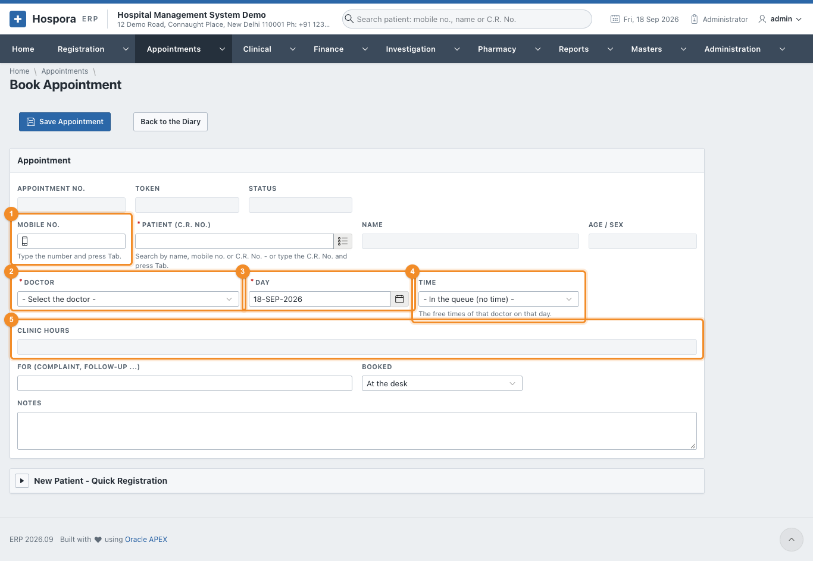
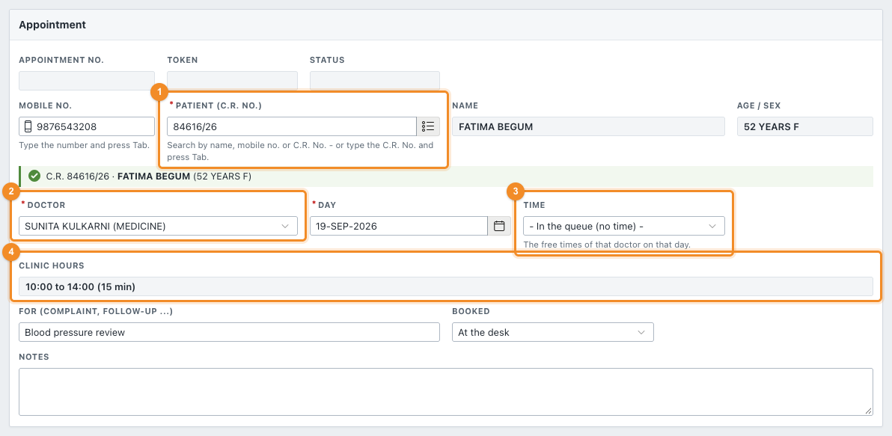
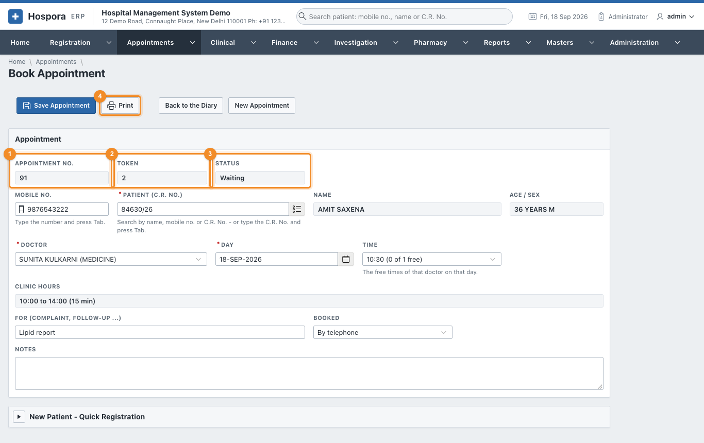
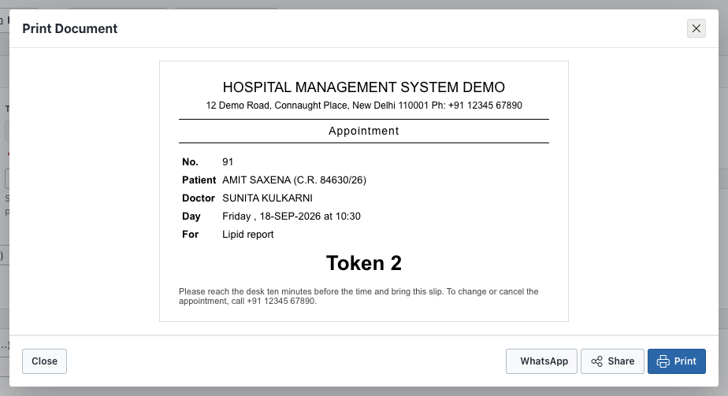

# Book Appointment

Open **Appointments > Book Appointment**, or **Book Appointment** in the diary, or the **Book
Appointment** tile on the Home page.

## Steps

1. 1 Type the patient's **Mobile No.** and press ++tab++, or search the
   **Patient (C.R. No.)**. The name, age and sex appear, with a green line confirming who was found.
   A patient who is not registered yet can be registered on the spot in **New Patient - Quick
   Registration** at the bottom of the page. Fill in the name, age, sex, mobile and unit, then click
   **Register Patient**.
2. 2 **Doctor**: filled in with the doctor the patient is registered with. Change it
   if the patient is seeing someone else.
3. 3 **Day**: the day of the appointment. Only today or a later day can be booked.
4. 4 **Time**: the list offers only the **free** times of that doctor on that day. A
   time is free when fewer patients are booked in it than the schedule allows. **In the queue (no time)**
   books without a time; the patient is seen in the order of arrival.
5. 5 **Clinic Hours** shows the doctor's hours on that day. If the doctor is on
   leave, it says so, and nothing can be booked.
6. **For**: the complaint or the reason, e.g. *follow-up* or *report review*.
7. **Booked**: at the desk, by phone, online ...
8. **Notes**: anything the desk should know.
9. Click **Save Appointment**.

## A saved appointment

Once saved, the appointment shows 1 its **Appointment No.**,
2 the **Token** (given when the patient arrives) and 3 its
**Status**:

- To **reschedule**, change the doctor, the day or the time and save. The appointment remembers where it
  was moved from.
- 4 **Print** prints the appointment slip for the patient. From the print window,
  **WhatsApp** sends the patient the confirmation with the day, time and doctor.

!!! question "Something went wrong?"
    - *"That day has passed"*: an appointment cannot be booked for a past day.
    - *No time is offered*: the doctor has no clinic on that day, is on leave, or every slot is full. Look
      at [Doctor Schedules](schedules.md), or book **in the queue**.
