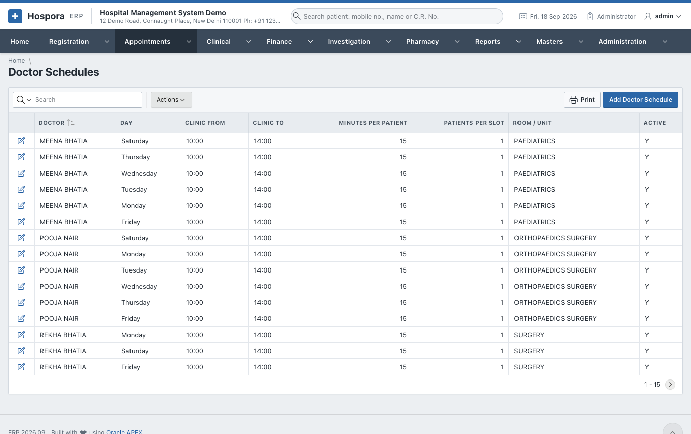
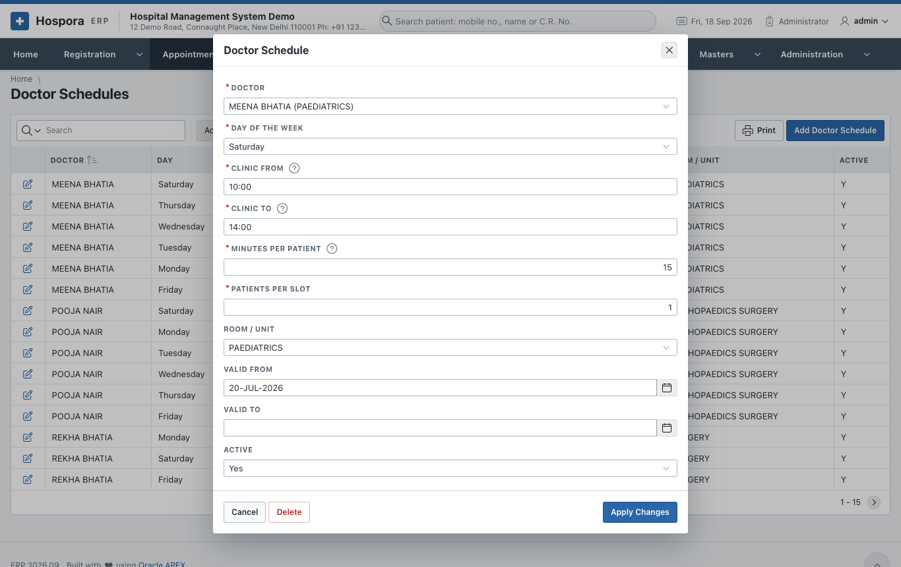
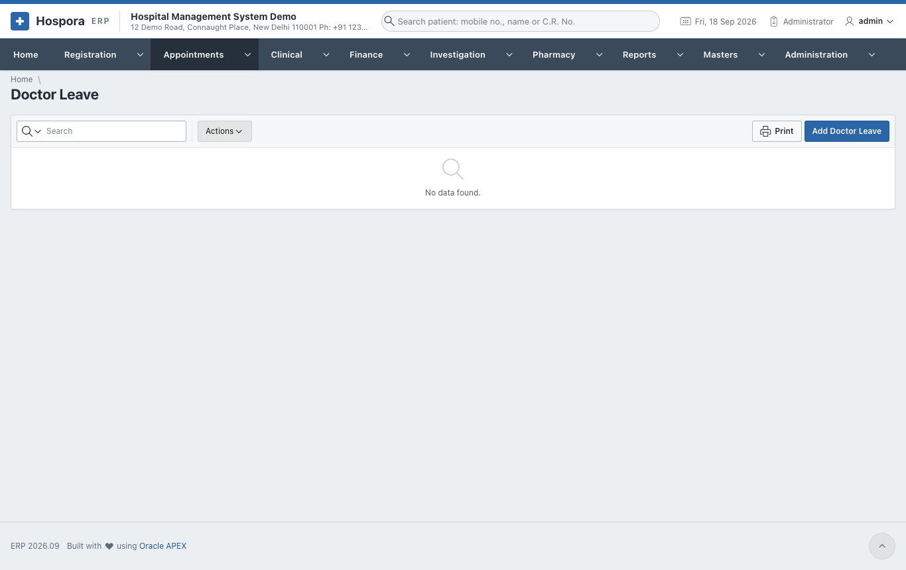
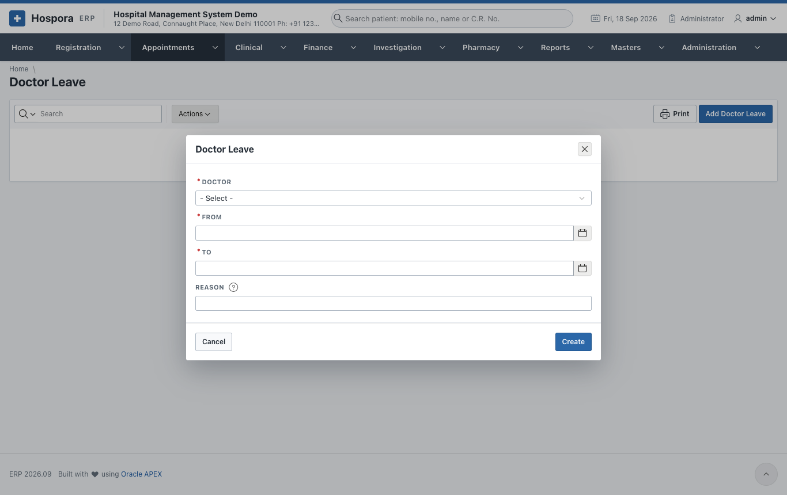

# Doctor Schedules and Leave

## Doctor Schedules

**Appointments > Doctor Schedules** holds the clinic hours of every doctor, one row for each day of the
week they sit. The free times offered in [Book Appointment](book.md) come from here.

Click **Add Doctor Schedule** for a new row, or the pencil of a row to change it:

| Field | Meaning |
|---|---|
| **Doctor** | the doctor |
| **Day of the Week** | one day; add a row for each day the doctor sits |
| **Clinic From** / **Clinic To** | the hours, in 24-hour time, e.g. 09:30 and 17:00 |
| **Minutes per Patient** | the length of one appointment. Make it the whole clinic (e.g. 240 for four hours) to work with tokens instead of times. |
| **Patients per Slot** | how many patients may be booked at the same time |
| **Room / Unit** | where the doctor sits |
| **Valid From** / **Valid To** | the period this schedule applies; empty means always |
| **Active** | **No** stops the schedule without deleting it |

Click **Create** (new) or **Apply Changes** (changed). **Delete** removes the row.

!!! example "Two clinics on the same day"
    A doctor who sits in the morning and again in the evening gets two rows for that day, e.g.
    09:00 - 13:00 and 17:00 - 19:00.

## Doctor Leave

**Appointments > Doctor Leave** records the days a doctor is away. No appointment can be booked with the
doctor on those days, and the booking screen shows the reason.

Click **Add Doctor Leave**:

1. **Doctor**.
2. **From** and **To**: the first and last day of the leave.
3. **Reason**: shown to the desk when that day is chosen, e.g. *conference in Mumbai*.
4. Click **Create**.

!!! warning
    Appointments already booked on those days are not cancelled on their own. Look at the diary of those
    days and **Reschedule** them.
