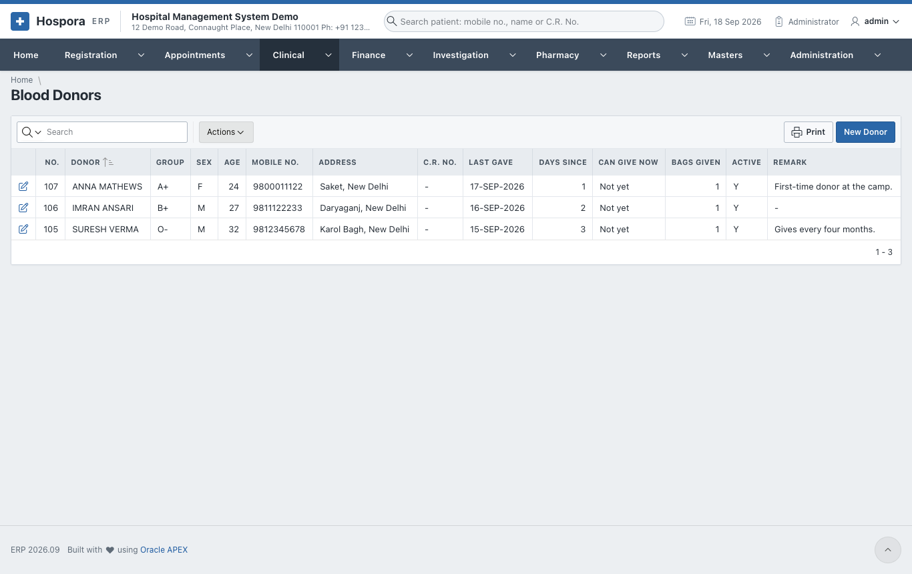
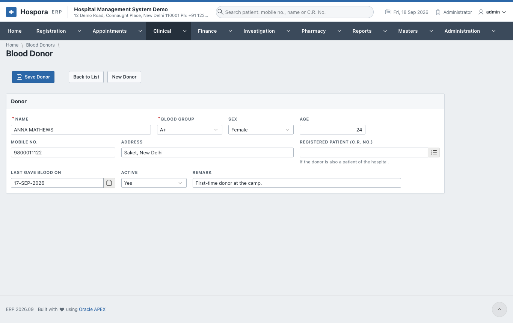
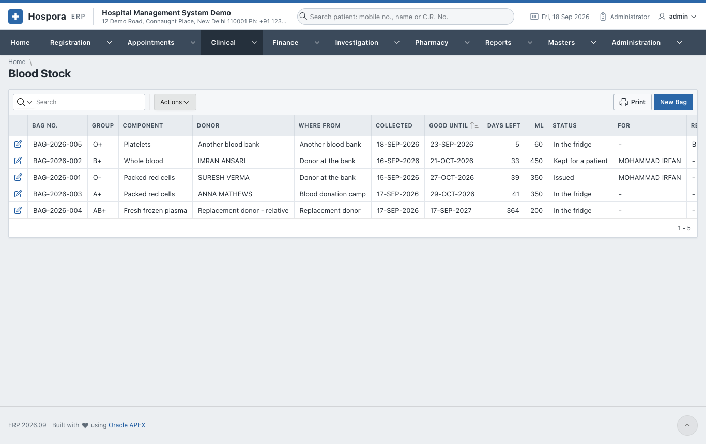
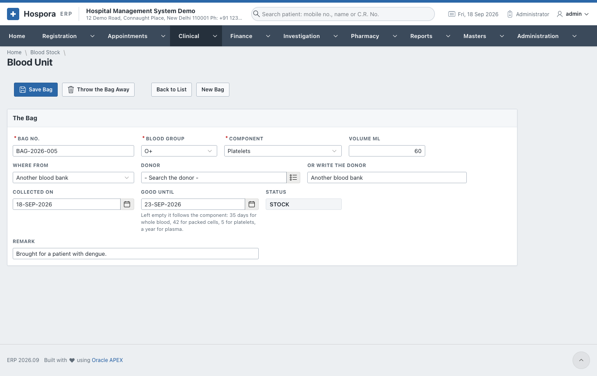
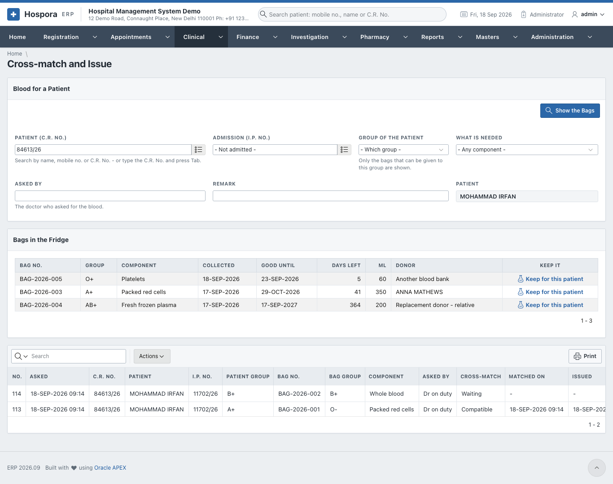

# Blood Bank

The blood bank keeps three things:

- the **donors**;
- the **bags** in the fridge, each with its group, component and expiry;
- the **requests** for patients, from cross-match to issue.

## Blood Donors

**Clinical > Blood Donors** lists the donors. **New Donor** adds one, and the pencil opens one.

Fill in:

- the **Name**, **Blood Group**, **Sex**, **Age**, **Mobile No.** and **Address**;
- **Registered Patient**, if the donor is also a patient;
- **Last Gave Blood On**, **Active** and a **Remark**.

Then click **Save Donor**.

## Blood Stock

**Clinical > Blood Stock** lists every bag with its status: in stock, reserved, issued, expired or thrown
away. Bags past their date are marked expired by themselves.

**New Bag** records a bag:

1. **Bag No.**, **Blood Group**, **Component** (whole blood, packed cells, platelets, plasma ...) and
   **Volume ml**.
2. **Where From**, and the **Donor** (or **Or Write the Donor**).
3. **Collected On**, and **Good Until**. Left empty, it follows the component: 35 days for whole blood, 42
   for packed cells, 5 for platelets, a year for plasma.
4. Click **Save Bag**. **Throw the Bag Away** records a bag that is discarded, with the reason.

## Cross-match and Issue

**Clinical > Cross-match and Issue** gives blood to a patient.

1. Choose the **Patient (C.R. No.)** and the **Admission**, the **Group of the Patient** and **What Is
   Needed**. Then click **Show the Bags**.
2. **Bags in the Fridge** shows only the bags that can be given to this group, soonest to expire first.
   Reserve a bag for the patient; give **Asked By** (the doctor) and a **Remark**.
3. In **Requests, Cross-matches and Issues**, the request then moves on:
    - record the **cross-match**: compatible or not;
    - **Issue** a compatible bag;
    - **Cancel** a request no longer needed. The bag goes back to stock.
4. **Print** prints the issue slip that goes with the bag.
