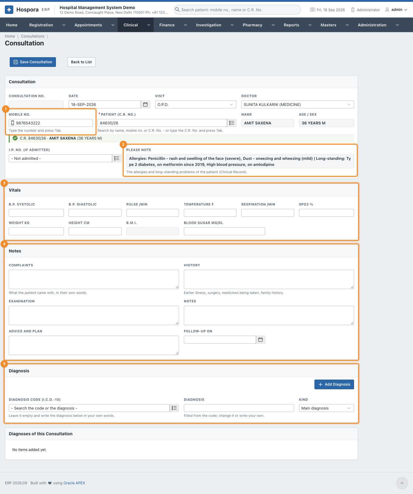
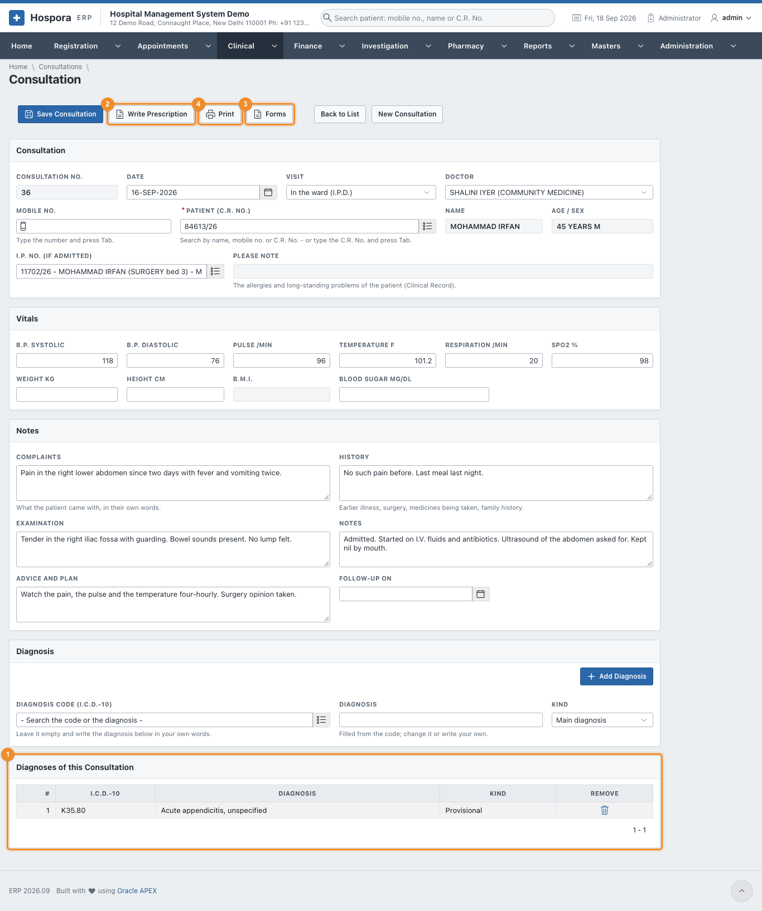
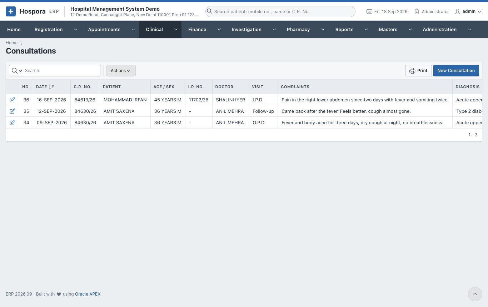
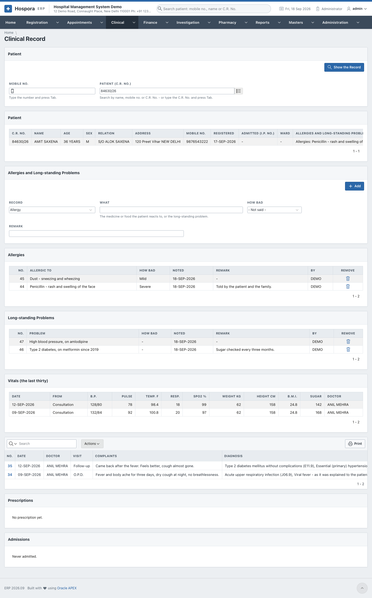

# Consultations and the Clinical Record

## Write a consultation

Open **Clinical > New Consultation**, or the **New Consultation** tile on the Home page.

1. 1 Type the patient's **Mobile No.** and press ++tab++, or search the
   **Patient (C.R. No.)**. For a patient in the wards, choose the **I.P. No.** as well.
2. Check the **Date**, the **Visit** (O.P.D., follow-up, ward round ...) and the **Doctor**. The doctor comes
   from the patient's registration.
3. 2 **Please Note** shows the patient's allergies and long-standing problems. Read it
   before prescribing.
4. 3 **Vitals**: B.P., pulse, temperature, respiration, SpO2, weight, height and
   blood sugar. The **B.M.I.** is worked out from the weight and height.
5. 4 **Notes**:
    - **Complaints**: what the patient came with, in their own words;
    - **History**: earlier illness, surgery, medicines being taken, family history;
    - **Examination** and **Notes**;
    - **Advice and Plan**;
    - **Follow-up On**: the day the patient should come back. It appears in
      [Follow-up Recall](forms.md#follow-up-recall).
6. 5 **Diagnosis**, as many as needed:
    - search the **Diagnosis Code (I.C.D.-10)** by code or by words, e.g. *pneumonia*. The **Diagnosis**
      fills in; change it or write your own;
    - or leave the code empty and just write the diagnosis;
    - **Kind**: main diagnosis, other diagnosis, or suspected;
    - click **Add Diagnosis**.
7. Click **Save Consultation**.

## A saved consultation

- 1 **Diagnoses of this Consultation** lists the diagnoses added. Each can be
  removed.
- 2 **Write Prescription** opens a [prescription](../registration/prescriptions.md)
  for this patient, with the diagnosis carried over.
- 3 **Forms** prints a consent or a letter for this patient
  ([Consents and Forms](forms.md)).
- 4 **Print** prints the consultation note. From the print window, **WhatsApp**
  tells the patient it is ready.

**Clinical > Consultations** lists all consultations, newest first:

## The Clinical Record

**Clinical > Clinical Record** gathers everything clinical about one patient on one page. Type the
**Mobile No.** and press ++tab++, or search the **Patient (C.R. No.)**, then click **Show the Record**.

It shows:

- **Patient**: the registration, whether the patient is admitted now, and the alerts;
- **Allergies** and **Long-standing Problems**;
- **Vitals (the last thirty)**, from the consultations and the ward chart;
- **Consultations**: click a number to open one;
- **Prescriptions** and **Admissions**.

### Add an allergy or a long-standing problem

In **Allergies and Long-standing Problems**:

1. **Record**: **Allergy** or **Long-standing problem**.
2. **What**: the medicine or food the patient reacts to, e.g. *Penicillin - rash*, or the problem, e.g.
   *Type 2 diabetes*.
3. **How Bad**: mild, moderate or severe.
4. **Remark**, then **Add**.

From then on, the **Please Note** line of every clinical screen shows it. The bin icon of a row removes a
record that is no longer true.
