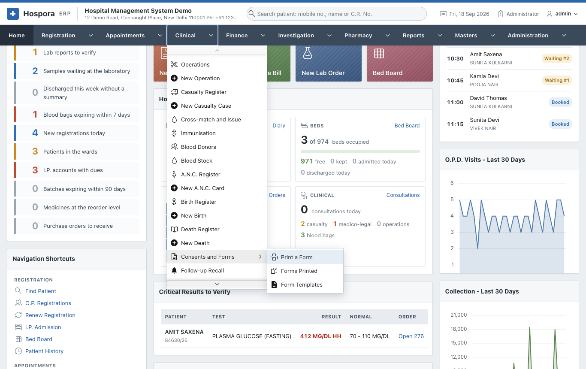
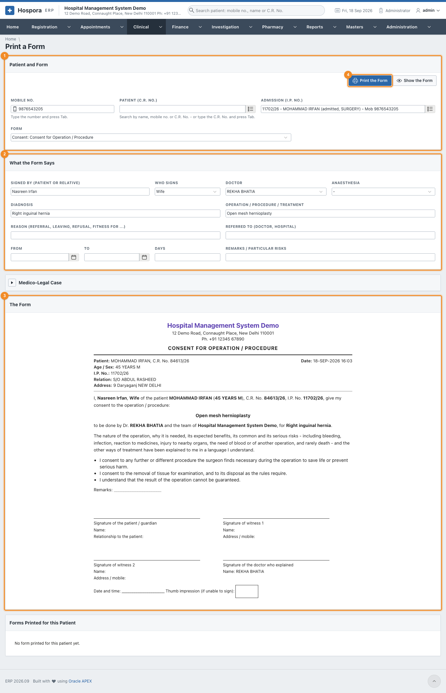
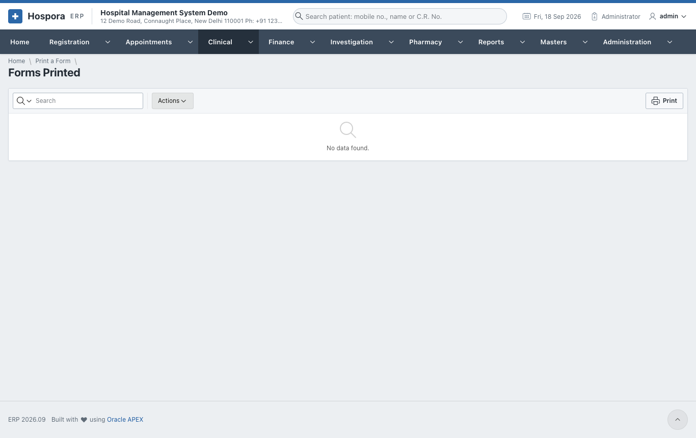
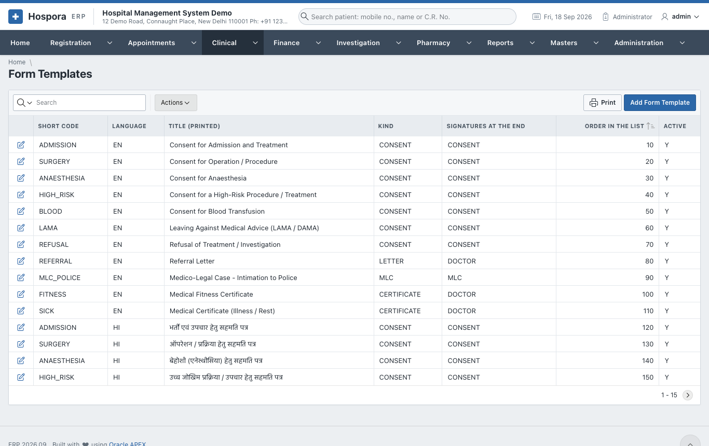
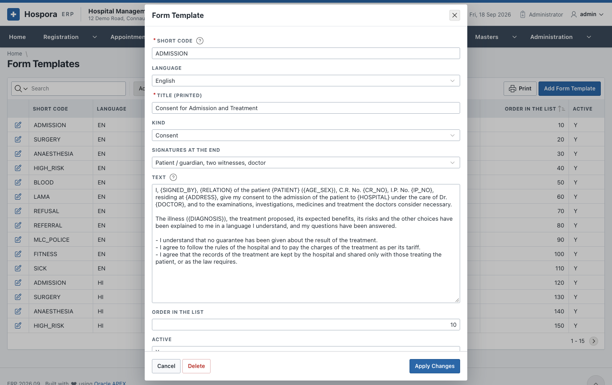
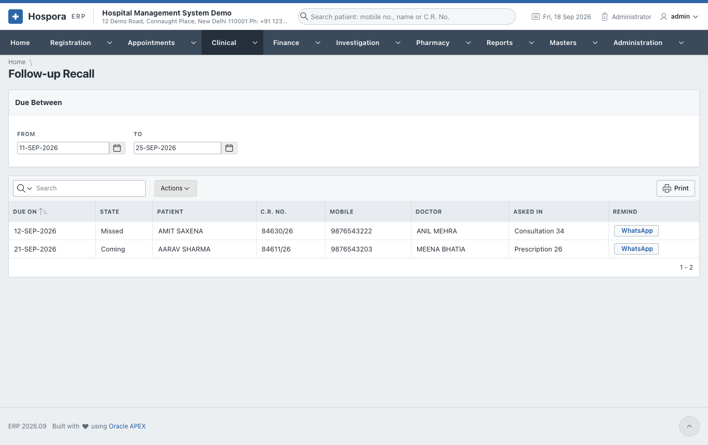

# Consents and Forms

**Clinical > Consents and Forms** prints the hospital's forms filled in for a patient:

- consents for an operation, anaesthesia, blood or a high-risk procedure;
- the referral letter;
- leaving against medical advice (LAMA);
- the M.L.C. intimation to the police;
- the fitness, sickness and other certificates.

The forms come in **English**, and most also in **Hindi**.

## Print a form

Open **Clinical > Consents and Forms > Print a Form**. Or use the **Forms** button of an admission, a
consultation, an operation or a casualty case: the form then opens with that patient and its details
filled in.

1. 1 **Patient and Form**: the **Patient** (by mobile or C.R. No.), the
   **Admission** if any, and the **Form**.
2. 2 **What the Form Says**: fill in what this form needs. A field the form does not
   use is simply left out:
    - **Signed By** (the patient or a relative) and **Who Signs**;
    - the **Doctor**, **Anaesthesia**, **Diagnosis** and the **Operation / Procedure / Treatment**;
    - the **Reason** (referral, leaving, refusal, fitness ...) and **Referred To**;
    - **From**, **To** and **Days** (for certificates);
    - **Remarks / Particular Risks**.

    For the M.L.C. intimation, **Medico-Legal Case** asks for the **Police Station**, **M.L.C. No.**,
    **Brought By** and **History / Injuries**.
3. Click **Show the Form**. 3 **The Form** shows it filled in, with blank lines left
   for anything not given.
4. 4 **Print the Form** prints it with the signature lines at the end. Every
   printed form is recorded.

**Forms Printed for this Patient**, at the bottom of the page, lists the forms already printed for the
patient.

## Forms Printed

**Clinical > Consents and Forms > Forms Printed** lists every form printed: when, for whom and by whom.
Open one to print it again, exactly as it was.

## Form Templates

**Clinical > Consents and Forms > Form Templates** holds the words of every form. An administrator can
change them or add the hospital's own.

| Field | Meaning |
|---|---|
| **Short Code** | the same code in English and in Hindi makes the two languages of one form |
| **Language** | English or Hindi |
| **Title (printed)** | the heading of the form |
| **Kind** | consent, letter, M.L.C., certificate ... |
| **Signatures at the End** | which signature lines are printed |
| **Text** | the words of the form. Blanks in braces are filled in when it is printed: `{PATIENT}`, `{AGE_SEX}`, `{CR_NO}`, `{IP_NO}`, `{GUARDIAN}`, `{ADDRESS}`, `{MOBILE}`, `{DOCTOR}`, `{DIAGNOSIS}`, `{PROCEDURE}`, `{ANAESTHESIA}` ... A line starting with `==` is a heading. |
| **Order in the List** and **Active** | where it appears in the list of forms, and whether it is offered |

## Follow-up Recall

**Clinical > Follow-up Recall** lists the patients due to come back between two days. It uses the
follow-up days of their consultations, prescriptions and discharge summaries. Choose **From** and **To**,
then call the patients, or send each a WhatsApp reminder from the list.

