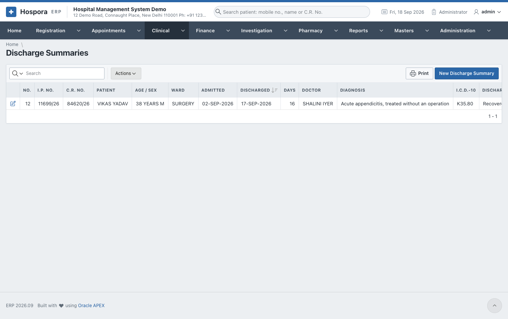
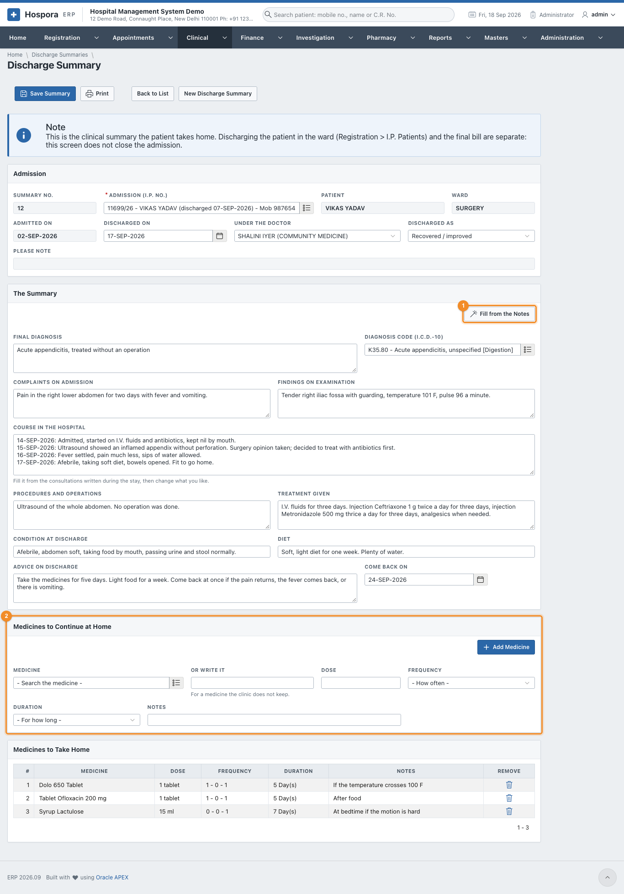
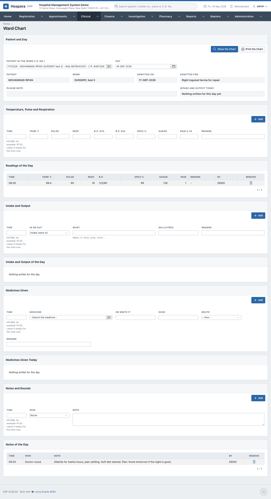

# In the Wards

## Discharge summaries

The discharge summary is the clinical summary the patient takes home. It does **not** discharge the
patient: the discharge in the ward ([I.P. Admission](../registration/admission.md#discharge)) and the final
bill are separate.

Open **Clinical > New Discharge Summary**, or open one from **Clinical > Discharge Summaries**:

1. **Admission (I.P. No.)**: choose the admission. The patient, ward and admission date fill in.
2. **Discharged On**, **Under the Doctor**, **Discharged As** (recovered, referred, LAMA, expired ...).
3. **The Summary**:
    - **Final Diagnosis** and its **I.C.D.-10 code**;
    - **Complaints on Admission** and **Findings on Examination**;
    - **Course in the Hospital**: 1 **Fill from the Notes** writes it from the
      consultations and ward notes of the stay, day by day. Then edit it;
    - **Procedures and Operations**, **Treatment Given**;
    - **Condition at Discharge**, **Diet**, **Advice on Discharge**;
    - **Come Back On**: the follow-up day.
4. 2 **Medicines to Continue at Home**: search each **Medicine** (or write it), give
   the **Dose**, **Frequency**, **Duration** and **Notes**, and click **Add Medicine**.
5. Click **Save Summary**, then **Print**. From the print window, **WhatsApp** tells the patient.

## The ward chart

**Clinical > Ward Chart** is the nurse's chart of one patient for one day.

1. Choose the **Patient in the Ward (I.P. No.)** and the **Day**, then click **Show the Chart**. The
   patient, ward, admission and the alerts appear. **Intake and Output Today** keeps the fluid balance of
   the day.
2. Each block adds one entry. Its **Time** can be left empty for "now":
    - **Temperature, Pulse and Respiration**: temperature, pulse, respiration, B.P., SpO2, sugar and pain
      (0 to 10). Click **Add**.
    - **Intake and Output**: **In or Out**, **What** (water, I.V. fluid, urine, vomit ...) and
      **Millilitres**. Click **Add**.
    - **Medicines Given**: the **Medicine**, **Dose** and **Route**. Click **Add**.
    - **Notes and Rounds**: **Who** (nurse, doctor round ...) and the **Note**. Click **Add**.
3. What was added appears in the list under each block, with who wrote it. The bin icon removes a wrong
   entry.
4. **Print the Chart** prints the day's chart.

