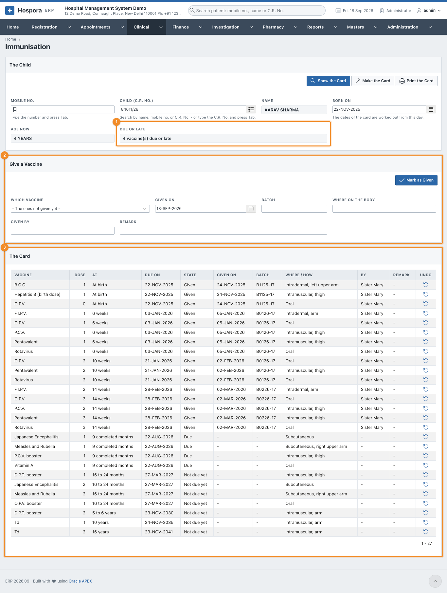
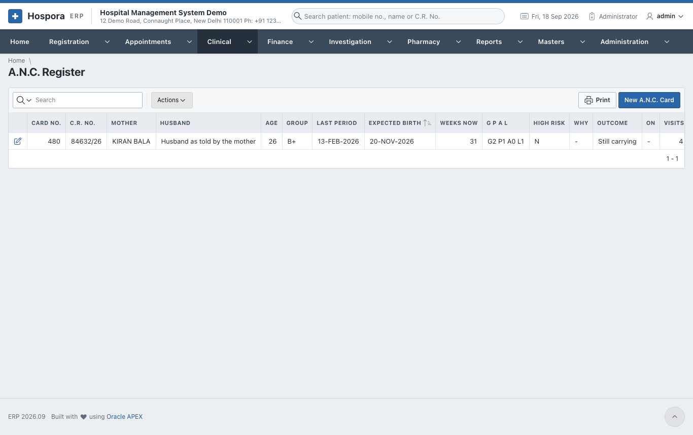
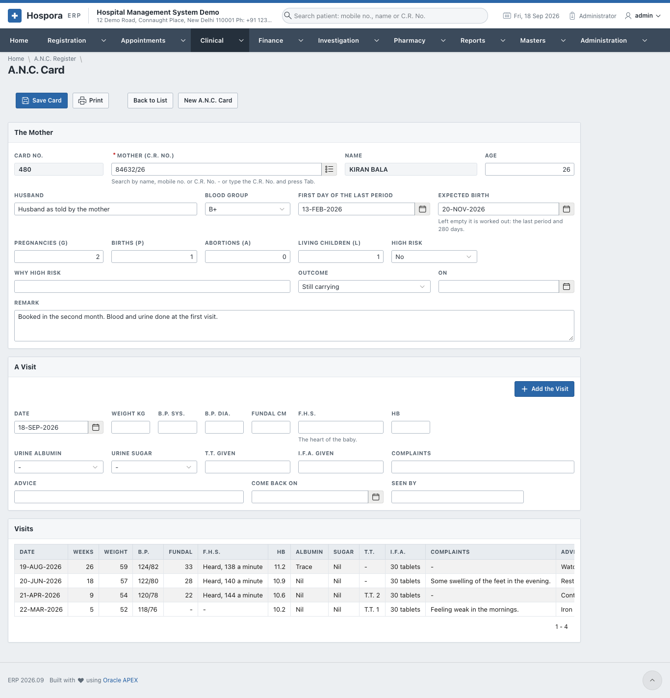
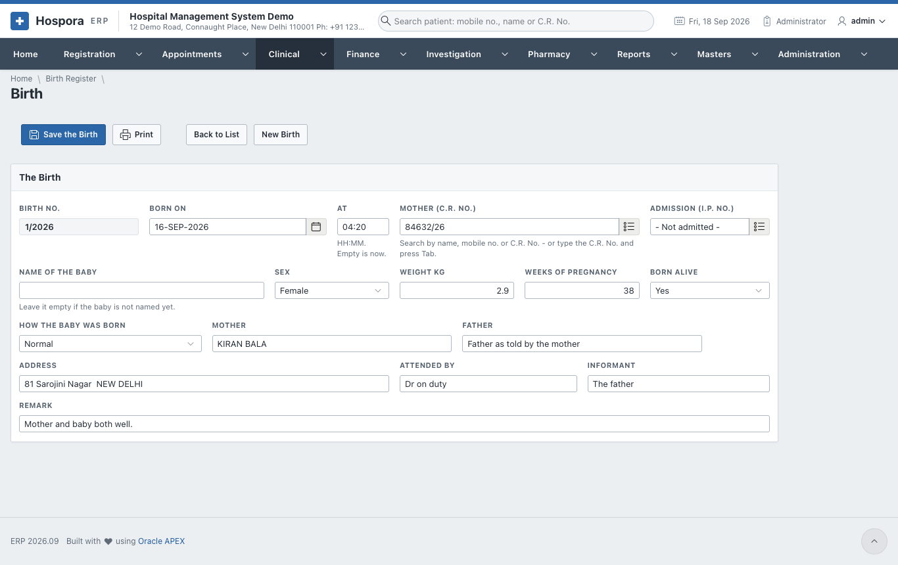
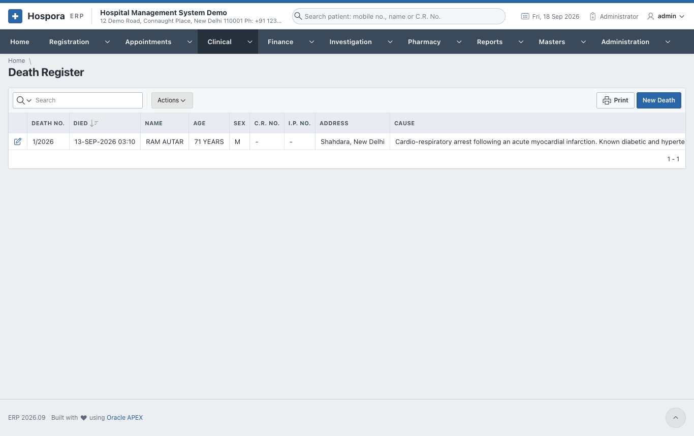
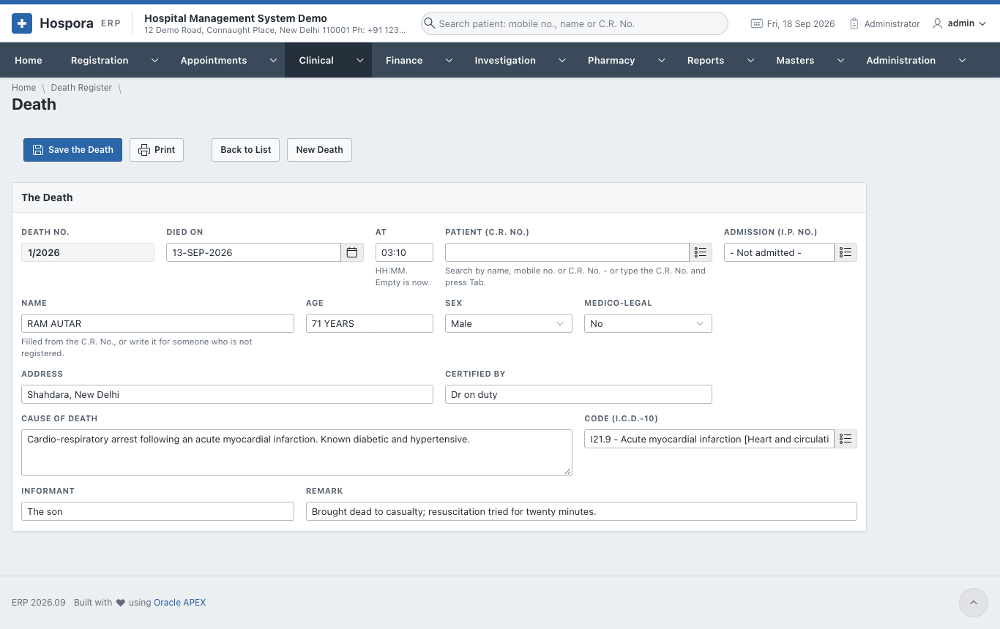

# Mother and Child

## Immunisation

**Clinical > Immunisation** keeps the vaccination card of a child, from the vaccines in **Masters >
Vaccines** (the national schedule).

1. Choose the **Child (C.R. No.)** (or type the **Mobile No.** and press ++tab++), then click **Show the
   Card**.
2. **Born On**: the dates of the card are worked out from this day. The first time, click **Make the
   Card**: every dose of the schedule gets its due date.
3. 1 **Due or Late** lists the doses due now or overdue.
4. 2 **Give a Vaccine**: choose **Which Vaccine**, the **Given On** day, the
   **Batch**, **Where on the Body**, **Given By** and a **Remark**. Then click **Mark as Given**.
5. 3 **The Card** shows every dose: due, given (with the day and batch) or late.
   **Print the Card** prints it for the parents.

**Reports > Immunisation Due** lists the children due for a dose, to call them in.

## Antenatal care

**Clinical > A.N.C. Register** lists the antenatal cards; **New A.N.C. Card** opens one.

1. **The Mother**:
    - the **Mother (C.R. No.)**, **Age**, **Husband** and **Blood Group**;
    - **First Day of the Last Period**, and the **Expected Birth**. Left empty, the expected birth is
      worked out as the last period plus 280 days;
    - **Pregnancies (G)**, **Births (P)**, **Abortions (A)** and **Living Children (L)**;
    - **High Risk** and **Why High Risk**;
    - **Outcome** and **On**, once the pregnancy ends.
2. Click **Save Card**.
3. **A Visit**, at every check-up:
    - the **Date**, **Weight**, **B.P.**, **Fundal** height, **F.H.S.** (the baby's heart), **Hb** and
      urine **Albumin** and **Sugar**;
    - **T.T. Given** and **I.F.A. Given**;
    - **Complaints**, **Advice**, **Come Back On** and **Seen By**.

    Click **Add the Visit**. The visits are listed under the card.
4. **Print** prints the card.

## Births and deaths

**Clinical > Birth Register** and **Clinical > Death Register** keep the registers the hospital reports to
the registrar.

A **birth** records:

- **Born On** and **At** (the **Birth No.** is given on saving);
- the **Mother (C.R. No.)** and the **Admission**;
- the **Name of the Baby** (empty if not named yet), **Sex**, **Weight kg** and **Weeks of Pregnancy**;
- **Born Alive**, and **How the Baby Was Born**;
- the **Mother** and **Father**, **Address**, **Attended By**, **Informant** and **Remark**.

A **death** records:

- **Died On** and **At**;
- the patient (or the **Name** of someone not registered), **Age**, **Sex** and **Address**;
- whether it is **Medico-legal**;
- **Certified By**, the **Cause of Death** and its **I.C.D.-10 code**;
- the **Informant** and a **Remark**.

Save, then **Print** the entry of the register.
