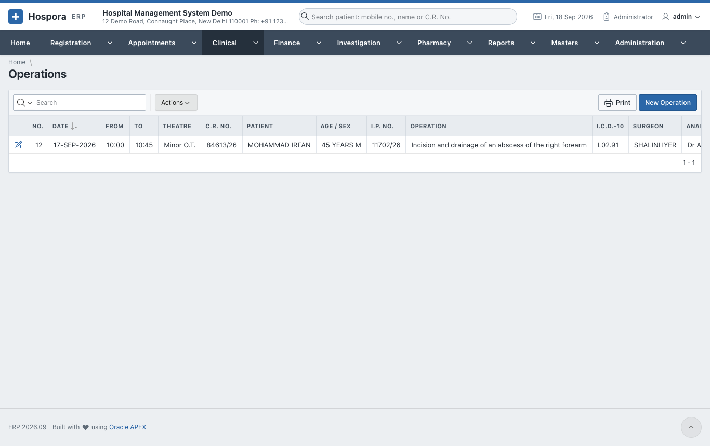
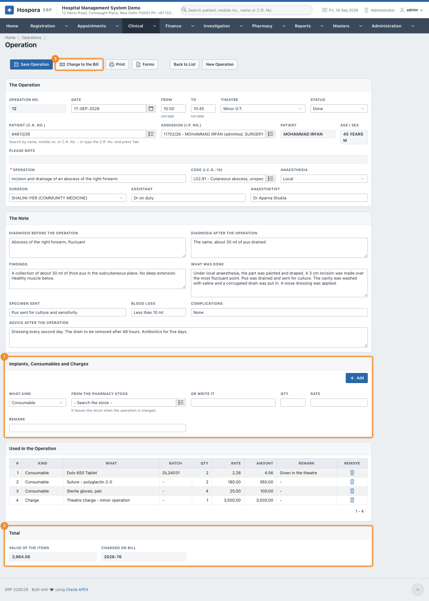
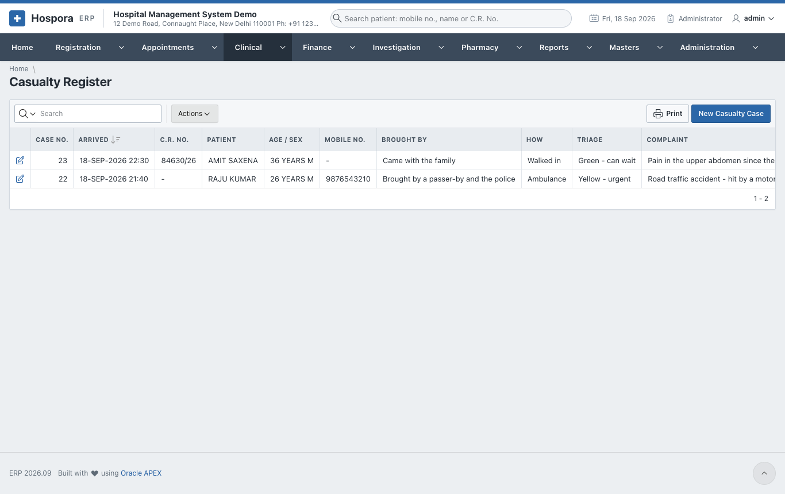
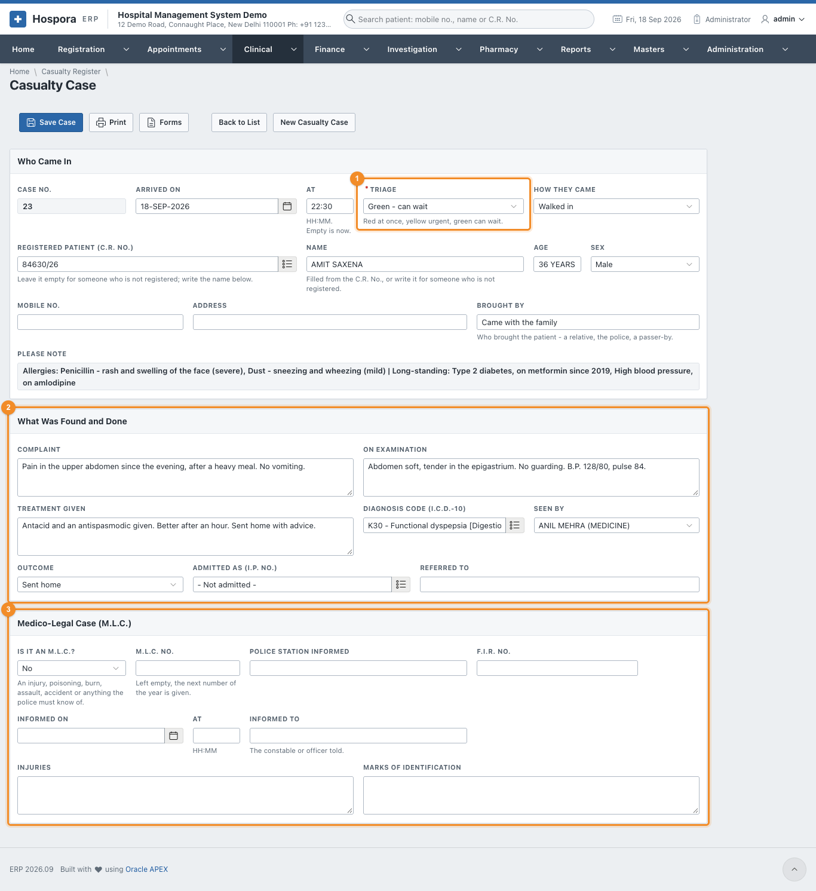

# Operations and Casualty

## Operations

**Clinical > Operations** lists the operations; **New Operation** records one.

1. **The Operation**:
    - **Date**, **From** and **To** (HH:MM), **Theatre** and **Status** (planned, done, cancelled);
    - the **Patient (C.R. No.)** and the **Admission (I.P. No.)**;
    - **Operation** and its **I.C.D.-10 code**, **Anaesthesia**, **Surgeon**, **Assistant** and
      **Anaesthetist**.
2. **The Note**: the diagnosis before and after, the **Findings**, **What Was Done**, the **Specimen Sent**,
   **Blood Loss**, **Complications** and the **Advice after the Operation**.
3. 1 **Implants, Consumables and Charges**, one line at a time:
    - **What Kind**: an implant, a consumable or a charge;
    - an item **From the Pharmacy Stock** (it leaves the stock when the operation is charged), or
      **Or Write It**;
    - **Qty**, **Rate** and **Remark**, then **Add**.
4. 2 **Total** shows the **Value of the Items** and the bill they were charged on.
5. Click **Save Operation**.
6. 3 **Charge to the Bill** puts the items on a credit bill of the admission and
   takes the pharmacy items out of the stock. Do this once the list is complete.
7. **Print** prints the operation note; **Forms** prints the consent for the operation
   ([Consents and Forms](forms.md)).

## Casualty

**Clinical > Casualty Register** lists every emergency case; **New Casualty Case** records one.

1. **Who Came In**:
    - **Arrived On** and **At** (empty is now);
    - 1 **Triage**: red at once, yellow urgent, green can wait;
    - **How They Came**: walking, ambulance, police ...
    - a **Registered Patient (C.R. No.)**, or, for someone not registered, the **Name**, **Age**, **Sex**,
      **Mobile No.** and **Address**;
    - **Brought By**: a relative, the police, a passer-by.
2. 2 **What Was Found and Done**:
    - the **Complaint**, **On Examination**, **Treatment Given**, the **Diagnosis Code** and who saw the
      patient;
    - **Outcome**: treated and sent home, admitted, referred, died. If admitted, give the **I.P. No.**; if
      referred, **Referred To**.
3. 3 **Medico-Legal Case (M.L.C.)**. For an injury, poisoning, burn, assault,
   accident, or anything the police must know of, set **Is It an M.L.C.?** to **Yes** and fill in:
    - **M.L.C. No.**: leave it empty for the next number of the year;
    - **Police Station Informed**, **F.I.R. No.**, **Informed On** / **At** and **Informed To** (the
      constable or officer told);
    - **Injuries** and **Marks of Identification**.
4. Click **Save Case**. **Print** prints the casualty sheet; **Forms** prints the M.L.C. intimation to the
   police ([Consents and Forms](forms.md)).

The M.L.C. cases also appear in **Reports > M.L.C. Register**.
