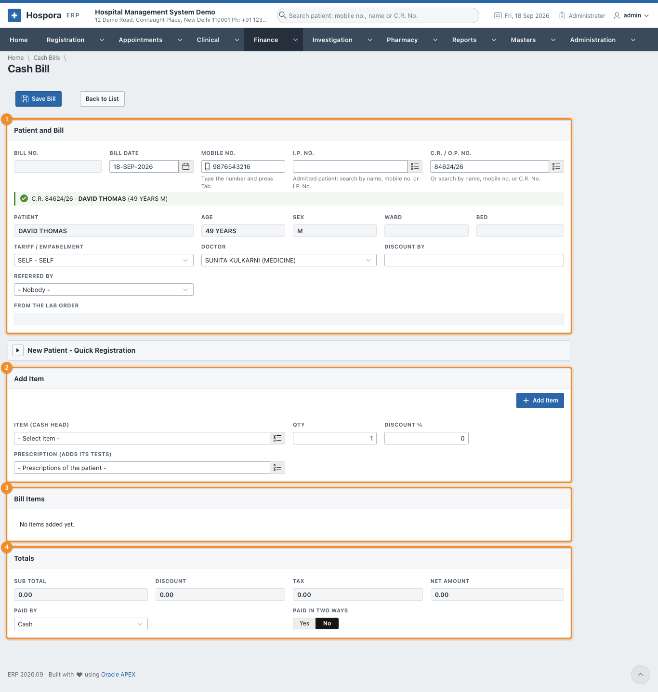
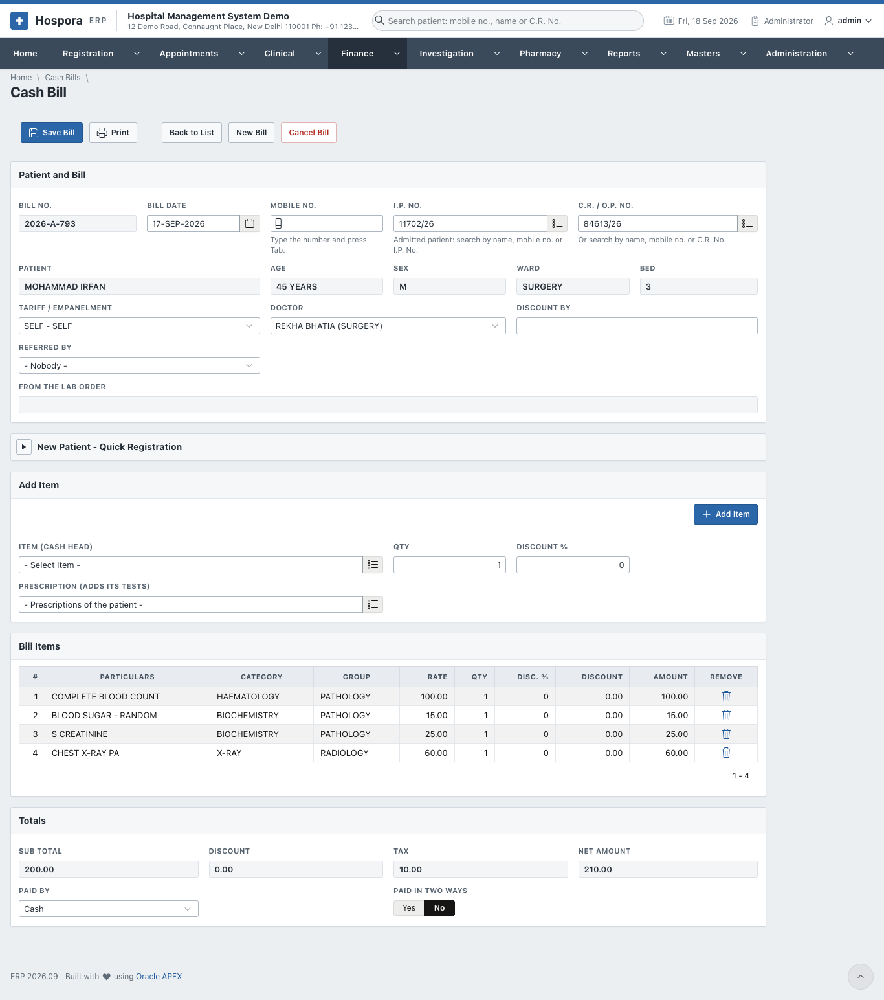
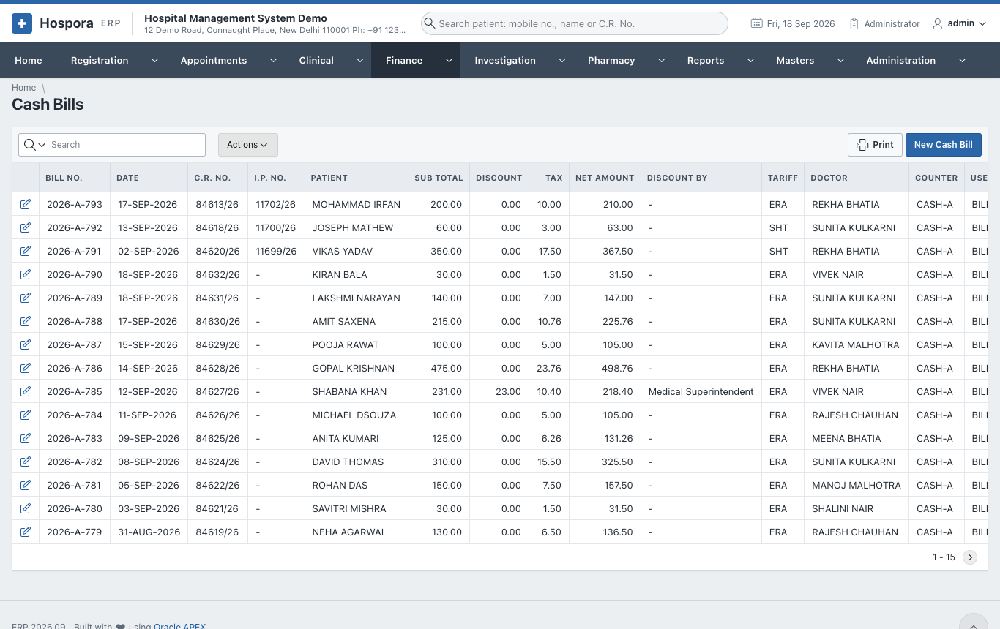
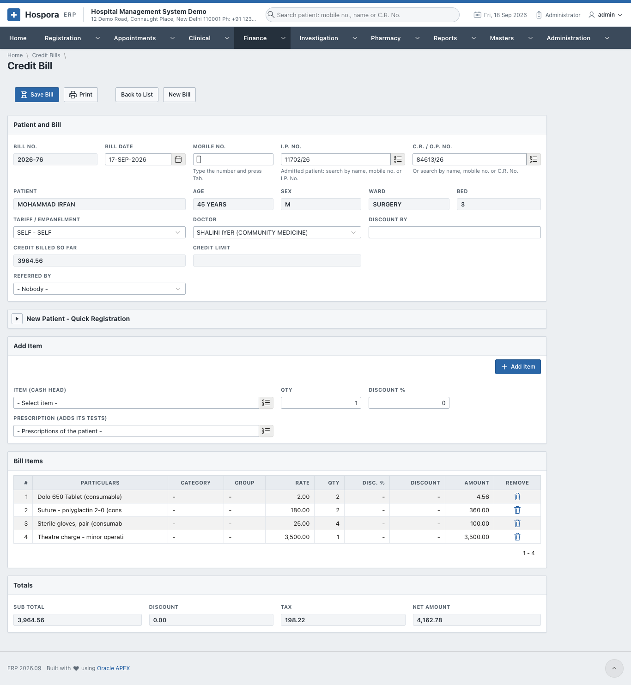
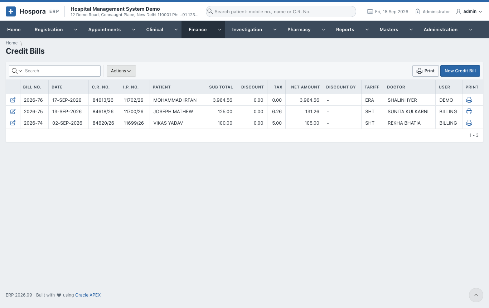
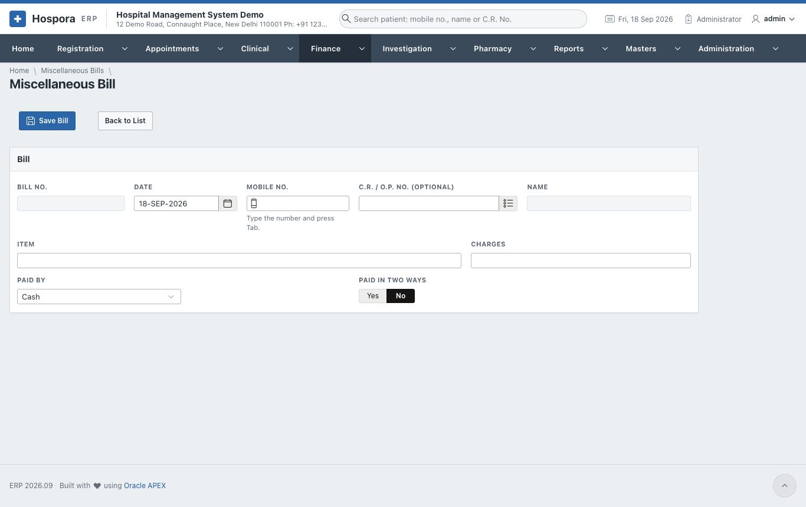
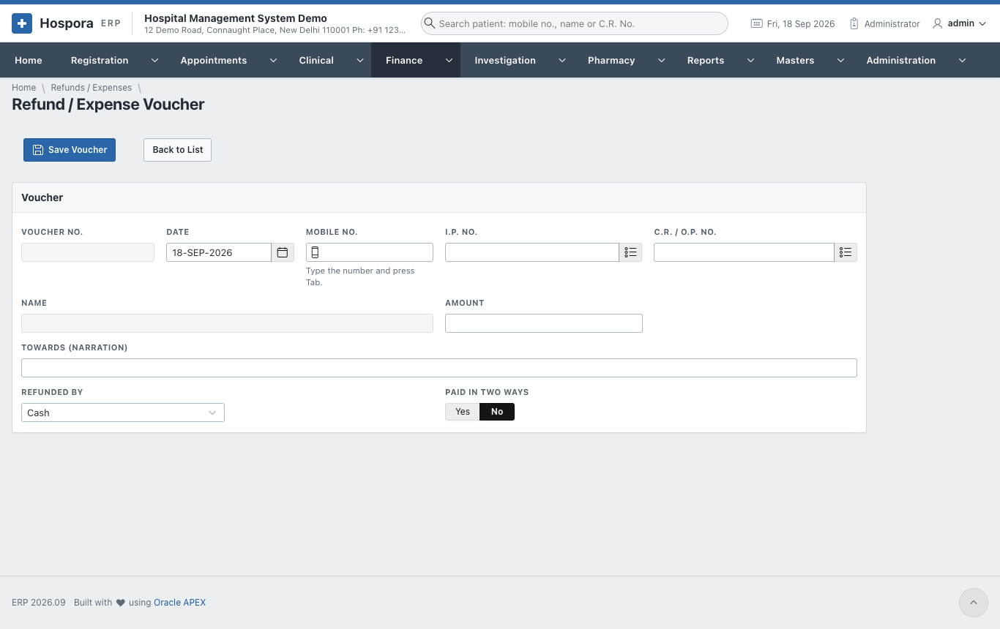
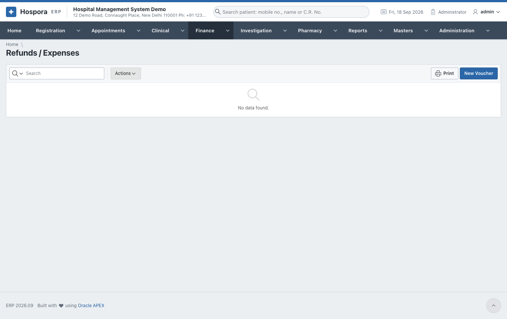

# Bills

## Cash bills

A cash bill charges the patient for tests, X-rays, procedures and services from the tariff, and is paid on
the spot.

Open **Finance > New Cash Bill**, or the **New Cash Bill** tile on the Home page.

1. 1 **Patient and Bill**:
    - type the **Mobile No.** and press ++tab++, or search the **C.R. / O.P. No.** For an admitted
      patient, search the **I.P. No.** instead: the ward and bed fill in;
    - **Tariff / Empanelment**: SELF, or the company whose rates apply;
    - **Doctor**: filled in with the patient's doctor;
    - **Discount By**: who allowed a discount, if any;
    - **Referred By**: the clinic or doctor who sent the patient;
    - **From the Lab Order**: filled in when the bill was opened from a lab order ("Bill the Tests"); its
      tests are already on the bill.

    A patient who is not registered can be registered on the spot in **New Patient - Quick Registration**.
2. 2 **Add Item**:
    - choose the **Item (Cash Head)** from the tariff, e.g. *COMPLETE BLOOD COUNT* or *CHEST X-RAY PA*;
    - the **Qty** and a **Discount %** if any, then **Add Item**;
    - **Prescription (adds its tests)**: choose one of the patient's prescriptions to add all the tests it
      asks for at once.
3. 3 **Bill Items** lists the lines. The bin icon removes a line.
4. 4 **Totals** shows the **Sub Total**, **Discount**, **Tax** and **Net Amount**.
   Choose **Paid By** as described in [How a payment is recorded](index.md#how-a-payment-is-recorded).
5. Click **Save Bill**, then **Print**. From the print window, **WhatsApp** sends the patient the bill
   amount.

- A discount above the limit of your role is sent for approval (see
  [Discount Approvals](rates.md#discount-approvals)). The bill can be saved once it is approved.
- **Cancel Bill** (administrators only) cancels a wrong bill.
- **Finance > Cash Bills** lists the bills:

## Credit bills

A **credit bill** is the same as a cash bill, but it is not paid now. It is charged to:

- an **admitted patient's account**, and settled in the [I.P. final bill](inpatient-billing.md#ip-final-bill);
- or a **company / TPA** (the empanelment), and claimed from them.

Open **Finance > New Credit Bill**. Choose the patient (usually by **I.P. No.**), add the items as on a
cash bill, and save. There is no payment on a credit bill.

## Miscellaneous bills

**Finance > Miscellaneous Bills** takes money for anything outside the tariff: a duplicate card, a
certificate copy, a medical record fee. The patient's C.R. No. is optional.

1. The **Date**, and the patient (**Mobile No.** or **C.R. / O.P. No.**) if there is one.
2. **Item**: what the money is for, and the **Charges**.
3. **Paid By**, then **Save Bill** and **Print**.

## Refunds / Expenses

**Finance > Refunds / Expenses** records money going out: a refund to a patient (e.g. an unused advance),
or a small expense paid from the counter.

1. The **Date**, and the patient by **Mobile No.**, **I.P. No.** or **C.R. / O.P. No.**
2. **Amount** and **Towards (narration)**: what the money was for.
3. **Refunded By**: cash, UPI, bank transfer ... with the transaction ID.
4. **Save Voucher**, then **Print** the voucher for the patient to sign.

