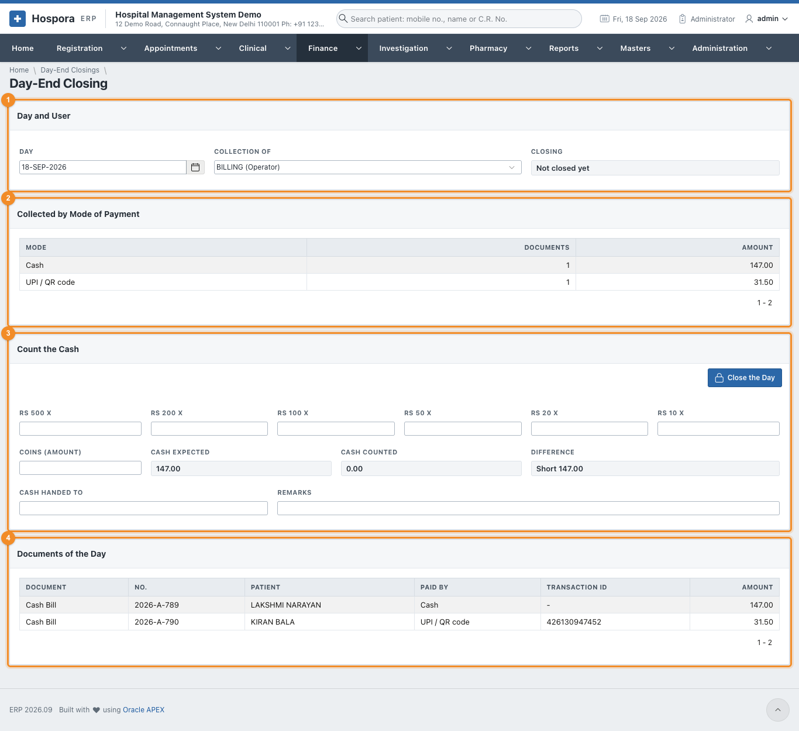
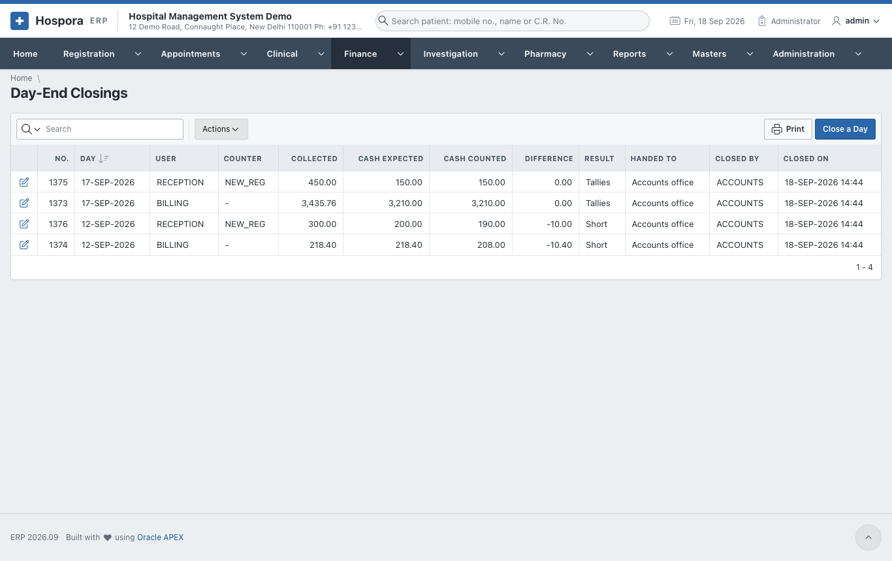
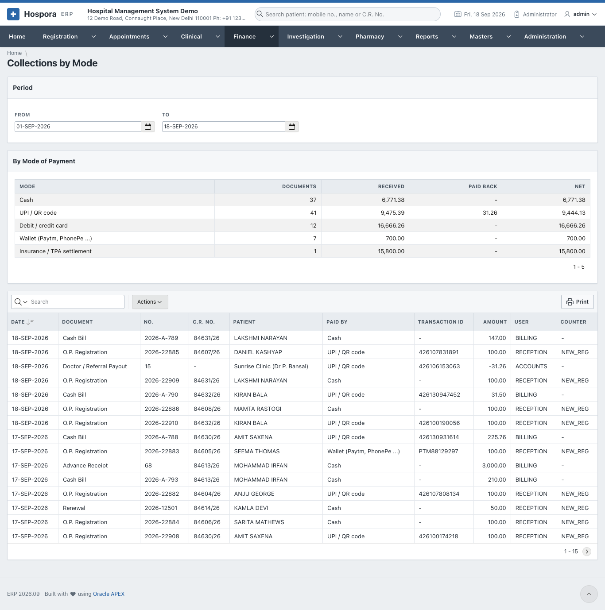
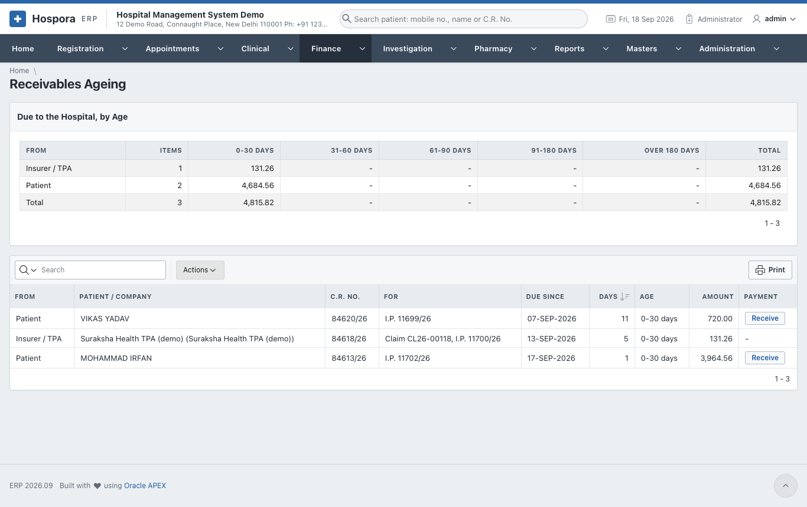

# The End of the Day

## Day-End Closing

At the end of a shift, each counter counts its cash and hands it over. **Finance > Day-End Closing** shows
what the counter collected and checks the cash.

1. 1 **Day and User**: the **Day** and whose **Collection of**. **Closing** says whether
   that day is already closed.
2. 2 **Collected by Mode of Payment**: how much came in by cash, UPI, card ..., and
   how many documents.
3. 3 **Count the Cash**:
    - enter how many notes of each kind: **Rs 500 x**, **Rs 200 x** ... **Rs 10 x**, and the **Coins
      (amount)**;
    - **Cash Expected** (the cash collected), **Cash Counted** and the **Difference** (short or excess) are
      worked out as you type;
    - **Cash Handed To**: e.g. *Accounts office*, and **Remarks**, e.g. why the cash is short.
4. 4 **Documents of the Day** lists every document behind the totals, with how it was
   paid and its transaction ID. Use it to trace a difference.
5. Click **Close the Day**, then **Print the Handover** for the person receiving the cash to sign.

**Finance > Day-End Closings** lists the closings, with the expected and counted cash and the difference.
**Close a Day** opens a new one.

## Collections by Mode

**Finance > Collections by Mode** shows, for a period (**From** and **To**):

- **By Mode of Payment**: the totals of cash, UPI, card ...
- **Every Payment**: each payment with its document, patient, mode and transaction ID. Use it to match
  the UPI and card settlements the bank reports.

## Receivables Ageing

**Finance > Receivables Ageing** shows who owes the hospital money, and for how long:

- **Due to the Hospital, by Age**: the totals owed by patients and by companies / TPAs, in columns of 0-30,
  31-60, 61-90, 91-180 and over 180 days;
- **Everything Due**: each due, with its document and age.

Chase the oldest first.

