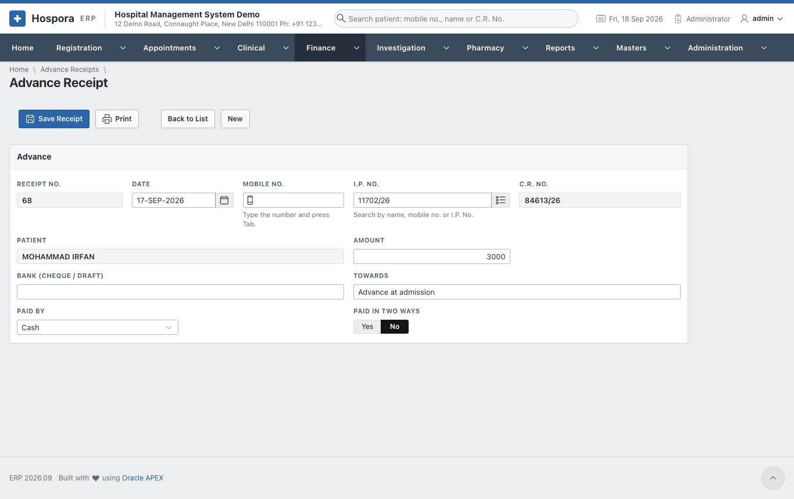
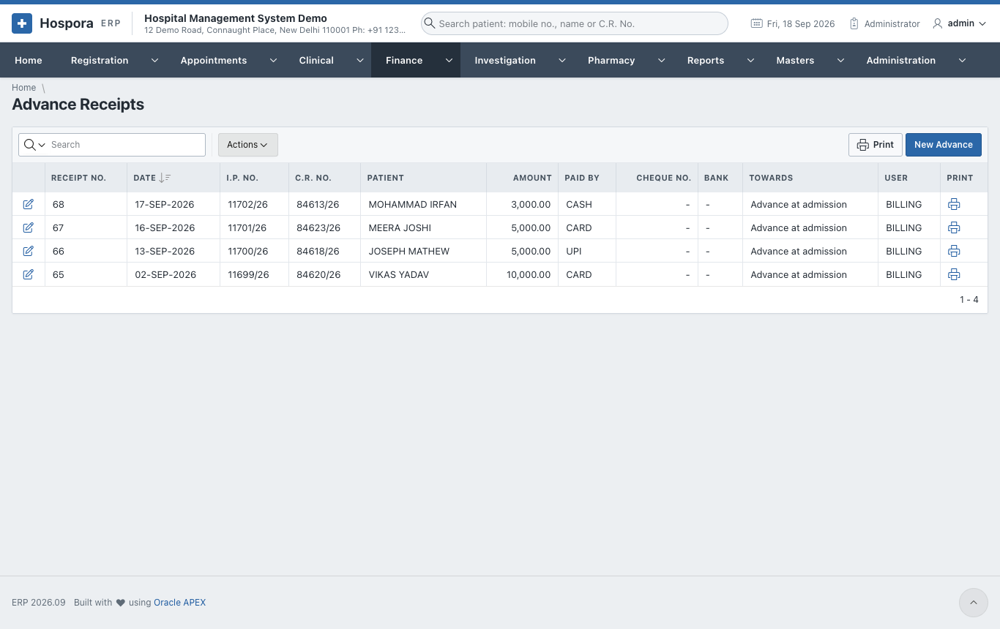
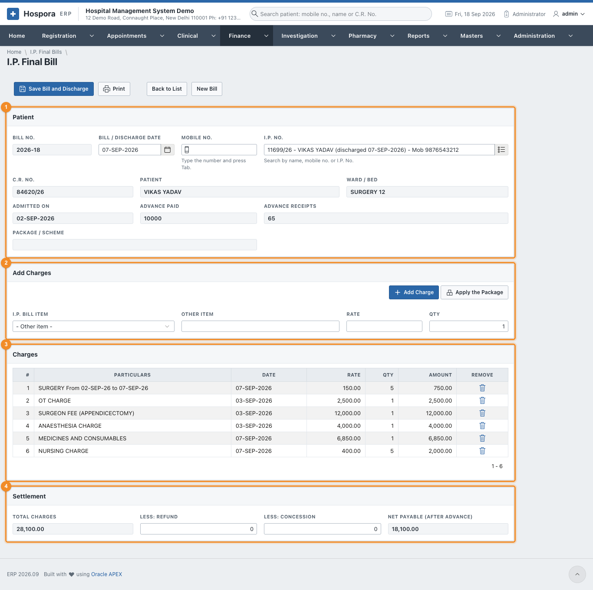
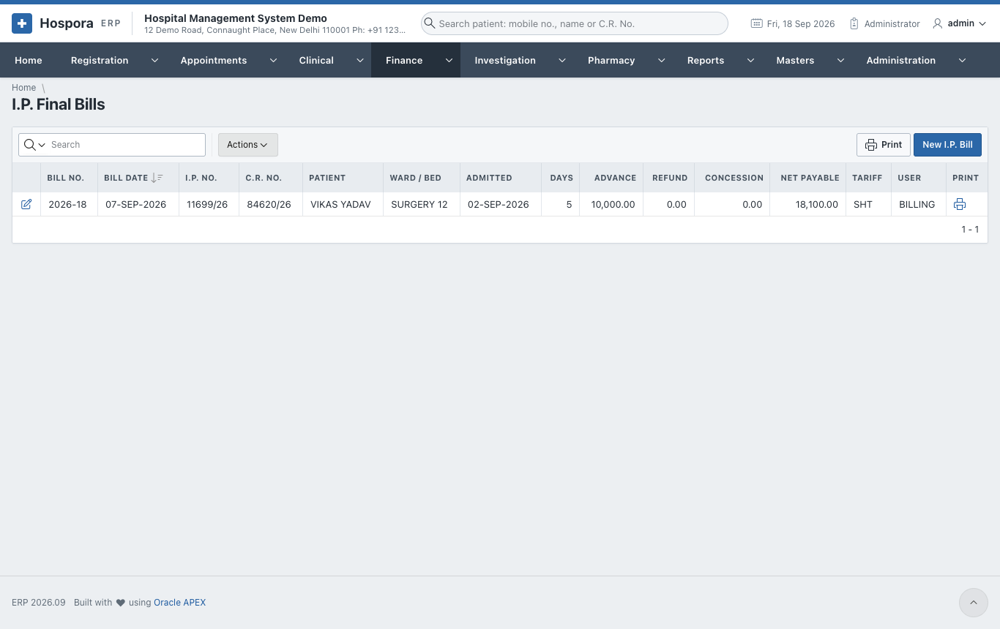
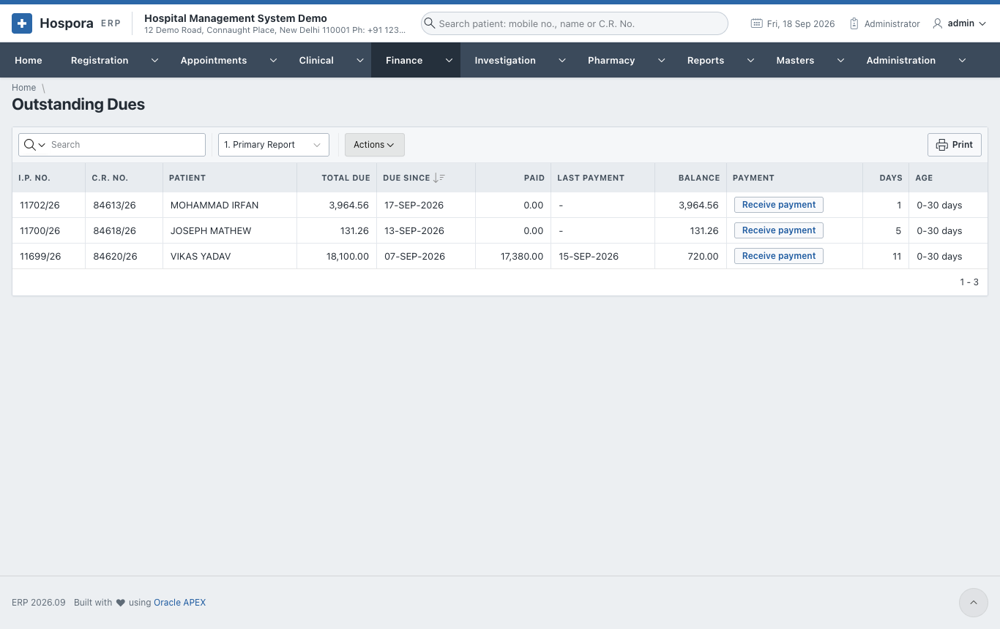
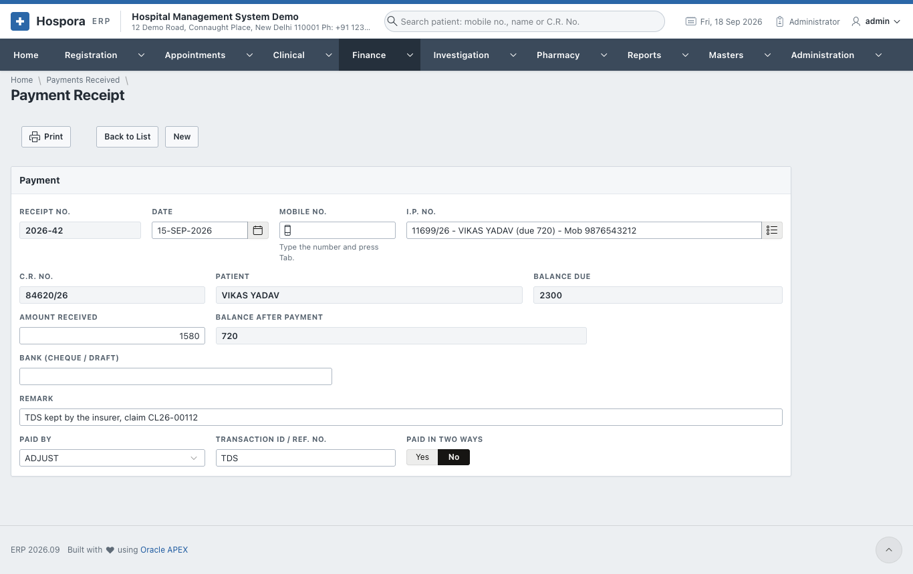
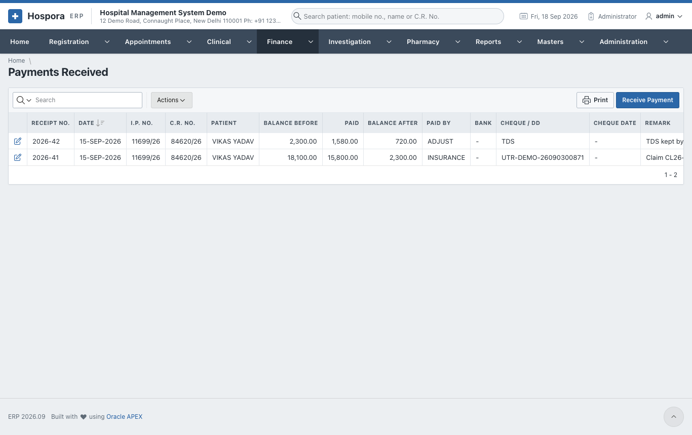
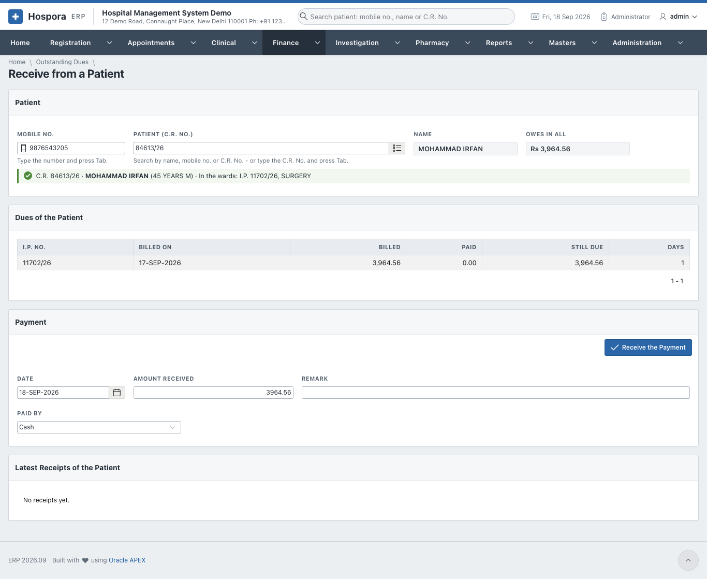

# In-Patient Billing and Dues

The money of an admission, in order:

1. **advances** while the patient is in the ward;
2. **credit bills** for tests and services during the stay;
3. the **I.P. final bill** at discharge, which takes the advances off;
4. **payments** against what is still due.

## Advance receipts

**Finance > Advance Receipts** lists the advances; **New Advance** takes one.

1. The **Date**. Type the **Mobile No.** and press ++tab++, or search the **I.P. No.** The C.R. No. and the
   patient fill in.
2. **Amount**, and **Towards**: e.g. *advance at admission*.
3. **Paid By**, with the transaction ID. For a cheque or draft, give the **Bank**.
4. **Save Receipt** and **Print** the receipt.

## I.P. final bill

Open the patient's admission and click **I.P. Final Bill**, or open **Finance > I.P. Final Bills** and
**New I.P. Bill**.

1. 1 **Patient**: choose the **I.P. No.** (or type the mobile number) and the
   **Bill / Discharge Date**. Click **Prepare Bill**. It shows:
    - the ward, bed and admission date;
    - the **Advance Paid** and the numbers of the **Advance Receipts**;
    - the **Package / Scheme**, if the admission has one.
2. **Prepare Bill** also writes the **ward charges** from the bed history: every ward and bed, from and to,
   at its daily rate.
3. 2 **Add Charges**: choose an **I.P. Bill Item** (from Masters > I.P. Bill Items),
   or write an **Other Item**. Give the **Rate** and **Qty**, then **Add Charge**. Use this for the surgeon's
   fee, the operation theatre, medicines, nursing and so on.
4. **Apply the Package**, for an admission on a package: the charges the package includes are replaced by
   the package price. Charges outside the package stay on the bill.
5. 3 **Charges** lists every line. The bin icon removes one.
6. 4 **Settlement**:
    - **Total Charges**;
    - **Less: Refund** and **Less: Concession**: what is taken off;
    - **Net Payable (after advance)**: what the patient still pays.
7. Click **Save Bill and Discharge**. The bill is saved and the patient is discharged. What is left to pay
   becomes a **due** of the patient.
8. **Print** the final bill.

!!! warning "A concession above your limit"
    A concession beyond the limit of your role needs approval first
    ([Discount Approvals](rates.md#discount-approvals)).

## Outstanding dues

**Finance > Outstanding Dues** lists every admission that still owes money: the bill, what was paid, and
the balance.

## Payments received

**Finance > Payments Received** lists the payments against dues. **Receive Payment** takes one:

1. Choose the patient by **Mobile No.** or **I.P. No.** **Balance Due** shows what is owed.
2. **Amount Received**, and a **Remark**. **Balance After Payment** shows what will be left.
3. **Paid By** and the transaction ID (**Bank** for a cheque).
4. **Save Receipt** and **Print**.

## Receive from a patient

**Finance > Receive from a Patient** takes one payment against **all** the dues of a patient, across bills
and admissions:

1. Type the **Mobile No.** and press ++tab++, or search the **Patient**. **Owes in All** shows the total, and
   **Dues of the Patient** lists each due.
2. **Amount Received**, the **Date**, a **Remark**, and **Paid By** (a UPI payment shows its QR code).
3. Click **Receive the Payment**. The amount is set against the oldest admission first, with one receipt
   for each admission it reaches. **Latest Receipts of
   the Patient** shows the receipts made.

