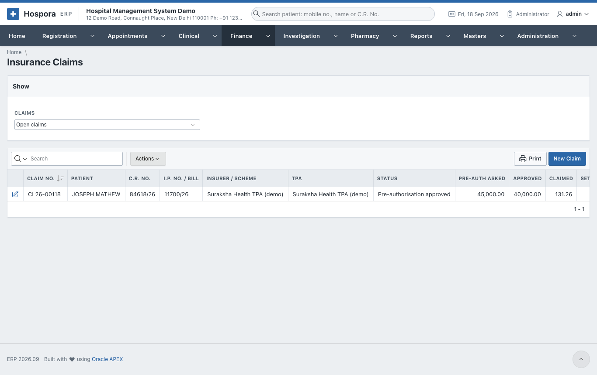
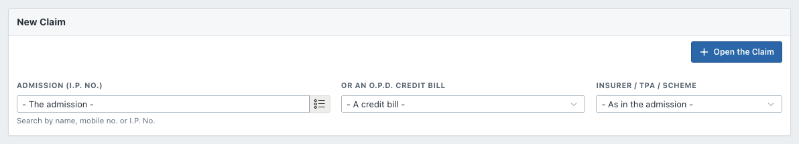
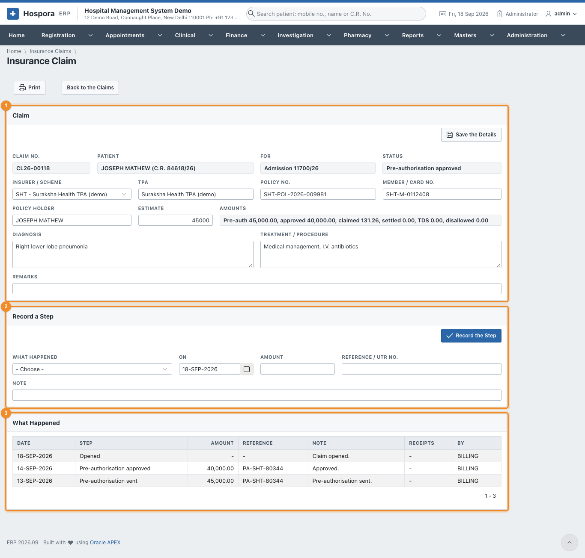
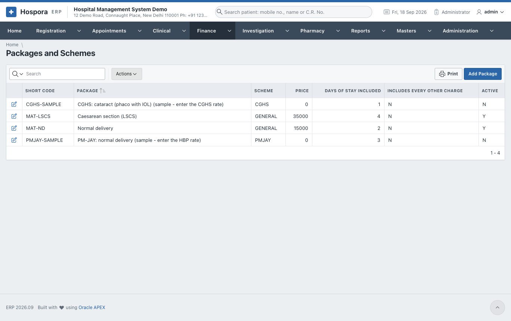
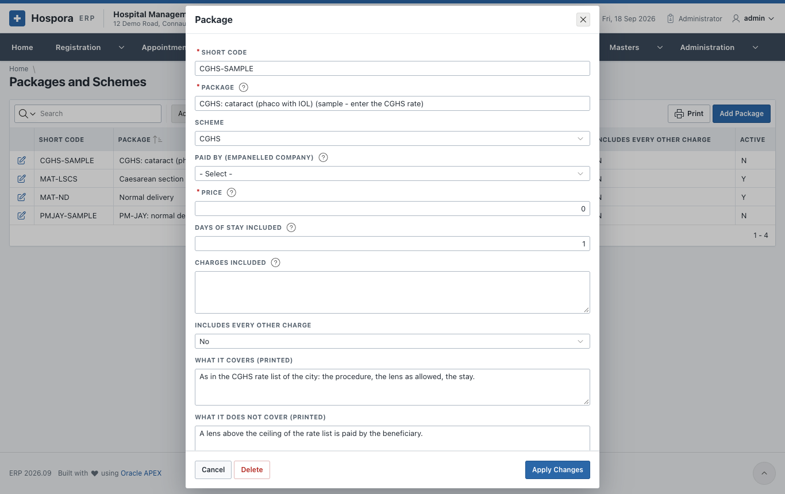

# Insurance and Packages

## Insurance claims

A cashless admission is paid by an insurer, a TPA or a scheme. **Finance > Insurance Claims** follows each
claim from the pre-authorisation to the money received.

**Claims** (at the top) filters the list: open claims, settled claims, all.

### Open a claim

Click **New Claim**:

1. Choose the **Admission (I.P. No.)**, or **Or an O.P.D. Credit Bill**.
2. Choose the **Insurer / TPA / Scheme**.
3. Click **Open the Claim**. The claim gets its **Claim No.**

### Follow a claim

1. 1 **Claim**: fill in the **Policy No.**, **Member / Card No.**, **Policy Holder**,
   **TPA**, the **Estimate**, the **Diagnosis** and **Treatment / Procedure**. Click **Save the Details**.
   **Amounts** shows the billed, approved, settled and outstanding amounts.
2. 2 **Record a Step** every time something happens. Choose **What Happened**:

    | Step | Record |
    |---|---|
    | Pre-authorisation sent | the amount asked for, the reference |
    | Query / query replied | what was asked or answered, in the **Note** |
    | Pre-authorisation approved (or enhancement) | the amount approved, the approval number |
    | Pre-authorisation denied | the reason |
    | Claim sent | the amount claimed, the claim reference |
    | Settled / part settled | the **Amount** received, the **Reference / UTR No.**, the **TDS Kept by the Insurer**, and what was **Disallowed** |
    | Appealed, closed, note | as needed |

    With a settlement, **Write the Disallowed Off** decides who bears the disallowed amount:

    - **Yes**: the hospital writes it off;
    - **No**: the patient is asked to pay it.

    Click **Record the Step**. The status of the claim moves on, and only the steps that can follow are
    offered next.
3. 3 **What Happened** lists every step with its date, amount and reference.
4. **Print** prints the claim with its history.

A settlement is posted as a payment against the admission's dues, and the TDS and write-off go to their
ledgers in the accounts.

## Packages and schemes

**Finance > Packages and Schemes** holds the fixed-price packages, e.g. a normal delivery or a cataract
operation, and the scheme rates (PM-JAY, CGHS ...).

A package has:

- a **Code** and **Name**, and its **Scheme**;
- the **Amount** and the usual **Stay (days)**;
- the **Inclusions** and **Exclusions**, printed for the patient;
- the tariff items it includes, or all of them.

A package is chosen on the [admission](../registration/admission.md), and **Apply the Package** on the
[I.P. final bill](inpatient-billing.md#ip-final-bill) charges it.
