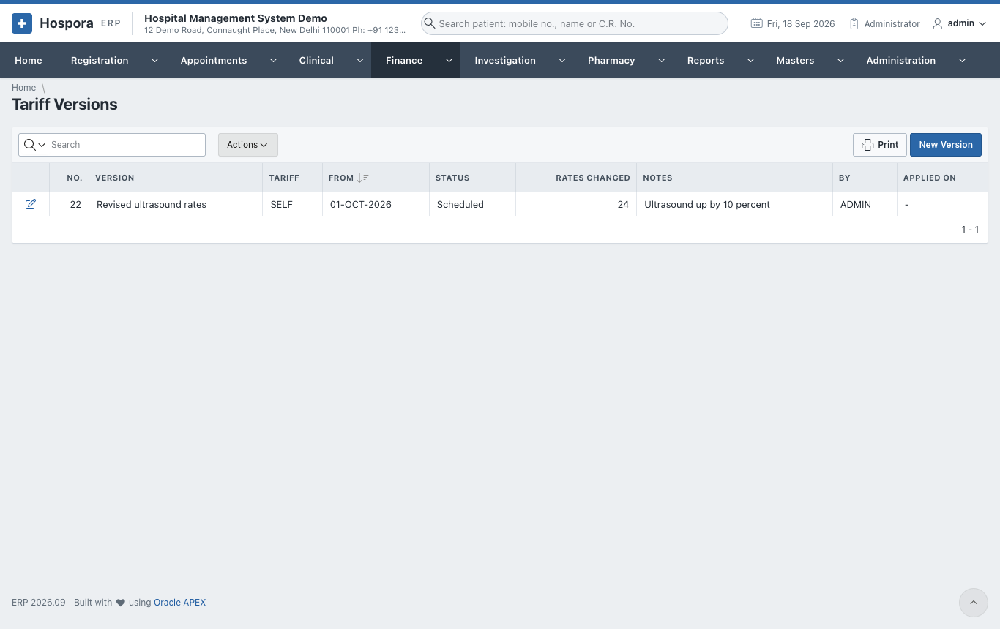
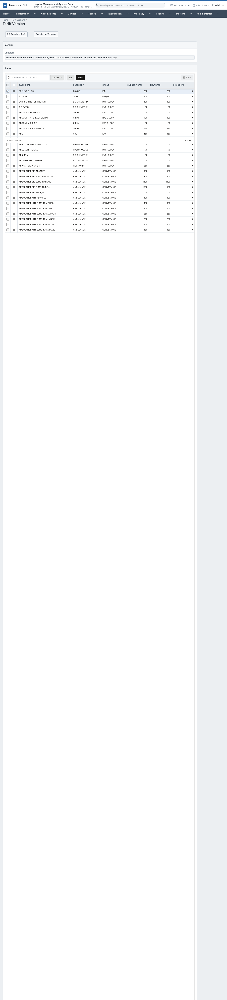
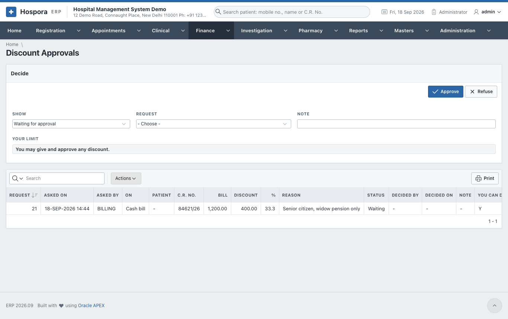

# Rates and Discounts

## Tariff versions

The rates of the tariff change from time to time. A **tariff version** prepares the new rates in advance.
They take effect by themselves on the day chosen. Every bill uses the rates of its own day, so old bills
keep the old rates.

**Finance > Tariff Versions** lists the versions; **New Version** starts one.

1. **New Version**:
    - a **Name**, e.g. *Revised rates from 1 October*;
    - **Tariff Of**: the hospital's own tariff, or a company's;
    - **Takes Effect On** and **Notes**.
2. **Copy the Current Rates** copies every rate into the version as a draft.
3. **Raise the Rates**:
    - **By %** (10 raises by 10%, -5 lowers by 5%);
    - **Rounded To** (the nearest 1, 5, 10 ...);
    - **Only the Category / Group**, e.g. *ULTRASOUND*; empty raises every rate.
4. Or change single rates in the **Rates** grid, then **Save the Rates**.
5. **Schedule the Version**: from **Takes Effect On**, the new rates apply. **Back to a Draft** undoes the
   scheduling while the day has not come.

## Discount approvals

Each role has a limit on the discount it may give, as a percentage and/or an amount (**Administration >
Roles**). A bigger discount or concession is not refused: it is sent for approval.

- The clerk saves the bill. The message says the discount is waiting for approval, with a request number.
- **Finance > Discount Approvals** shows the requests to someone allowed to decide:

1. **Show**: requests waiting, or all.
2. Choose the **Request**, and write a **Note**.
3. **Approve** or **Refuse**. **Your Limit** shows what you may approve yourself. Nobody approves their
   own request.
4. Once approved, the clerk saves the bill again, the same day, and the discount goes through.
