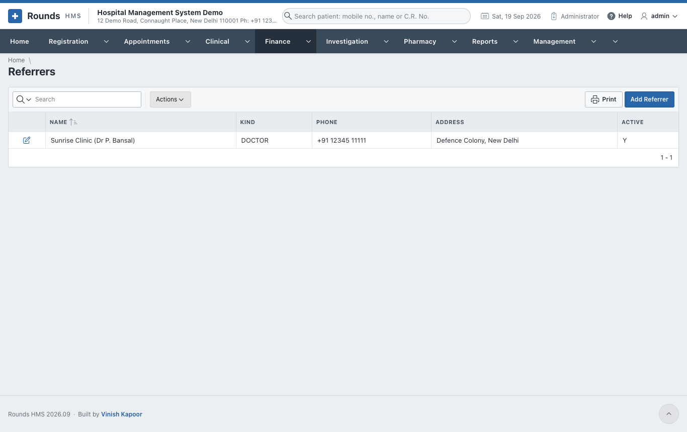
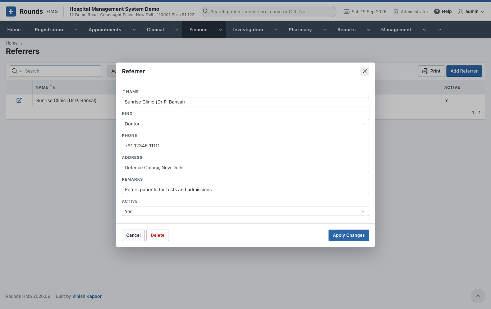
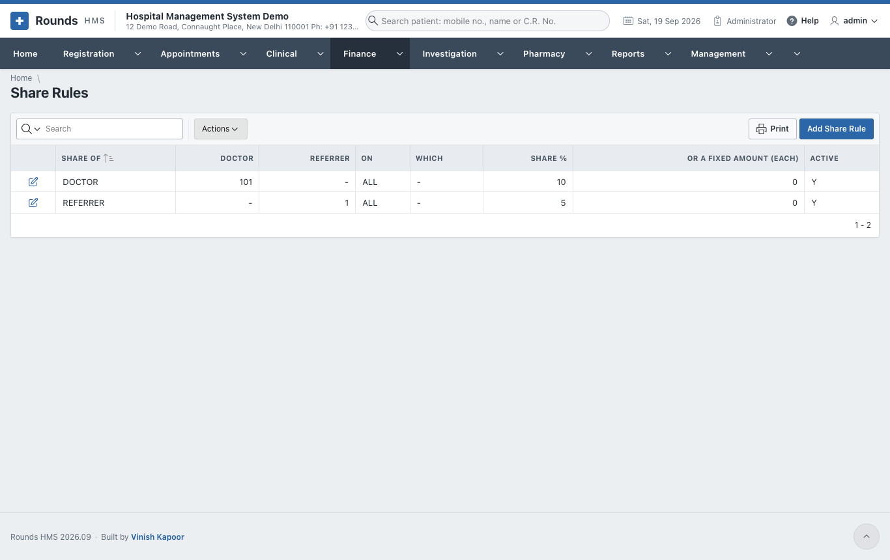
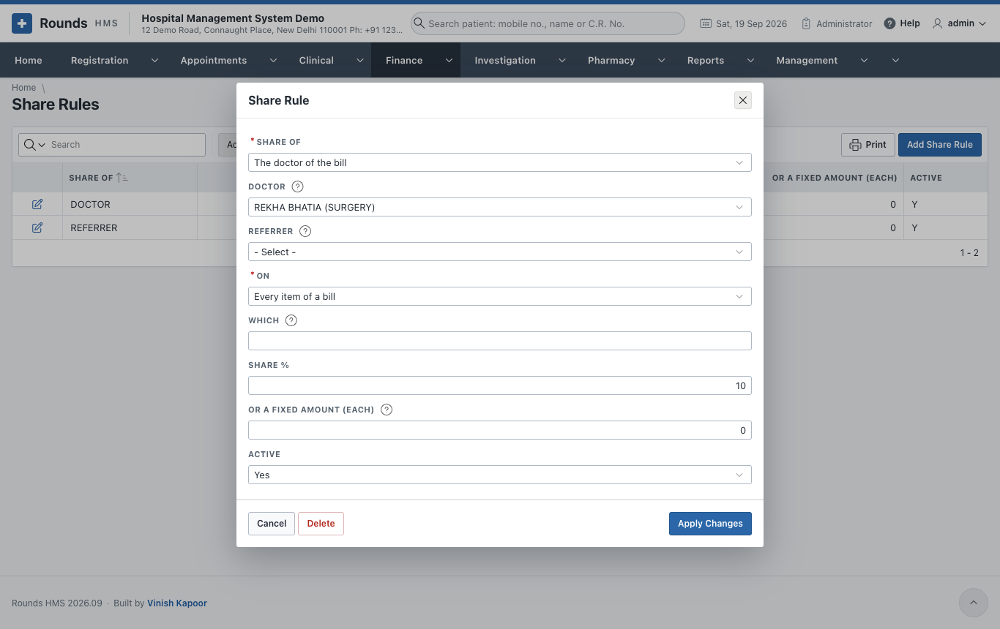
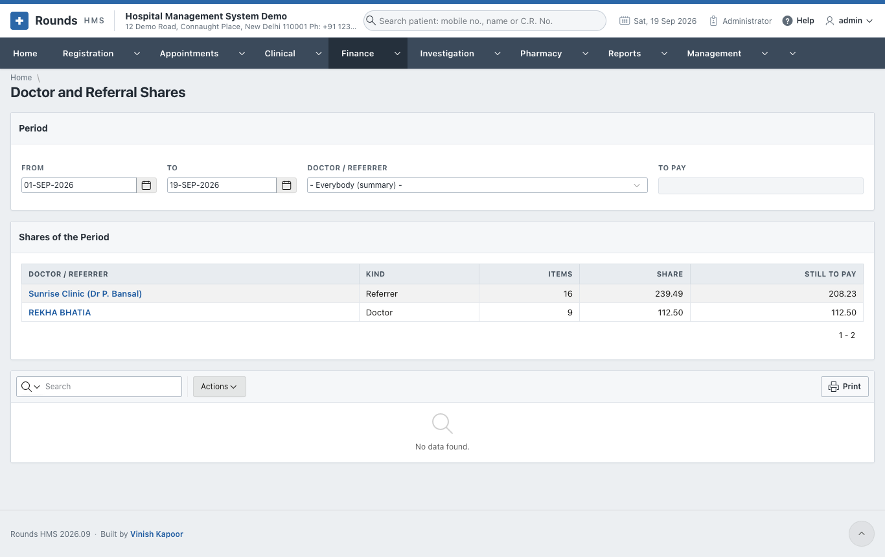
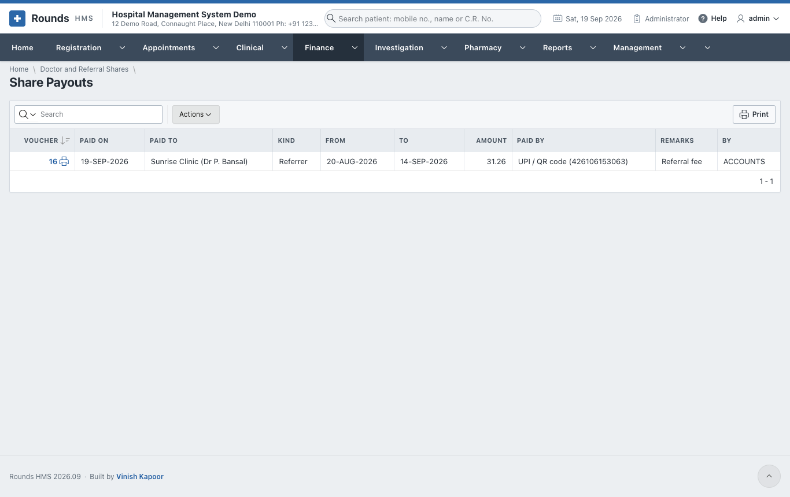

# Doctor and Referral Shares

Many hospitals pay a share of what they bill:

- to their **doctors**, e.g. 10% of the operations of a surgeon;
- to the clinics and doctors who **refer** patients, e.g. 5% of what the referred patient is billed.

Rounds HMS works these shares out from the bills and records what is paid.

## Referrers

**Finance > Referrers** lists the clinics, doctors and agents who send patients. **Add Referrer** adds one:
the **Name**, **Kind** (doctor, clinic, agent ...), **Phone**, **Address** and **Remarks**.

A referrer is chosen in **Referred By** on a registration, a renewal, an admission or a bill.

## Share Rules

**Finance > Share Rules** says who earns what. **Add Share Rule**:

- **Party**: a **Doctor** or a **Referrer**, and which one;
- **Applies To**: all the items billed, or only a category or group of the tariff (e.g. only *X-RAY*);
- **Share %**, and/or a **Fixed** amount per item;
- **Active**.

## Doctor and Referral Shares

**Finance > Doctor and Referral Shares** works out the shares of a period:

1. Choose **From** and **To**. **Shares of the Period** lists every doctor and referrer, with what they
   earned, what was paid and what is left.
2. Choose a **Doctor / Referrer**. **Items of the Doctor or Referrer** lists each bill item behind the
   share, and **To Pay** shows the amount.
3. **Pay the Share**: **Paid By**, the **Transaction ID / Cheque No.** and **Remarks**. Click **Pay What Is
   Due**, then **Print the Voucher**.

**Finance > Share Payouts** lists every payout made.

