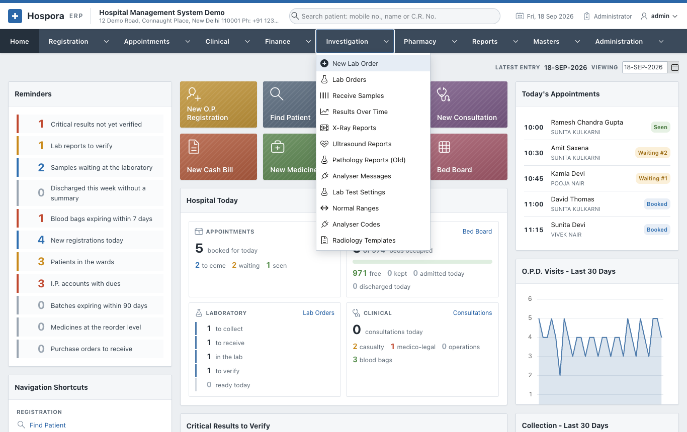

# Investigation

The **Investigation** menu runs the laboratory and the radiology department:

- the lab order;
- the sample and its barcode;
- the results, with normal ranges for the patient's age and sex;
- verification and the printed report;
- X-ray and ultrasound reports.



| Page | Options |
|---|---|
| [The Laboratory](laboratory.md) | New Lab Order, Lab Orders, Receive Samples, Results Over Time, Analyser Messages |
| [X-Ray and Ultrasound](radiology.md) | X-Ray Reports, Ultrasound Reports |
| [Laboratory Settings](lab-settings.md) | Lab Test Settings, Normal Ranges, Analyser Codes, Radiology Templates |
| [Pathology Reports (Old)](radiology.md#pathology-reports-old) | The old way of reporting a bill's tests, kept for earlier reports |

## A lab test from start to end

```text
Lab order -> Collect the sample (barcode label) -> Receive in the lab (scan)
          -> Enter the results (flags) -> Verify and release -> Print / WhatsApp
```

At every step the order shows where it is: **To collect**, **Collected**, **In the lab**, **To verify** or
**Ready**. The Home page shows the same stages at a glance, and the **critical** values not yet verified.
