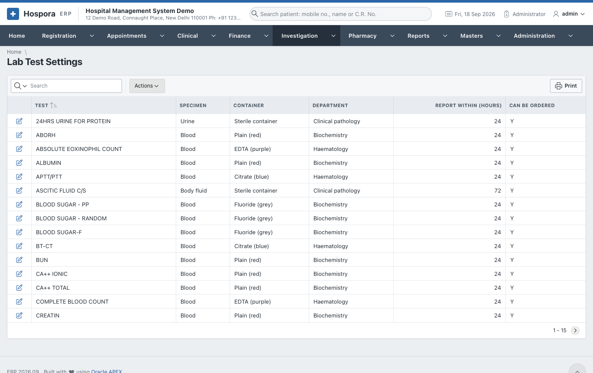
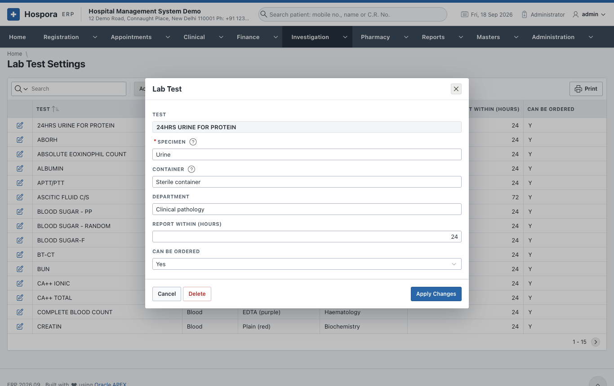
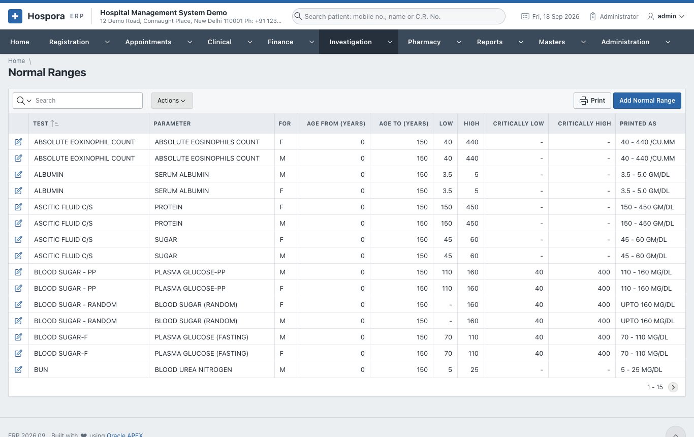
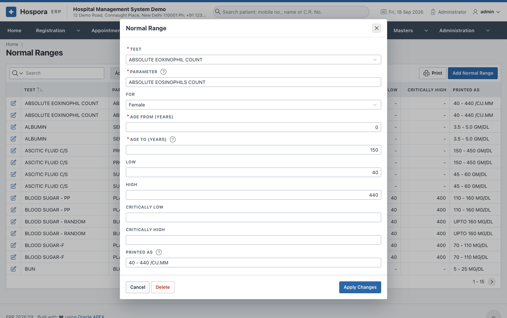
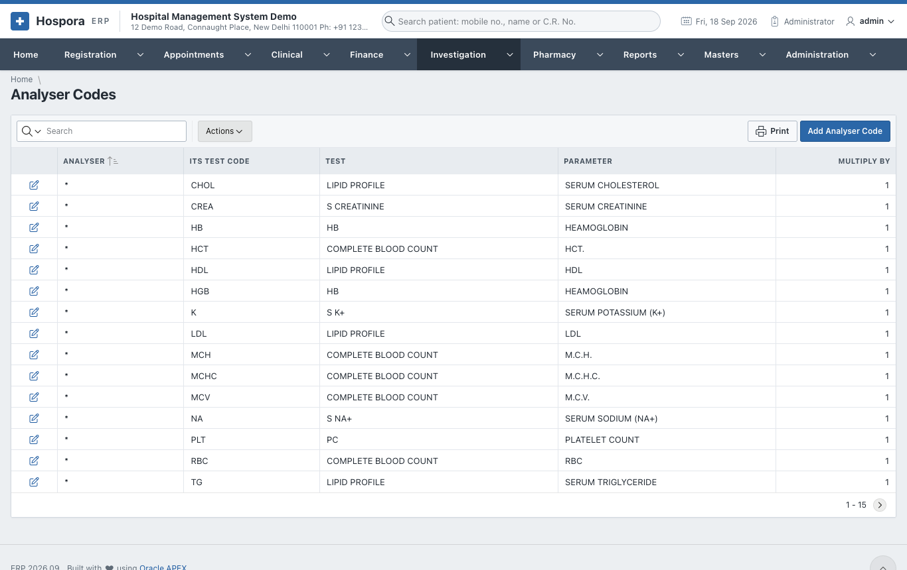
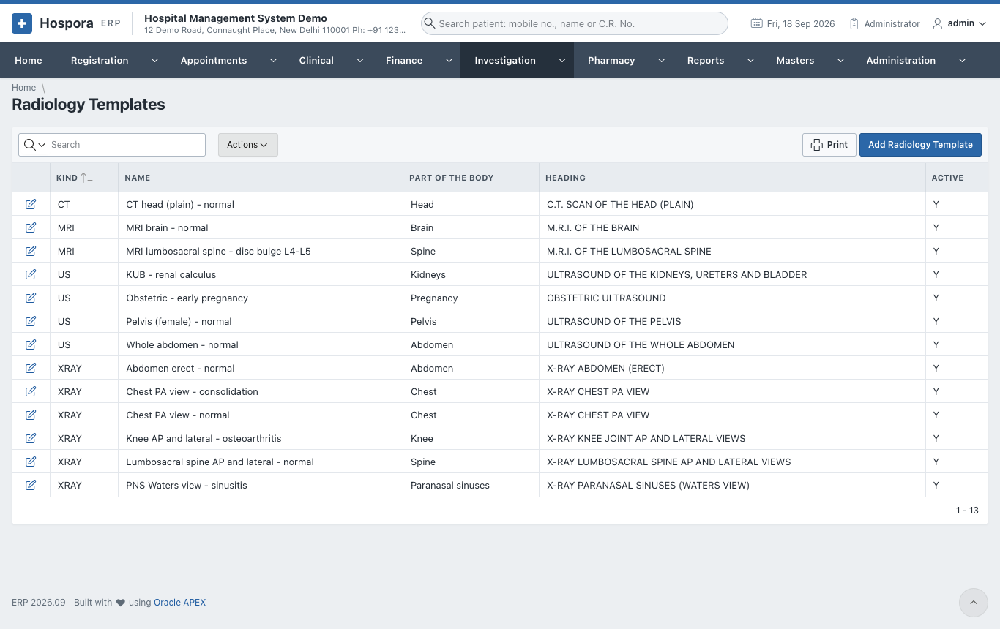
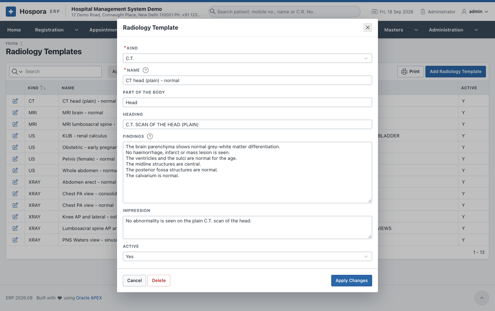

# Laboratory Settings

These screens are set up once, by the laboratory in charge.

## Lab Test Settings

**Investigation > Lab Test Settings** lists every test the laboratory does. Open a test with its pencil:

- **Specimen** (blood, urine ...) and **Container** (EDTA purple, plain red ...). Tests with the same
  specimen and container share one tube.
- **Department** (haematology, biochemistry ...), the **Turnaround** in hours, and **Active**.

The parameters of a test (e.g. the six values of a lipid profile) come from **Masters > Pathology Test
Formats**.

## Normal Ranges

**Investigation > Normal Ranges** gives each parameter its normal and critical limits. A parameter can
have several ranges, by **sex** and **age** (for example, haemoglobin for men, for women, and for
children).

- **Low** and **High**: outside them, a result is flagged low or high.
- **Critically Low** and **Critically High**: outside them, the result is critical and shown on the Home
  page until verified.
- **Normal Text**: how the range is printed, e.g. *70 - 110 mg/dL*.

When a result has no range here, the normal value written in the Pathology Test Format is used.

## Analyser Codes

**Investigation > Analyser Codes** matches the code an analyser sends (e.g. *GLU*) to the laboratory's test
and parameter (*BLOOD SUGAR-F / PLASMA GLUCOSE*). Add a code for every parameter each analyser reports.

## Radiology Templates

**Investigation > Radiology Templates** holds the ready-made report texts for X-ray, ultrasound, CT and
MRI. A template has:

- its **Modality** and **Name** (e.g. *Chest PA view - normal*);
- the **Body Part**, **Heading**, **Findings** and **Impression**.

Radiologists start their reports from these.

