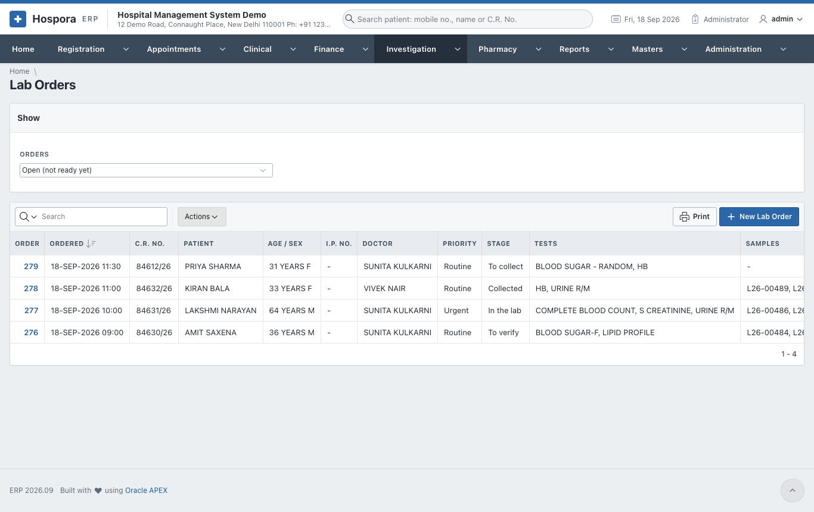
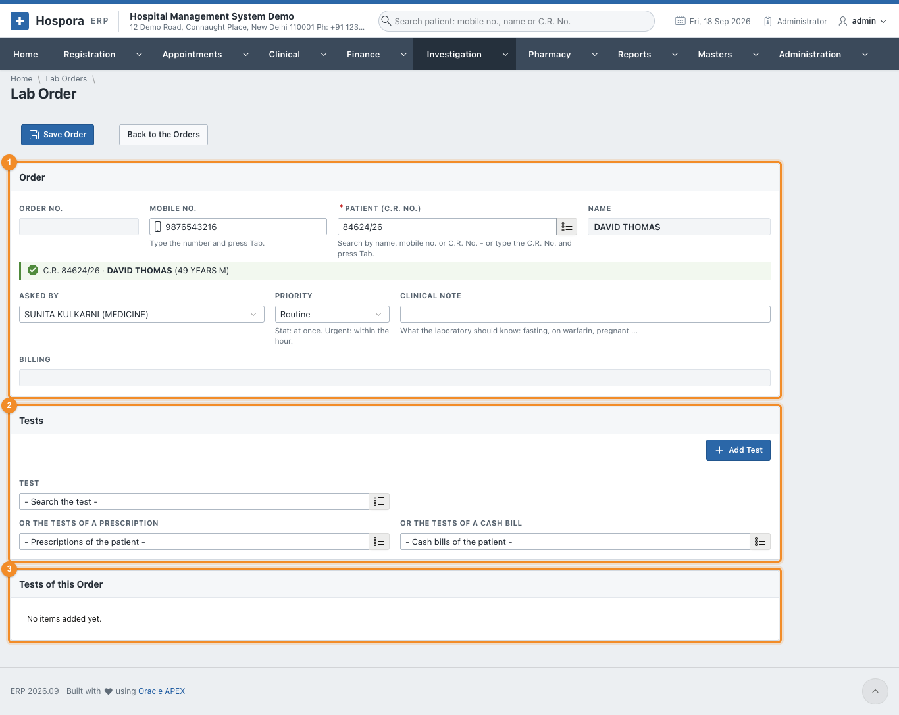
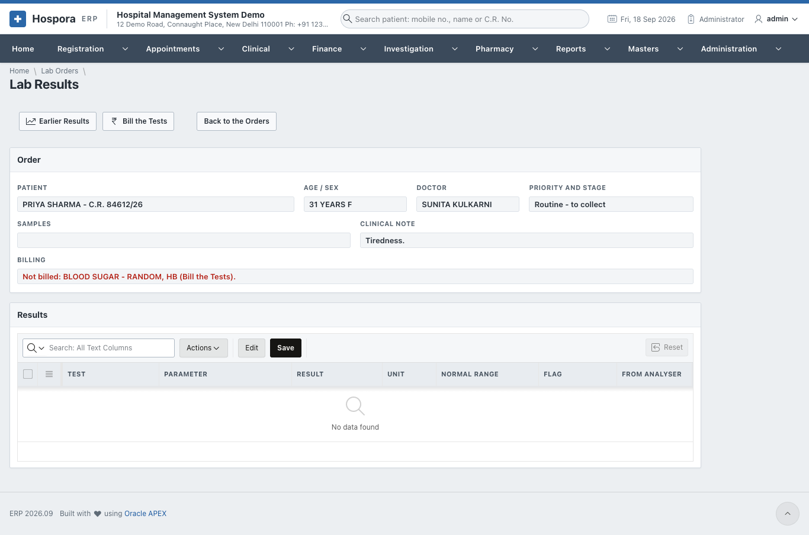
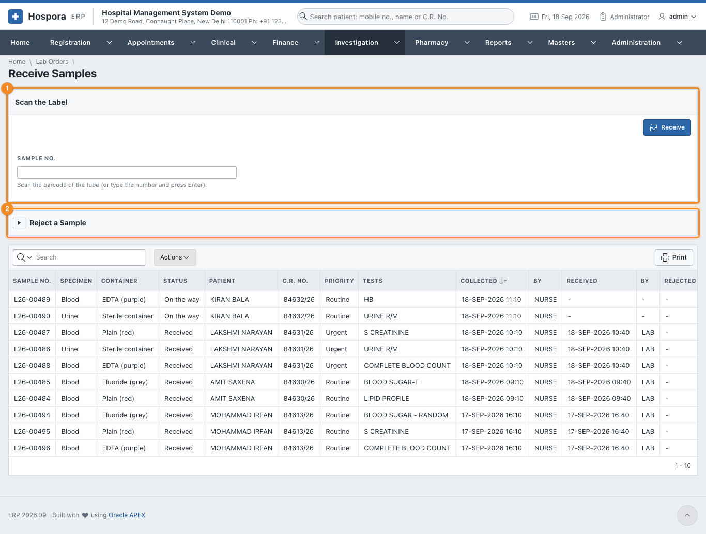
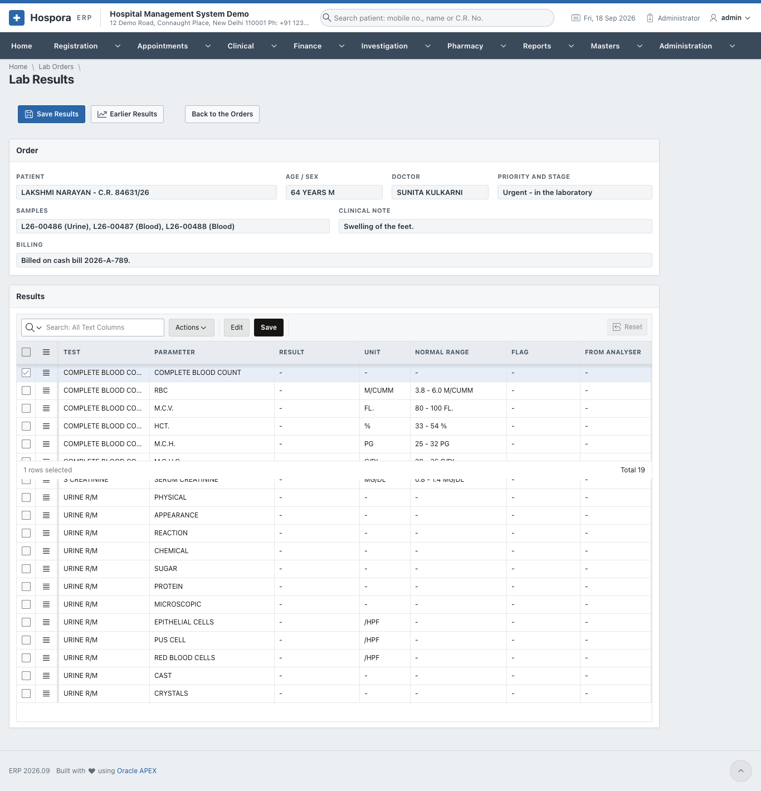
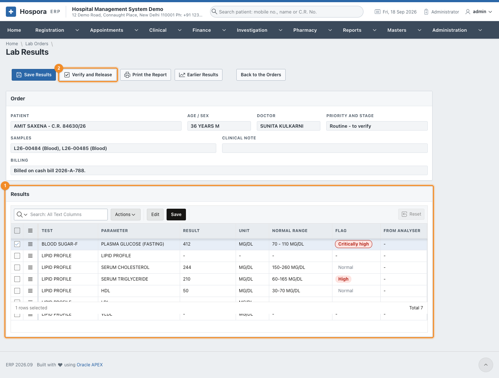
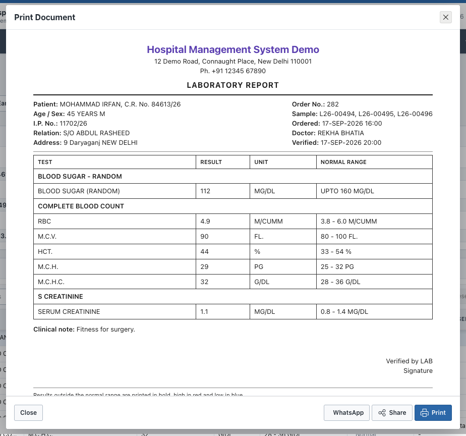
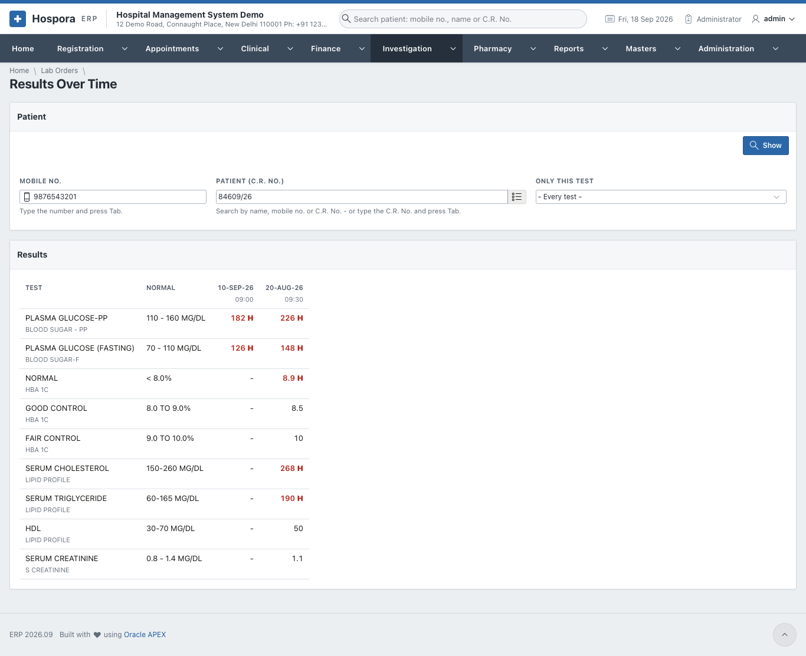
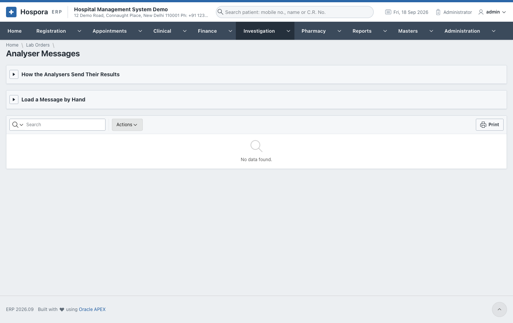

# The Laboratory

## Lab orders

**Investigation > Lab Orders** lists the orders. **Orders** at the top chooses which: open (not ready yet),
ready, all ...

The **Stage** of each order says what comes next, and the actions of the row do it:

| Stage | Action | What it does |
|---|---|---|
| To collect | **Collect** | the samples are taken: one tube for each kind of specimen, each with its sample number (e.g. L26-00489) |
| Collected | **Received in the lab** | the tubes have reached the laboratory |
| In the lab | **Results** | enter the results |
| To verify | **Verify** | a pathologist checks and releases the report |
| Ready | **Open** | see or print the report |

**Cancel** cancels an order that is not needed any more.

## New lab order

Open **Investigation > New Lab Order**, or the **New Lab Order** tile on the Home page.

1. 1 **Order**:
    - the patient by **Mobile No.** (press ++tab++) or **Patient (C.R. No.)**;
    - **Asked By**: the doctor, filled in with the patient's doctor;
    - **Priority**: routine, urgent (within the hour) or stat (at once);
    - **Clinical Note**: what the laboratory should know, e.g. fasting, on warfarin, pregnant.
2. 2 **Tests**, one of three ways:
    - choose a **Test** and add it;
    - **Or the Tests of a Prescription**: all the tests a doctor asked for;
    - **Or the Tests of a Cash Bill**: all the tests already billed.
3. 3 **Tests of this Order** lists them.
4. Click **Save Order**. Then:
    - **Collect the Samples** records the samples;
    - **Print the Labels** prints a barcode label for each tube;
    - **Bill the Tests** opens a cash bill with the tests of the order, when they are not billed yet.

!!! warning "Not billed"
    An order whose tests are not on a bill shows **Not billed** in red. The Lab Orders list has a
    **Not Billed** column. Click **Bill the Tests**: the cash bill opens with those tests, and saving it links
    the bill to the order.

    

## Receive samples

When the tubes reach the laboratory, open **Investigation > Receive Samples**:

1. 1 **Scan the Label**: scan the barcode of the tube, or type the sample number and
   press ++enter++. The sample is received, and the rows for its results are made, each with the normal
   range for this patient's age and sex.
2. 2 **Reject a Sample**: a clotted, haemolysed or unlabelled tube, or too little.
   Give the **Sample No.** and **Why**, then **Reject**. Its tests go back to **To collect**.
3. **Samples of the Last Days** lists the samples and where each one is.

## Enter the results

Click **Results** on the order in the list:

1. Type each **Result** in the grid. Only the **Result** column can be typed in. **Unit** and **Normal
   Range** are shown beside it.
2. Click **Save Results**. The **Flag** of each value is set:
    - **Normal**;
    - **Low** or **High**;
    - **Critically low** or **Critically high**, when the value is past the critical limits.

    A critical value appears on the Home page until the report is verified.
3. Results sent by an analyser arrive by themselves; **From Analyser** shows them.

## Verify and release

A pathologist opens the order (**Verify** in the list), checks 1 the results and
their flags, and clicks 2 **Verify and Release**. The report is then ready.

**Print the Report** shows the report with the abnormal values marked. From the print window, **Print**,
**Share** (the PDF) or **WhatsApp** (tells the patient the report is ready):

## Results over time

**Investigation > Results Over Time** (or **Earlier Results** on an order) shows every result of a patient
side by side, date by date, so a trend can be seen: sugar falling, creatinine rising. Choose the patient
and, if you like, **Only this Test**, then **Show**.

## Analyser messages

Analysers can send their results straight into Hospora ERP, with no typing. They send them as HL7 or ASTM
messages, to the web address shown on **Investigation > Analyser Messages**, with the sample number of
the tube.

- **How the Analysers Send Their Results** gives the address and the key. **Make a New Key** replaces the
  key, e.g. if it was shared by mistake.
- **Load a Message by Hand** pastes a message from an analyser that cannot send it. Click **Load the
  Results**.
- **Messages Received** lists every message, and what was done with it.

The codes each analyser uses for its tests are matched to the laboratory's tests in
[Analyser Codes](lab-settings.md#analyser-codes).
