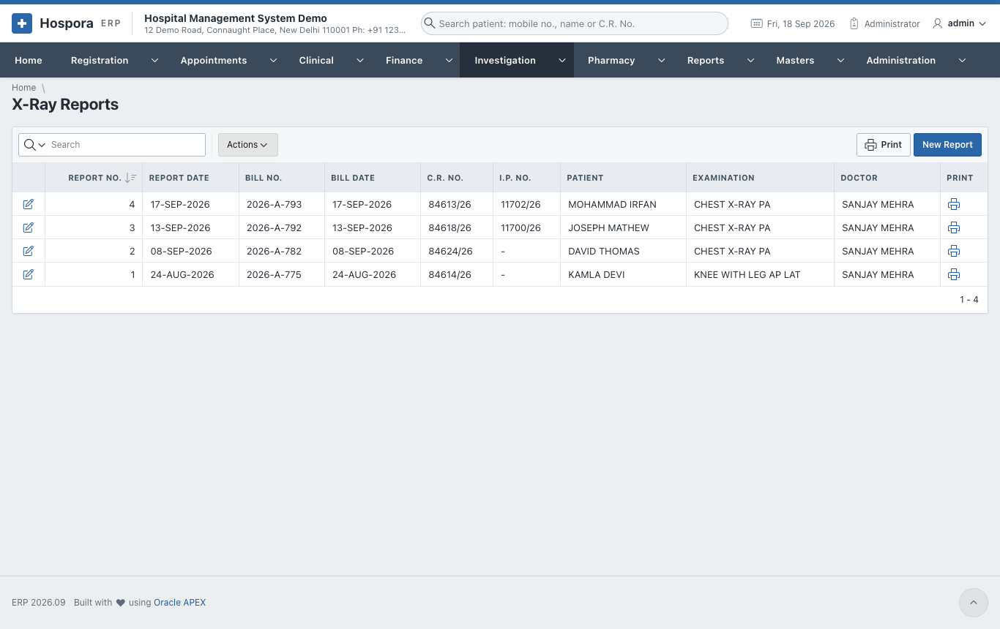
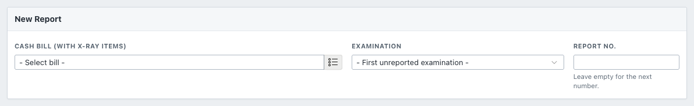
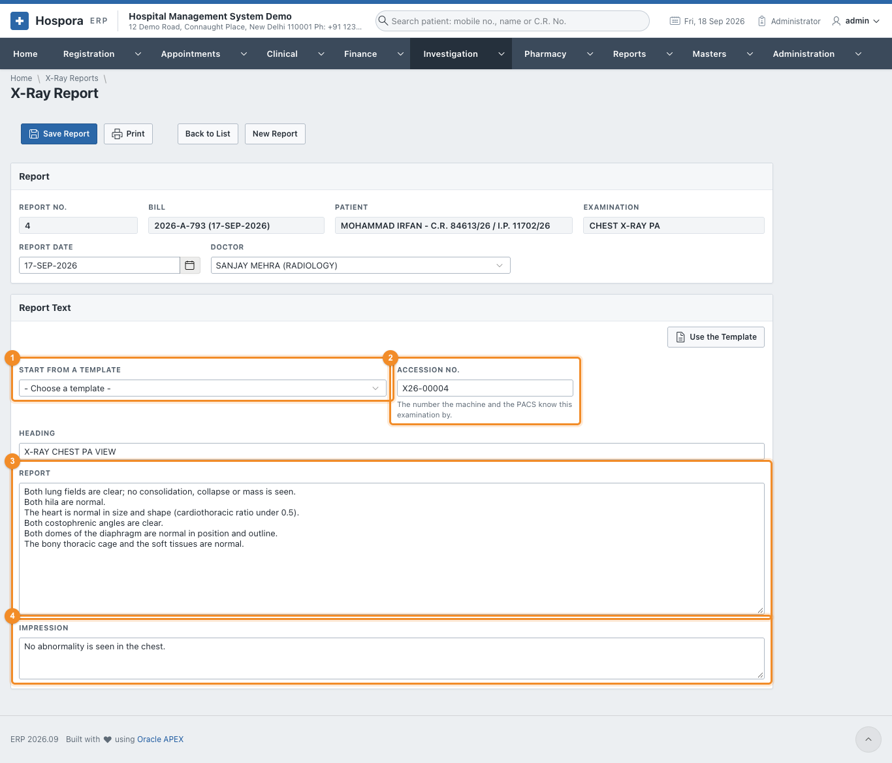
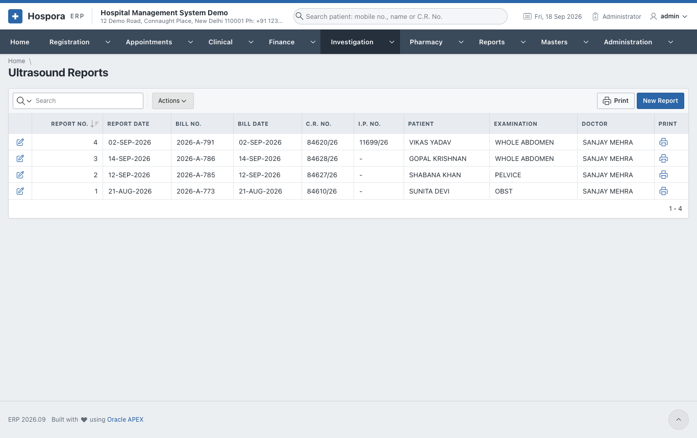
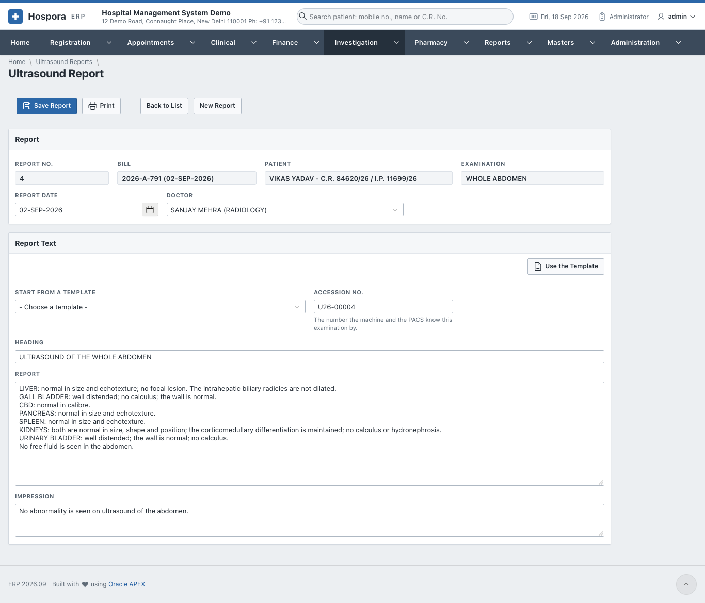
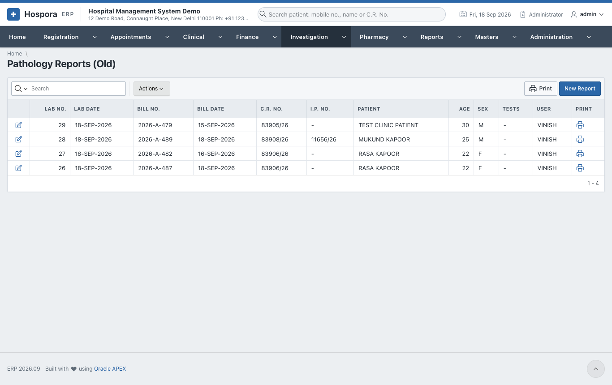

# X-Ray and Ultrasound

X-rays and ultrasounds are billed first, on a cash bill. The report is then written against that bill.

## X-ray reports

**Investigation > X-Ray Reports** lists the reports:

### Write a report

1. Click **New Report**:

    

2. Choose the **Cash Bill (with x-ray items)**, and the **Examination** on it (a bill may hold several).
   Leave **Report No.** empty for the next number.
3. Click **Create Report**. The report opens with the patient, the bill and the examination:

4. **Report Date** and **Doctor** (the radiologist).
5. 1 **Start from a Template**: choose a template, e.g. *Chest PA view - normal*,
   then **Use the Template**. The heading, findings and impression are filled in. Change what differs.
6. 2 **Accession No.**: the number the X-ray machine and the PACS know this
   examination by. It is given by itself.
7. 3 **Report** and 4 **Impression**.
8. Click **Save Report**, then **Print**. From the print window, **WhatsApp** tells the patient the report
   is ready.
9. **View the Images** opens the images in the hospital's PACS viewer, if its address is set in
   **Administration > Hospital Details**.

## Ultrasound reports

**Investigation > Ultrasound Reports** works the same way, with the ultrasound items of a bill and the
ultrasound templates.

## Pathology Reports (Old)

**Investigation > Pathology Reports (Old)** is the old way of reporting the tests of a bill, from before
lab orders. It is kept so that earlier reports can still be opened and printed. Its results are flagged
the same way. For every new test, use a [lab order](laboratory.md).

