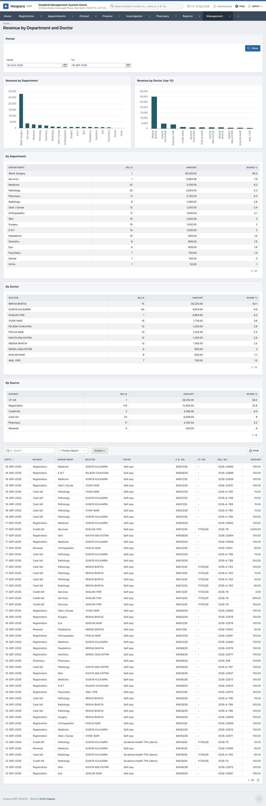
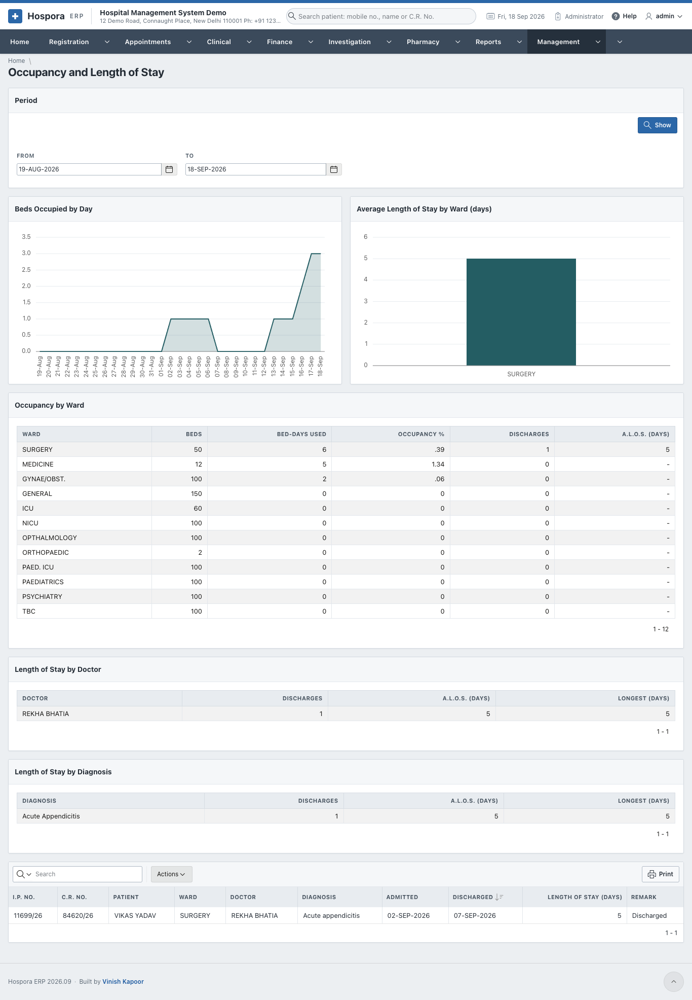
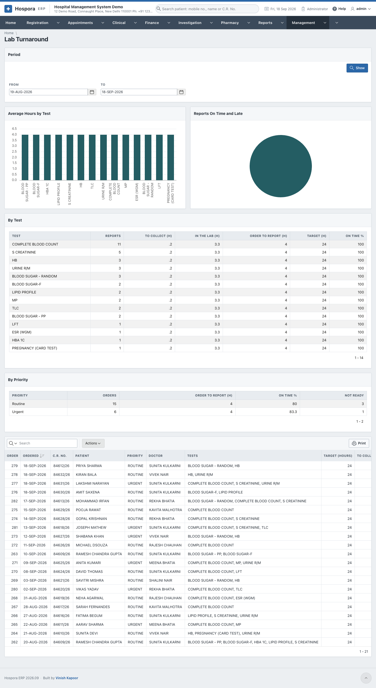
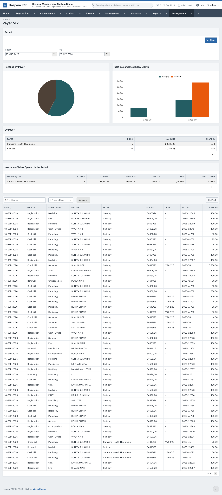
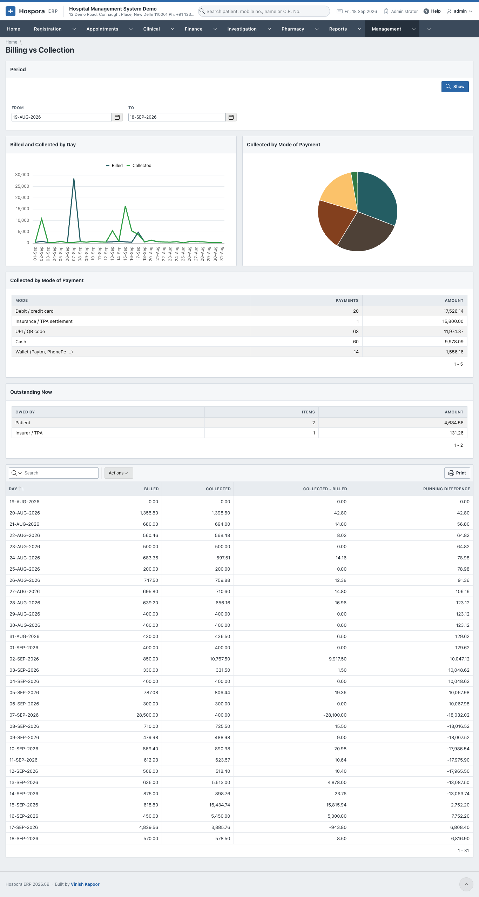

# Analyses

Each analysis has the period, two charts, summary tables, and then every line in an interactive report
(search, filter, save a view, download - see [how every report works](../reports/index.md#how-every-report-works)).

## Revenue by Department and Doctor

**Management > Revenue by Department and Doctor**. What was billed, by department, by doctor and by
source (registration, cash bill, credit bill, I.P. bill, pharmacy ...), each with its share of the whole.
The lines show every bill line with its department, doctor and payer. The saved views **By Department**
and **By Doctor** group the lines with a total for each.

!!! note
    A line without a doctor (a medicine bill, a bill made without one) is left out of the doctor summary
    but counted everywhere else.

## Occupancy and Length of Stay

**Management > Occupancy and Length of Stay**. The beds occupied day by day, and for every ward its beds,
the bed-days used, the occupancy and the discharges. Then the average and the longest stay by doctor and
by diagnosis. The lines are the patients discharged in the period.

## Lab Turnaround

**Management > Lab Turnaround**. For every test: the reports verified, the hours to collect the sample,
the hours in the laboratory, the hours from order to report, the target and the share on time. **By
Priority** compares Routine, Urgent and Stat orders, and counts those not ready yet. The lines are the
orders of the period, marked **On time**, **Late** or **Not ready**.

## Payer Mix

**Management > Payer Mix**. How much of the revenue each payer brings: self-paying patients, insurers,
TPAs and companies, with self-pay and insured month by month for a year. **Insurance Claims Opened in the
Period** shows, for each insurer or TPA, what was claimed, approved, settled, deducted as TDS and
disallowed.

## Billing vs Collection

**Management > Billing vs Collection**. Day by day, what was billed and what was collected, the
difference and the running difference. A negative running difference is money still to come in. The
summaries show the collection by mode of payment (cash, UPI, card, bank transfer, insurance settlement)
and who owes what today.

