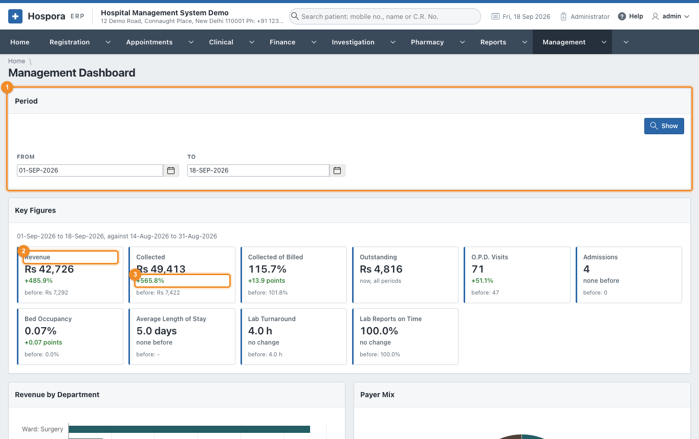
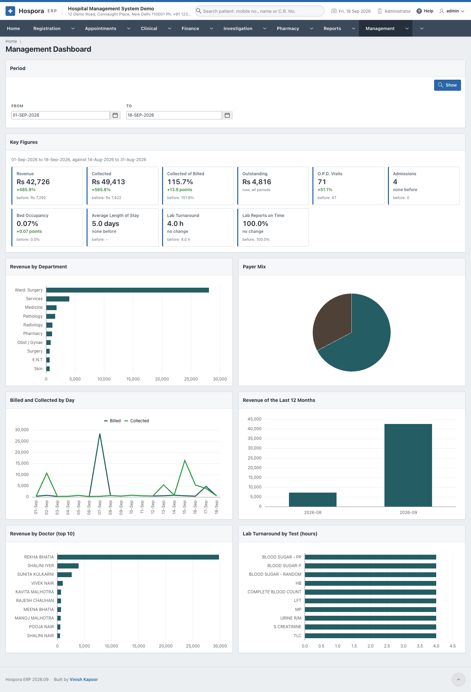

# Management Dashboard

**Management > Management Dashboard** puts the figures of a period side by side with the period of the
same length just before it. It opens on the current month to date, against the same number of days
before.

1. **Period**: choose **From** and **To** and click **Show**. The line under **Key Figures** says which
   period the figures are compared with.
2. **A figure**: its value for the period. Click the box to open the page behind it, for the same period
   (Revenue opens Revenue by Department and Doctor, Bed Occupancy opens Occupancy and Length of Stay ...).
3. **The change** against the period before: **green** when it is better, **red** when it is worse. For
   revenue more is better, for the average length of stay and the lab turnaround less is better. A
   percentage (occupancy, collected of billed) changes by **points**. **none before** means the earlier
   period had nothing to compare with. **Outstanding** is what is owed today, so it has no comparison.

| Figure | Meaning |
|---|---|
| Revenue | everything billed in the period |
| Collected | everything received in the period, less refunds |
| Collected of Billed | Collected as a percentage of Revenue; over 100% when old dues or advances came in |
| Outstanding | what patients and insurers owe today |
| O.P.D. Visits | new registrations and renewals |
| Admissions | patients admitted |
| Bed Occupancy | how full the wards were |
| Average Length of Stay | days in hospital of the patients discharged |
| Lab Turnaround | average hours from the order to the verified report |
| Lab Reports on Time | the share of reports verified within their target |

## The charts

Under the figures six charts show the same period: revenue by department, the payer mix, billed and
collected day by day, the revenue of the last twelve months, the ten doctors with the most revenue, and
the lab turnaround by test. Point at a bar or a slice to see its value.

!!! tip
    The figures are worked out when the page opens, from the bills and registers themselves. A bill
    saved a minute ago is already counted.
