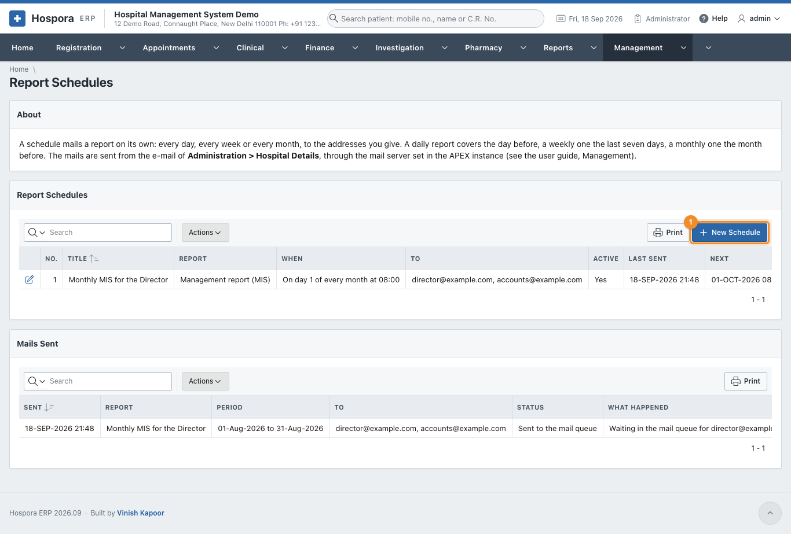
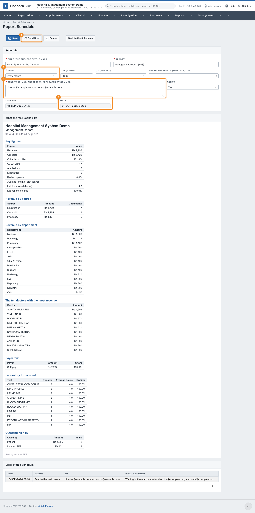

# Report Schedules

**Management > Report Schedules** mails a report on its own, every day, every week or every month, to
the addresses you give: the director gets the summary of the day each morning, the accountant the
collections each Monday, the owners the management report on the first of the month.

The upper list holds the schedules, with when each goes out, when it was last sent and when it goes next.
**Mails Sent** below is the log of every mail, with what happened to it.

## Add or change a schedule

Click **New Schedule** (1), or the pencil of a schedule to change it.

| Field | What to put in |
|---|---|
| **Title** | the subject of the mail; the hospital's name is added to it |
| **Report** | which report goes (see below) |
| **Send** (1) | **Every day**, **Every week** (then choose the day in **On**) or **Every month** (then the **Day of the Month**, 1 to 28) |
| **At** | the time, as HH:MI in 24 hours, e.g. 07:00 or 18:30 |
| **Send To** (2) | one or more e-mail addresses, separated by commas |
| **Active** | **No** stops the schedule without deleting it |

Click **Save**. **Next** (3) shows when the mail will go. **What the Mail Looks Like** shows the report as it
would be sent now, and **Mails of this Schedule** lists what was sent. **Send Now** (4) sends it at once,
without waiting for its time.

| Report | What it holds |
|---|---|
| **Summary of the day** | the key figures, revenue by source and by department, collection by mode of payment |
| **Management report (MIS)** | the key figures, revenue by source, department and the ten top doctors, the payer mix, the lab turnaround by test, what is owed now |
| **Collections** | collection by mode of payment and by user |
| **Outstanding dues** | what is owed now, by patients and insurers, and the largest dues with how many days old they are |

The period follows the frequency: a daily report covers **yesterday**, a weekly one **the last seven
days**, a monthly one **the month before**. Outstanding dues are always as on the moment the mail goes.

## Setting up e-mail

The mails are sent from the e-mail address of the hospital in
[Administration > Hospital Details](../administration/settings.md#hospital-details), through the mail
server of the Oracle APEX instance.

- On **apex.oracle.com** the mail server is already set: give the hospital an e-mail address and the
  schedules work.
- On your own server, the database administrator sets the SMTP server once, in **APEX Administration
  Services > Manage Instance > Instance Settings > Email** (host, port, user and password of the mail
  account).

Until then, a mail waits in the APEX mail queue and **Mails Sent** says *Waiting in the mail queue*. A mail
the server refused says *Not sent* with the reason. A job looks every 15 minutes for the schedules whose
time has come.

!!! warning
    A report holds the hospital's figures. Send it only to addresses inside the hospital.
