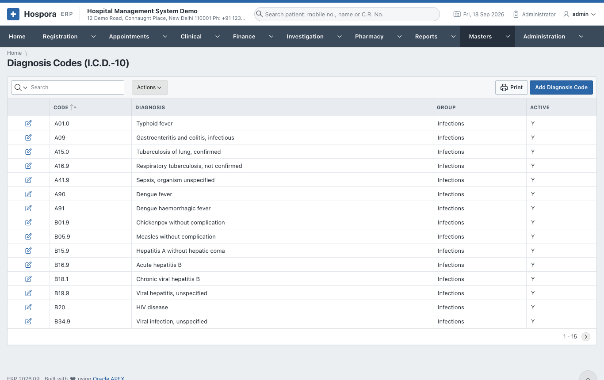
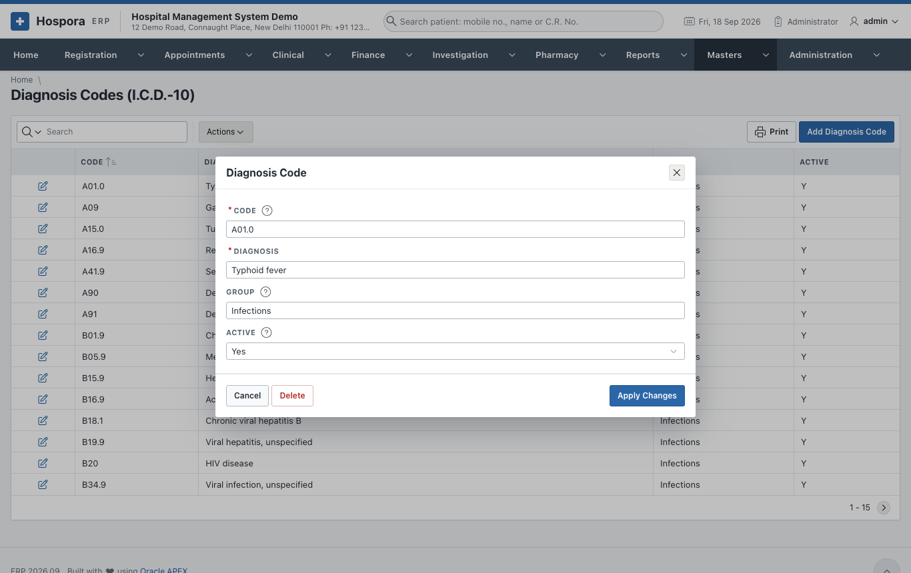
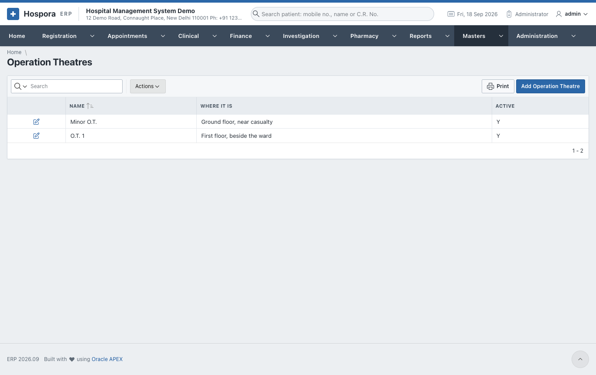
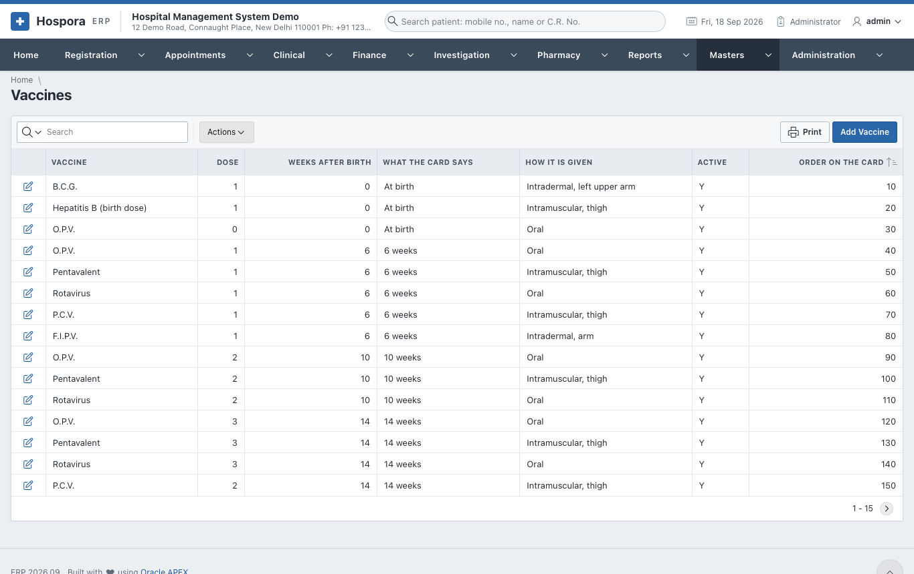
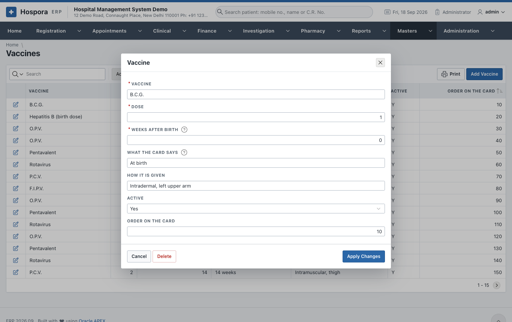

# Clinical Lists

## Diagnosis Codes (I.C.D.-10)

The diagnoses doctors choose from on consultations, discharge summaries, operations, casualty cases and
deaths:

- **Code**: the I.C.D.-10 code, e.g. *J06.9*. It cannot be changed afterwards.
- **Diagnosis**: the words shown.
- **Group**: what it belongs to, e.g. *Breathing* or *Injury*.
- **Active**: a code switched off stays on the records that already carry it, but is no longer offered.

Add the codes your doctors use most. The list comes with the common ones.

## Operation Theatres

The theatres an [operation](../clinical/operations.md) is booked in: **Name** (O.T. 1, Minor O.T., Labour
Room ...), **Where It Is**, and **Active**.

## Vaccines

The vaccination schedule the [immunisation card](../clinical/mother-child.md#immunisation) is made from.
One row per dose:

- **Vaccine** and **Dose**;
- **Weeks after Birth**: when the dose falls due, counted from the day the child was born. 0 is at birth;
- **What the Card Says**, e.g. *6 weeks* or *9 completed months*;
- **How It Is Given**, **Active**, and the **Order on the Card**.

