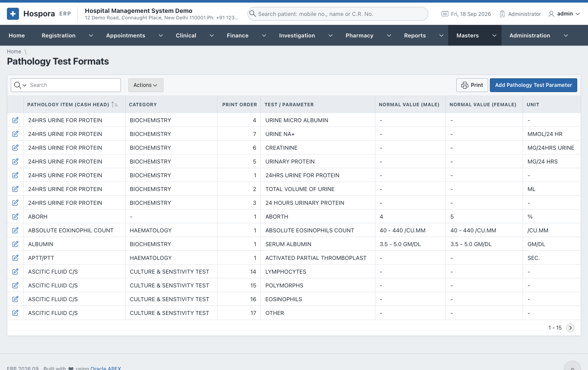
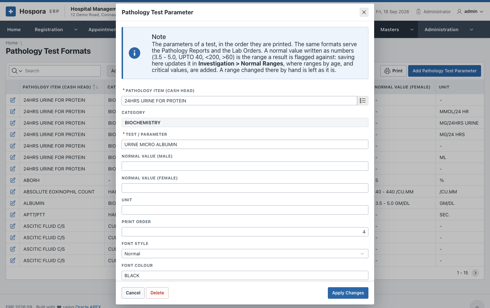
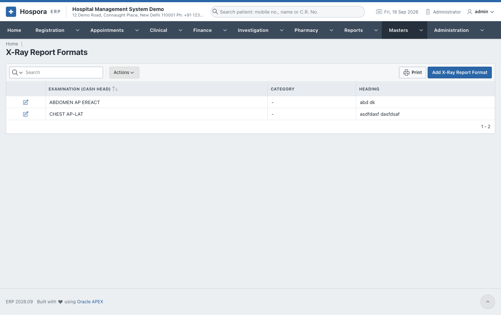
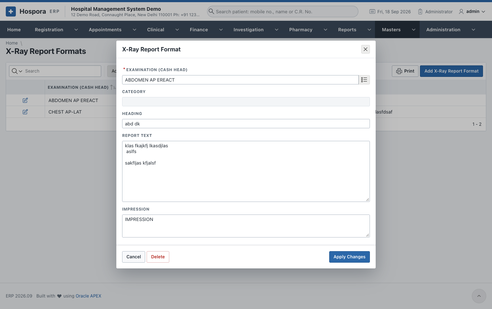

# Report Formats

## Pathology Test Formats

The parameters of every laboratory test, e.g. the six values of a lipid profile, each on its own row:

- **Pathology Item (cash head)**: the test, from the tariff;
- **Test / Parameter**: e.g. *SERUM CHOLESTEROL*;
- **Normal Value (Male)** and **Normal Value (Female)**, e.g. *150-260 MG/DL*, and the **Unit**;
- **Print Order**, **Font Style** and **Font Colour**: how the report is laid out.

Saving a format also keeps the [Normal Ranges](../investigation/lab-settings.md#normal-ranges) of the
laboratory in step. A normal value written here becomes the range of the parameter, unless a more exact
range by age and sex has been set there.

## X-Ray, Ultrasound, MRI and CT-Scan Report Formats

The standard text of each examination: the **Examination (cash head)**, the **Heading**, the **Report
Text** and the **Impression**. A new report of that examination starts from it.

The [Radiology Templates](../investigation/lab-settings.md#radiology-templates) of the Investigation menu
add more ready texts (normal and abnormal findings) for the radiologist to choose from.
