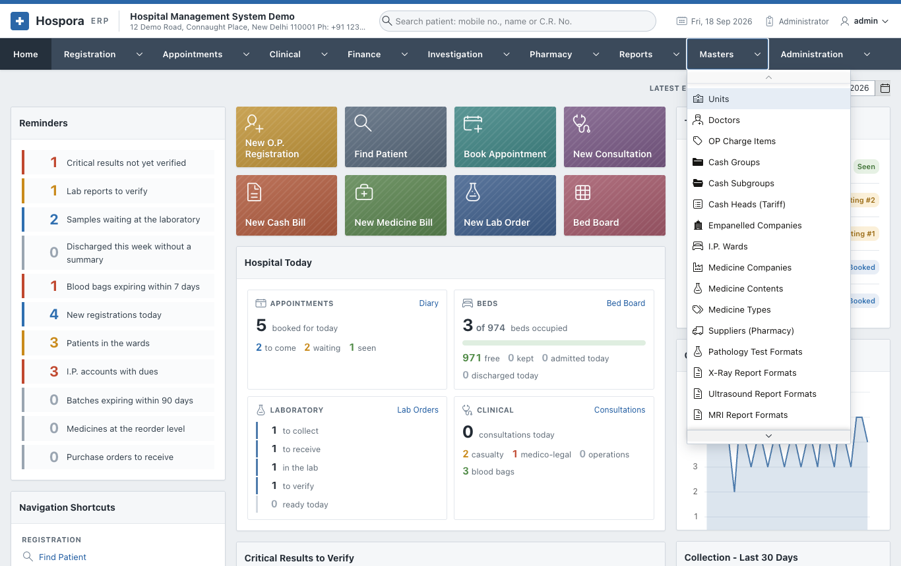

# Masters

The **Masters** menu holds the lists the rest of the application uses:

- units and doctors;
- the tariff of charges and the empanelled companies;
- wards, and the items of the I.P. bill;
- the medicine lists and suppliers;
- the report formats of the laboratory and radiology;
- diagnosis codes, operation theatres and vaccines.

They are set up once and changed only now and then, usually by an administrator.

| Page | Masters |
|---|---|
| [Hospital and Tariff](tariff.md) | Units, Doctors, OP Charge Items, Cash Groups, Cash Subgroups, Cash Heads (Tariff), Empanelled Companies, I.P. Wards, I.P. Bill Items |
| [Pharmacy Lists](pharmacy.md) | Medicine Companies, Medicine Contents, Medicine Types, Suppliers (Pharmacy) |
| [Report Formats](formats.md) | Pathology Test Formats, X-Ray, Ultrasound, MRI and CT-Scan Report Formats |
| [Clinical Lists](clinical.md) | Diagnosis Codes (I.C.D.-10), Operation Theatres, Vaccines |

## How every master works

Every master is a list, with the same buttons:

- **Add ...** (top right) adds a new entry in a small window. Fill it in and click **Create**.
- The **pencil** of a row opens it. Change it and click **Apply Changes**, or **Delete** it.
- **Search**, **Actions** and **Print** work as in the [reports](../reports/index.md#how-every-report-works).

!!! warning "Deleting"
    An entry that bills or registrations already use (a doctor, a cash head, a ward) should be switched
    off, not deleted: the old records still point to it. Where a master has **Active** or **Is Active?**,
    set it to **No** instead.
