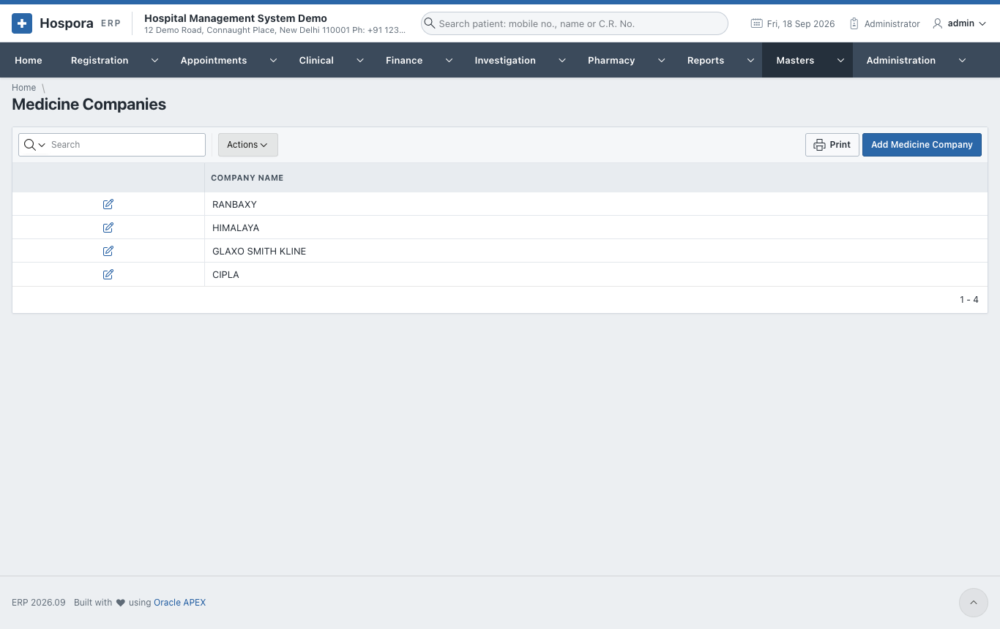
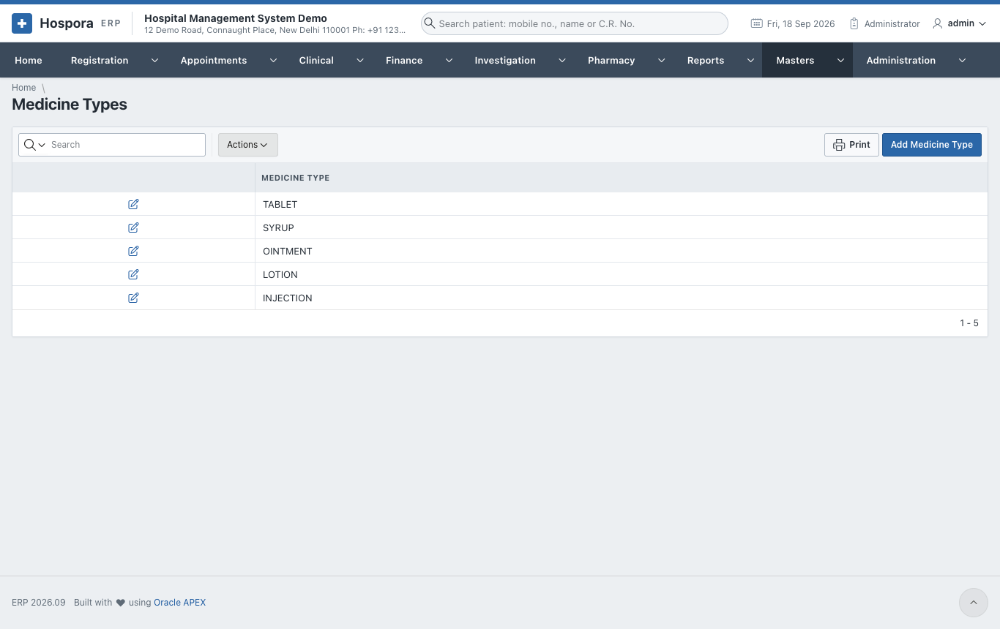
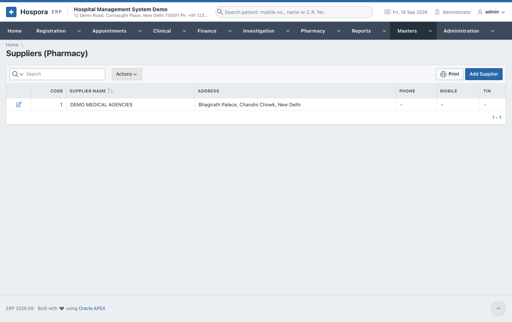
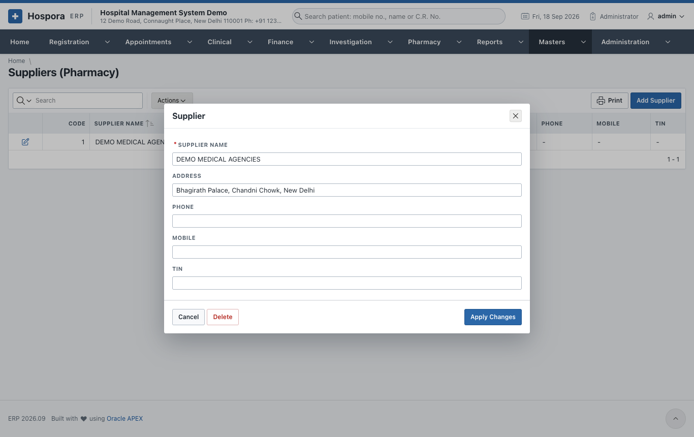

# Pharmacy Lists

These short lists give the [medicines](../pharmacy/stock.md#medicines) their company, content and type, and
the purchases their supplier.

| Master | Holds |
|---|---|
| **Medicine Companies** | the manufacturers, e.g. Cipla, Sun Pharma |
| **Medicine Contents** | the contents or categories, e.g. paracetamol, antibiotic |
| **Medicine Types** | tablet, capsule, syrup, injection, ointment ... |
| **Suppliers (Pharmacy)** | the distributors the pharmacy buys from: name, address, phone, mobile and tax number |

