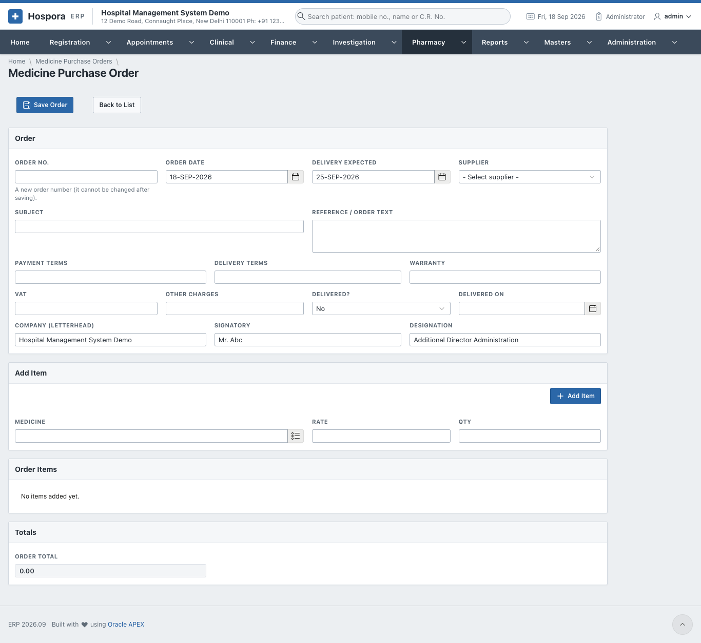
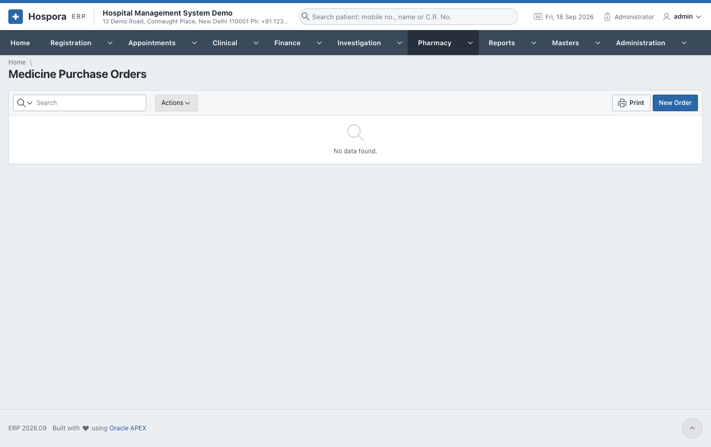
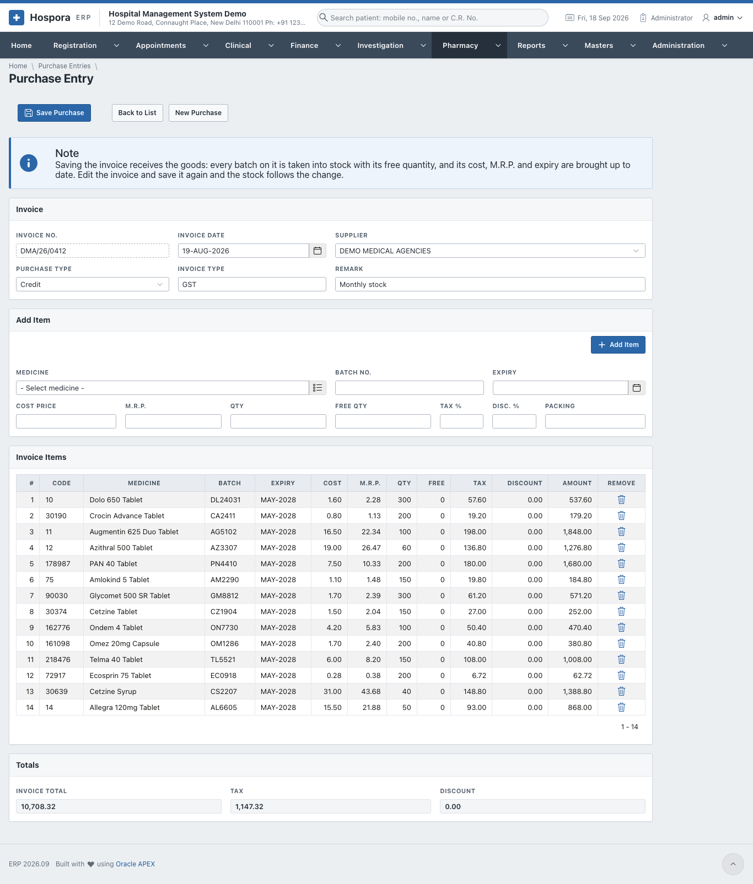
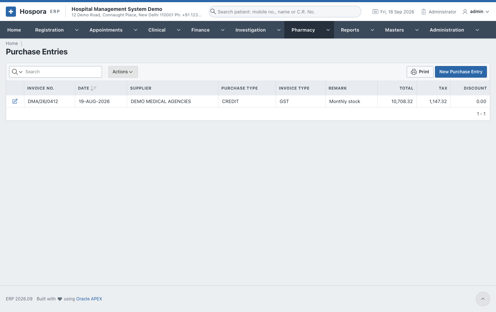

# Buying Medicines

## Medicine purchase orders

**Pharmacy > Medicine Purchase Orders** lists the orders sent to suppliers. **New Order**:

1. **Order**:
    - a new **Order No.** (it cannot be changed after saving), the **Order Date** and **Delivery
      Expected**;
    - the **Supplier**, a **Subject** and the **Reference / Order Text**;
    - the **Payment Terms**, **Delivery Terms** and **Warranty**;
    - **VAT** and **Other Charges**;
    - the letterhead **Company**, the **Signatory** and the **Designation**.
2. **Add Item**: the **Medicine**, **Rate** and **Qty**, for each line.
3. **Save Order** and **Print** it to send to the supplier.
4. When the goods arrive, set **Delivered?** and **Delivered On**, then make the
   [purchase entry](#purchase-entries).

The printed order's settings (letterhead, terms) are in **Administration > Purchase Order Settings**.

## Purchase entries

**Pharmacy > Purchase Entries** receives the supplier's invoice into stock. **New Purchase Entry**:

1. **Invoice**:
    - the **Invoice No.**, **Invoice Date** and **Supplier**;
    - the **Purchase Type** (cash or credit), the **Invoice Type** and a **Remark**.
2. **Add Item**, for each line of the invoice:
    - the **Medicine**, **Batch No.** and **Expiry**;
    - the **Cost Price**, **M.R.P.**, **Qty** and **Free Qty**;
    - the **Tax %**, **Disc. %** and **Packing**.
3. **Totals** shows the **Invoice Total**, the **Tax** and the **Discount**. Check them against the paper
   invoice.
4. Click **Save Purchase**. Every batch on the invoice is taken into stock with its free quantity. Its
   cost, M.R.P. and expiry are brought up to date.

To correct an invoice, open it, change it and save it again. The stock follows the change.

