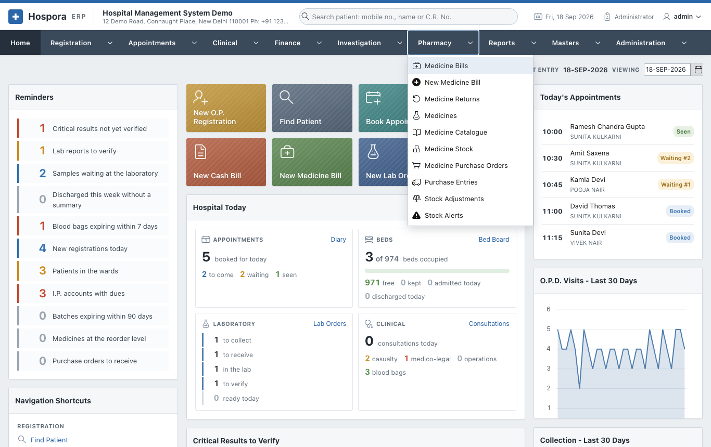

# Pharmacy

The **Pharmacy** menu sells medicines and keeps their stock, batch by batch:

- what came in on a purchase invoice;
- what was sold, returned or thrown away;
- what is about to expire or run out.

| Page | Options |
|---|---|
| [Selling Medicines](selling.md) | Medicine Bills / New Medicine Bill, Medicine Returns |
| [Medicines and Stock](stock.md) | Medicines, Medicine Catalogue, Medicine Stock, Stock Adjustments, Stock Alerts |
| [Buying Medicines](buying.md) | Medicine Purchase Orders, Purchase Entries |

Every sale, return and purchase moves the stock by itself. Each movement is kept, so the stock of a batch
can always be explained (**Reports > Stock Movements**).
