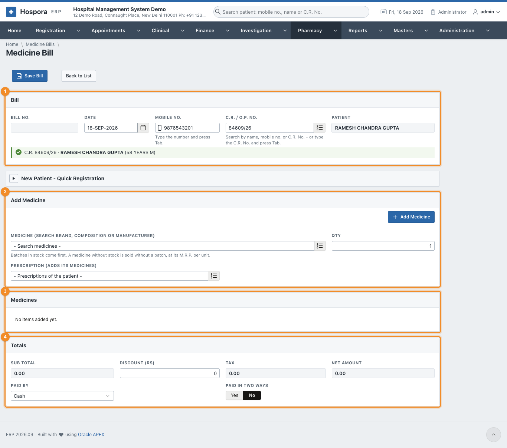
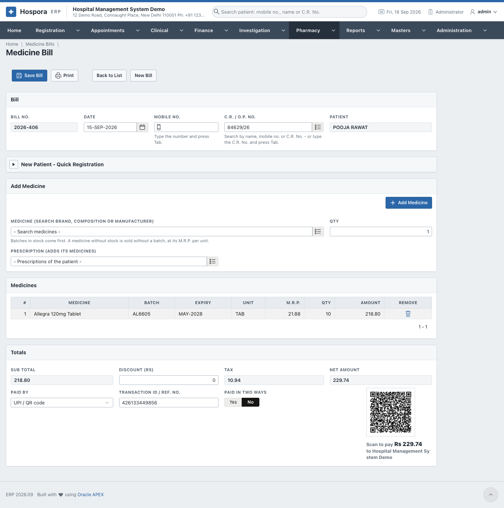
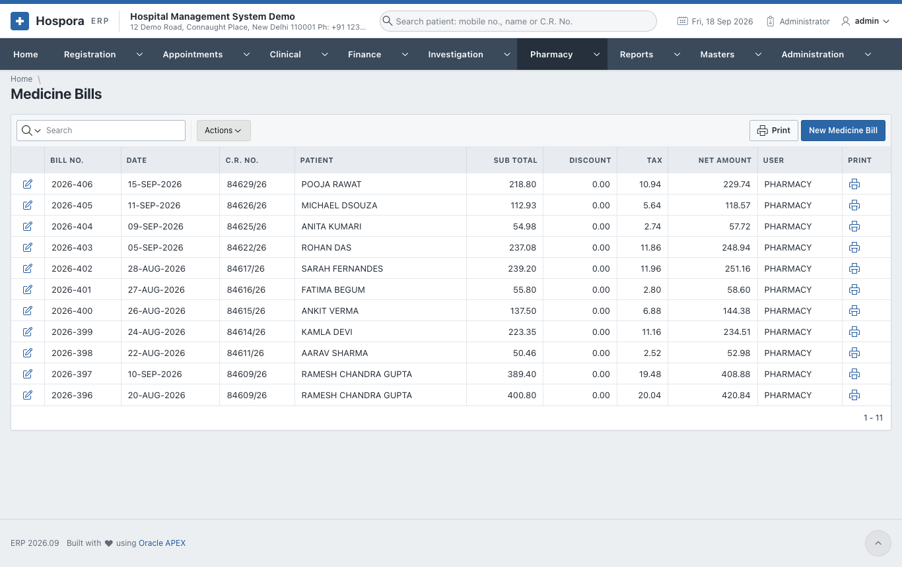
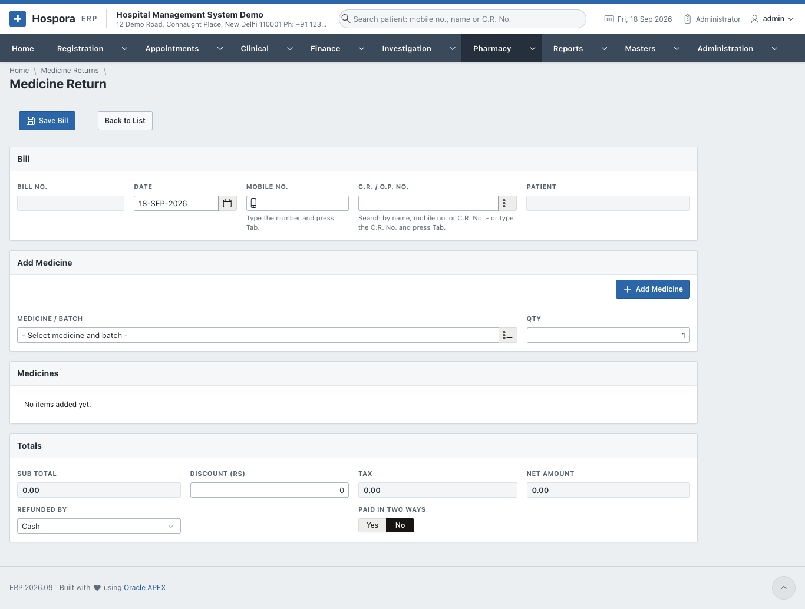
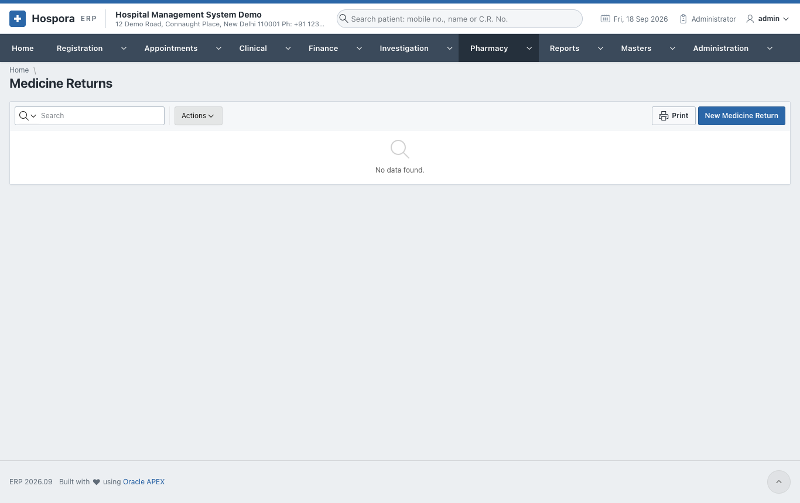

# Selling Medicines

## Medicine bills

Open **Pharmacy > New Medicine Bill**, or the **New Medicine Bill** tile on the Home page.

1. 1 **Bill**:
    - the **Date**;
    - the patient by **Mobile No.** (press ++tab++) or **C.R. / O.P. No.**
    - A walk-in can be registered in **New Patient - Quick Registration**.
2. 2 **Add Medicine**:
    - **Medicine**: search by the brand, the composition (e.g. *paracetamol*) or the manufacturer. Batches
      in stock come first, each with its expiry and M.R.P.;
    - **Qty**, then **Add Medicine**;
    - **Prescription (adds its medicines)**: choose one of the patient's prescriptions to add all its
      medicines, in the quantities the doctor worked out.
3. 3 **Medicines** lists the lines. The bin icon removes one.
4. 4 **Totals**: the **Sub Total**, a **Discount (Rs)**, the **Tax** and the **Net
   Amount**. Choose **Paid By**; UPI shows its QR code.
5. Click **Save Bill**, then **Print**.

**Pharmacy > Medicine Bills** lists the bills:

## Medicine returns

A patient brings back medicines they did not use. Open **Pharmacy > Medicine Returns** and **New Medicine
Return**:

1. The patient, as on a bill.
2. **Add Medicine**: the medicine and batch returned, and the **Qty**.
3. **Refunded By**: how the money is given back.
4. **Save Bill** and **Print**. The medicines go back into the stock of their batch.

