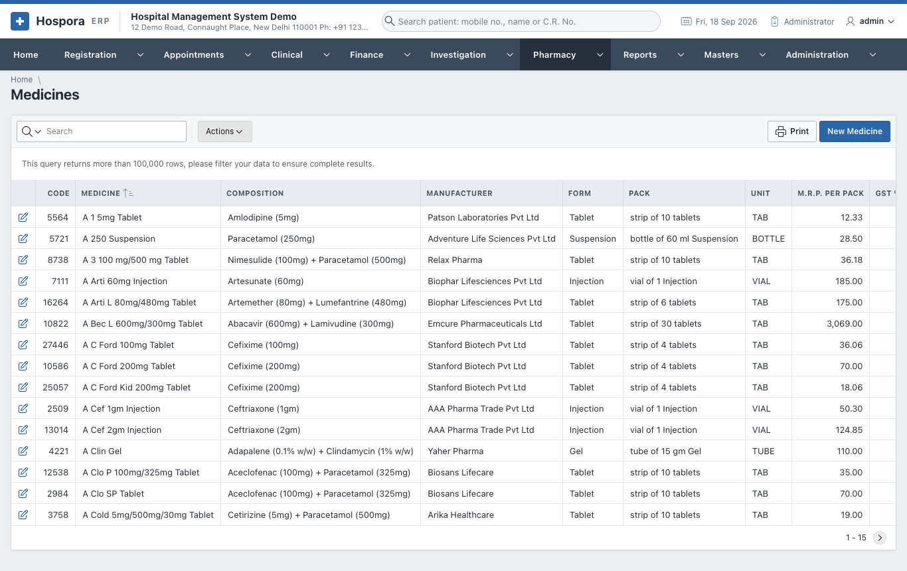
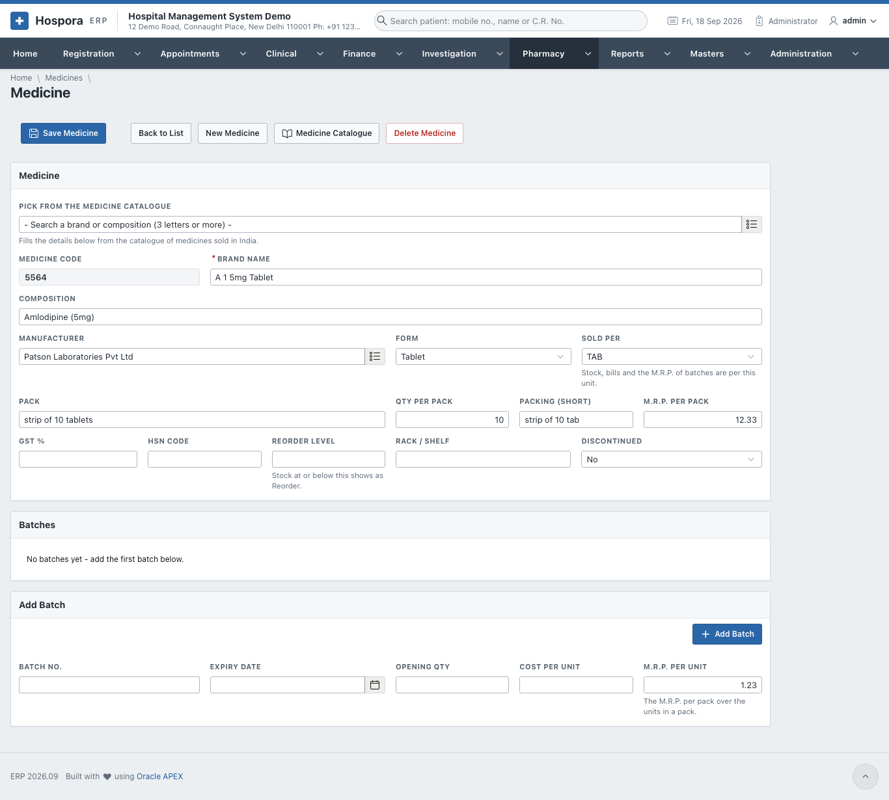
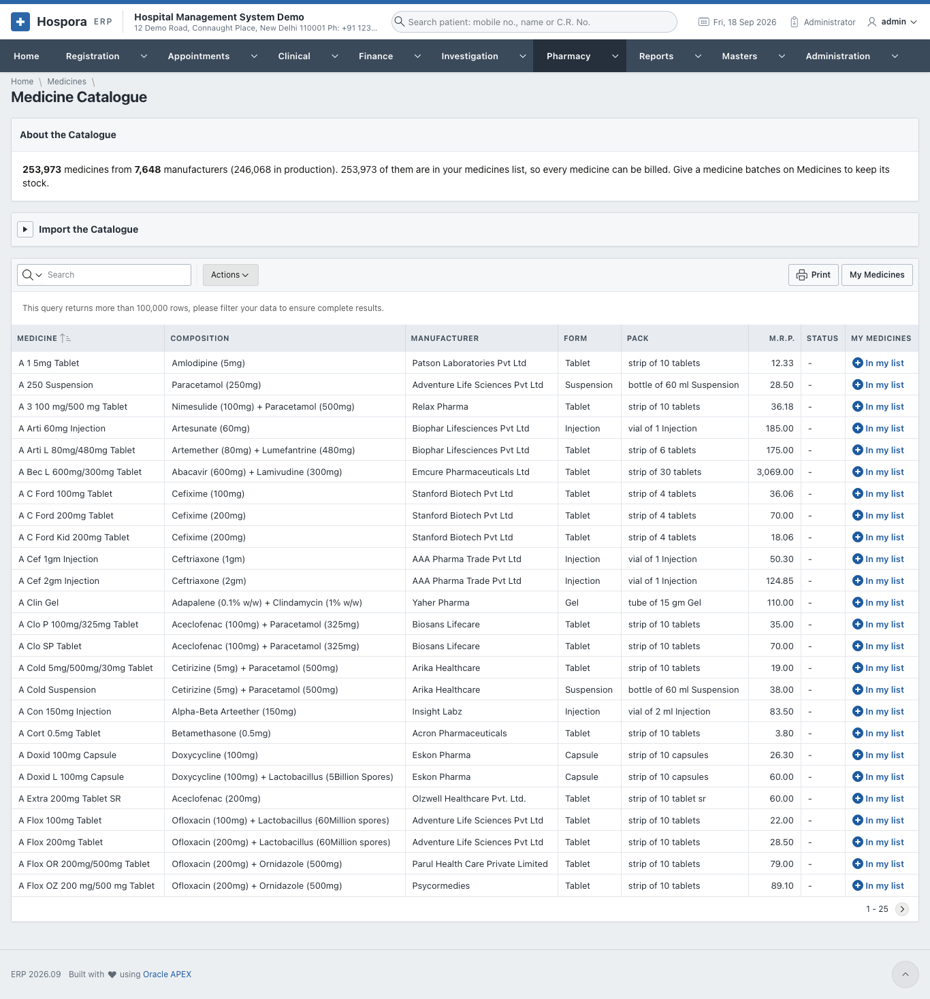
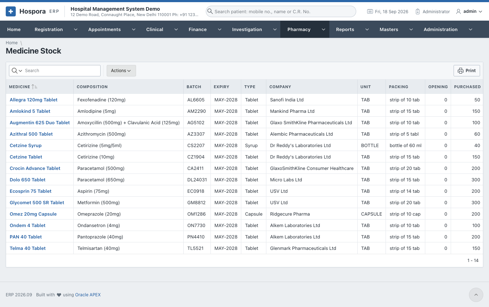
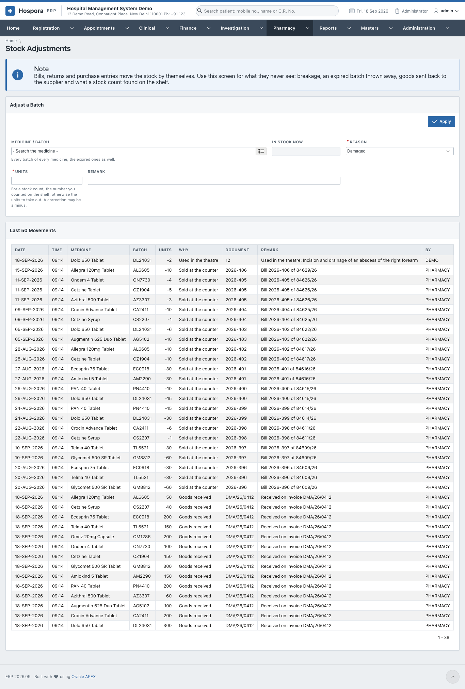
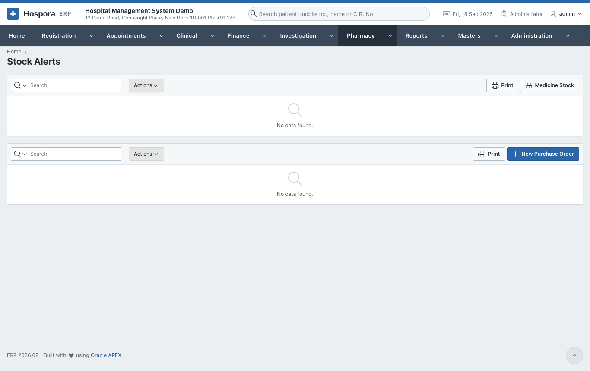

# Medicines and Stock

## Medicines

**Pharmacy > Medicines** lists the medicines the pharmacy keeps:

Open one with its pencil, or **New Medicine**:

- **Medicine**:
    - the **brand name**, **type** (tablet, syrup, injection ...) and **company**;
    - the **composition**, **unit** and **packing**;
    - the **HSN code** and **GST rate**;
    - the **reorder level** and the **rack**.
- **Batches** lists each batch with its expiry, cost, M.R.P. and the stock in hand.
- **Add Batch** adds a batch by hand, e.g. the opening stock. Batches normally come in with a
  [purchase entry](buying.md#purchase-entries).

## Medicine Catalogue

**Pharmacy > Medicine Catalogue** holds a large list of medicines sold in India: brand, composition,
manufacturer, pack size and M.R.P. Search it, and add a medicine to **Medicines** in one click instead of
typing it.

- **About the Catalogue** tells how many medicines it holds and when it was loaded.
- **Import the Catalogue** loads a newer CSV file (the *A-Z medicines dataset of India*).
- The link in each row adds that medicine to **Medicines** (or opens it, if it is already there).
- **Add All to Medicines** adds every catalogue medicine not yet in the pharmacy's list.
- **My Medicines** goes back to the pharmacy's own list.

## Medicine Stock

**Pharmacy > Medicine Stock** shows the stock of every batch: in hand, sold, purchased, returned, with
the expiry. Use **Actions** to filter by medicine, company or expiry.

## Stock Adjustments

Bills, returns and purchase entries move the stock by themselves. **Pharmacy > Stock Adjustments** records
what they never see:

- breakage;
- an expired batch thrown away;
- goods sent back to the supplier;
- the result of a stock count.

1. **Medicine / Batch**: every batch of every medicine, the expired ones too. **In Stock Now** shows its
   stock.
2. **Reason**: **Damaged**, **Expired**, **Returned to the supplier**, **Counted (stock check)** or
   **Correction**.
3. **Units**:
    - for a stock count, the number you counted on the shelf;
    - otherwise, the units to take out.
4. **Remark**, then **Apply**. **Last 50 Movements** shows the change.

## Stock Alerts

**Pharmacy > Stock Alerts** shows two lists:

- **Expiry**: batches in stock that expire within three months;
- **Running Out**: medicines at or below their reorder level.

**New Purchase Order** starts an order for what is running out.

