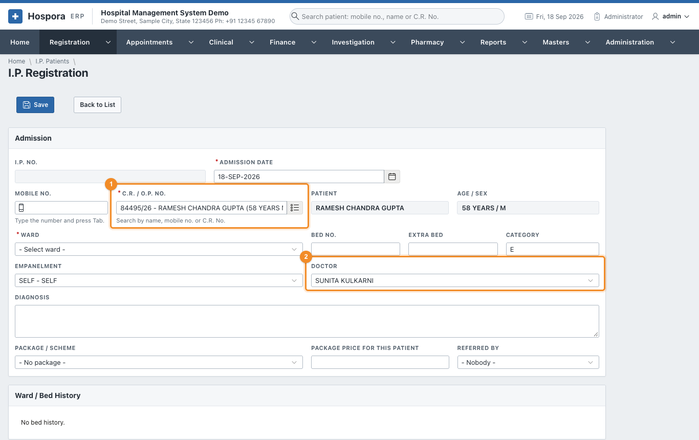
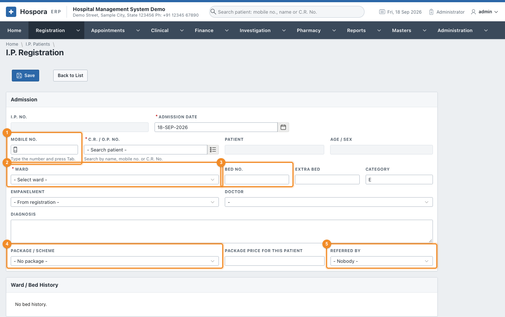
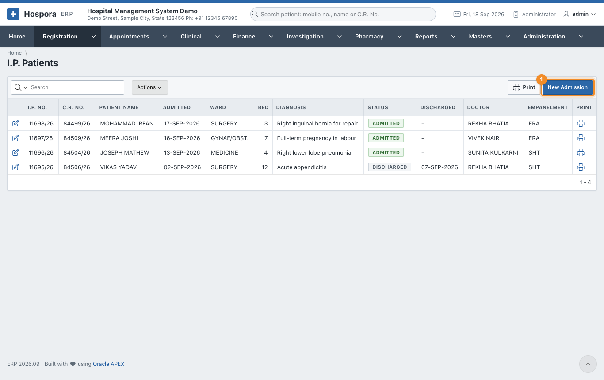
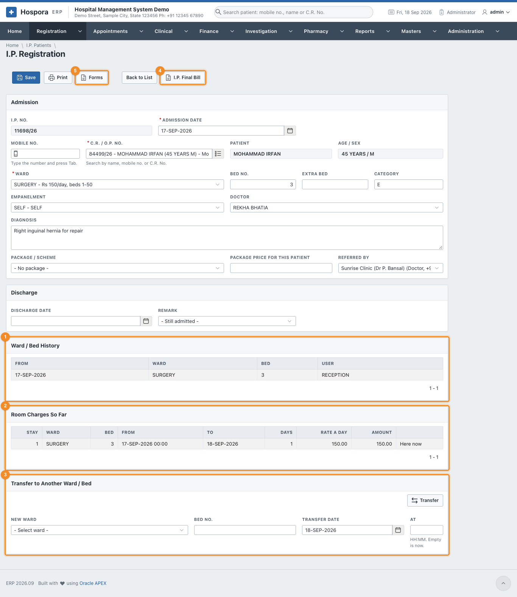

# I.P. Admission

Admit a registered patient to a ward and a bed. The admission gets an **I.P. No.** (in-patient number).
The ward charges, the bills of the stay, the ward chart and the final bill all follow that number.

!!! note "Register first"
    Only a registered patient can be admitted. A new patient is first registered with
    [New O.P. Registration](op-registration.md), or with the quick registration of
    [Find Patient](find-patient.md#quick-registration-of-a-walk-in) in an emergency.

## Admit a patient

The quickest way: find the patient in [Find Patient](find-patient.md) and click **Admit**. The admission
form opens with 1 the patient and 2 the doctor the patient is
registered with already filled in:

Or open **Registration > I.P. Admission** and choose the patient yourself:

1. 1 Type the **Mobile No.** and press ++tab++, or search the **C.R. / O.P. No.**
   The patient's name, age and sex appear.
2. Check the **Admission Date** (today by default).
3. 2 **Ward**: the list shows the rate a day and the range of bed numbers of every
   ward.
4. 3 **Bed No.**: a bed of that ward. A bed that another patient is in, or that is
   kept for somebody else, is refused. Look at the [Bed Board](beds.md) to find a free one.
5. **Category**, **Empanelment** (the company or TPA that pays, or SELF) and **Doctor**.
6. **Diagnosis**: the reason for admission.
7. 4 **Package / Scheme**: for a package such as a normal delivery, choose it here.
   **Package Price for This Patient** starts at the package's price and can be changed. The I.P. final bill
   then charges the package instead of the items it includes.
8. 5 **Referred By**: the clinic or doctor who sent the patient.
9. Click **Save**. The admission gets its **I.P. No.**

Next, take an advance from the patient in **Finance > Advance Receipts**.

## An admission in progress

Open **Registration > I.P. Patients** and click the pencil of the patient:

- 1 **Ward / Bed History**: every ward and bed the patient has been in, from which
  day, and who moved them.
- 2 **Room Charges So Far**: the days in each ward and bed at its daily rate, up to
  today. **Here now** marks the current bed.
- 3 **Transfer to Another Ward / Bed**: see below.
- 4 **I.P. Final Bill**: opens the final bill of this admission in Finance.
  Saving the final bill discharges the patient.
- 5 **Forms**: prints a consent, a referral letter or another form for this
  patient, filled in with the admission's details (see Clinical > Consents and Forms).
- **Print** prints the admission slip.

### Transfer to another ward or bed

1. In **Transfer to Another Ward / Bed**, choose the **New Ward** and **Bed No.**
2. Check the **Transfer Date**. **At** is the time (HH:MM); leave it empty for now.
3. Click **Transfer**.

The move is added to the bed history. The room charges count the old bed up to the move and the new one
from then on.

### Discharge

The usual way is the **I.P. Final Bill**: saving it discharges the patient. To record a discharge
without a bill (for example, a patient who left against advice), fill in **Discharge** and **Save**:

- **Discharge Date**;
- **Remark**: Discharged, LAMA (left against medical advice), Referred, Absconded, Expired or DOPR.

!!! question "Something went wrong?"
    - *"Bed ... is kept for ..."*: the bed is reserved on the [Bed Board](beds.md). Choose another bed,
      or release the reservation there.
    - *The doctor is empty*: the patient's registration has no doctor. Choose one; the patient's next
      screens will then suggest it.
