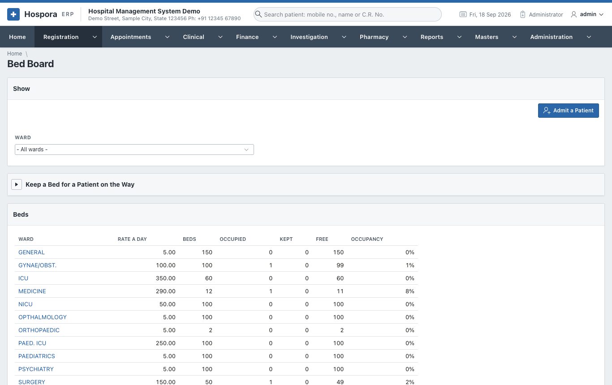
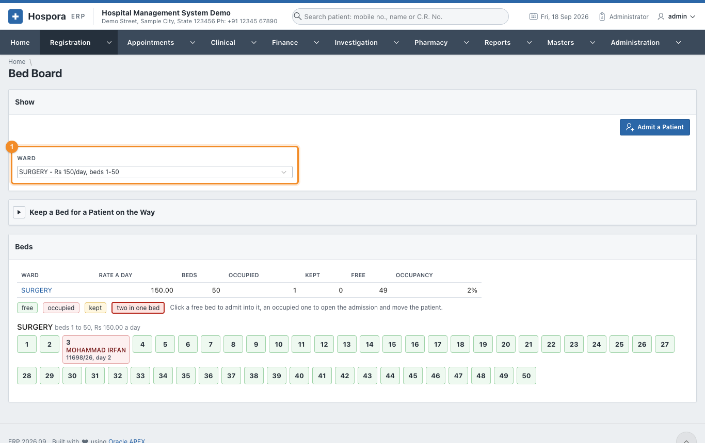
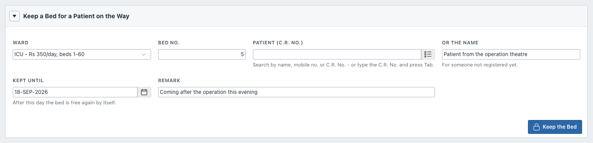
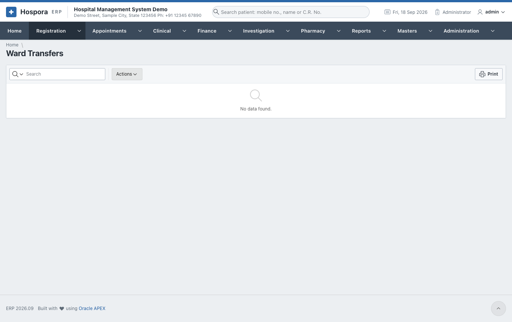

# Bed Board and Ward Transfers

## Bed Board

**Registration > Bed Board** shows every ward at a glance: its beds, how many are occupied, kept or free,
and the occupancy.

Choose a 1 **Ward** to see its beds one by one:

| Colour | Meaning |
|---|---|
| green | **free**: click it to admit a patient into this bed |
| red | **occupied**: shows the patient's name, I.P. No. and the day of the stay. Click it to open the admission, e.g. to move the patient. |
| yellow | **kept** for a patient on the way (see below) |
| red frame | **two in one bed**: two admissions share the bed, one of them on an extra bed |

**Admit a Patient** opens an empty [admission](admission.md).

### Keep a bed for a patient on the way

A bed can be held for a patient who is coming: from the operation theatre, from another hospital, or
from casualty. Open **Keep a Bed for a Patient on the Way**:

1. Choose the **Ward** and **Bed No.**
2. Choose the **Patient (C.R. No.)**, or type **Or the Name** for someone not registered yet.
3. **Kept Until**: after this day the bed is free again by itself.
4. A **Remark**, e.g. *coming after the operation this evening*.
5. Click **Keep the Bed**.

The bed turns yellow. Nobody else can be admitted into it. When the patient arrives, click the bed to
admit them.

## Ward Transfers

**Registration > Ward Transfers** lists every move of every patient between wards and beds: who moved,
from where, to where, and when. Use **Actions** to filter it, for example by ward or by day.

A transfer itself is made on the patient's [admission](admission.md#transfer-to-another-ward-or-bed).
