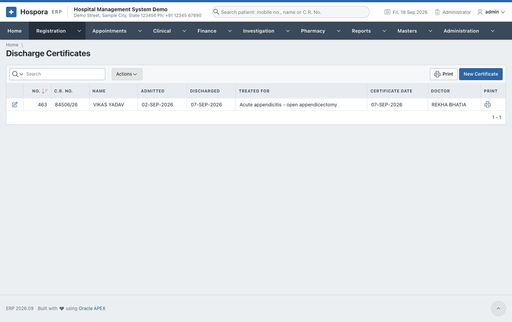
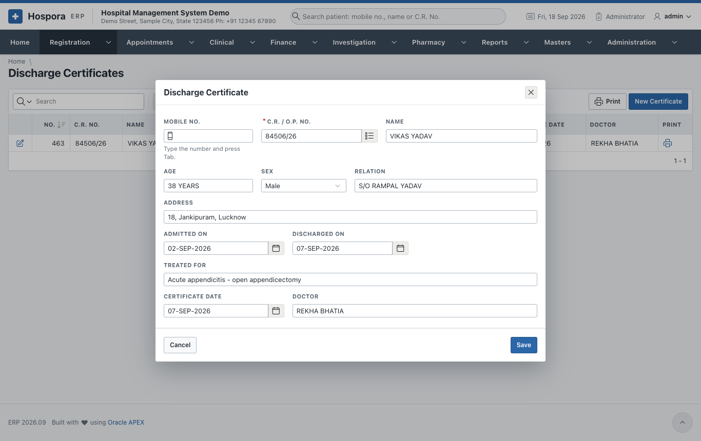
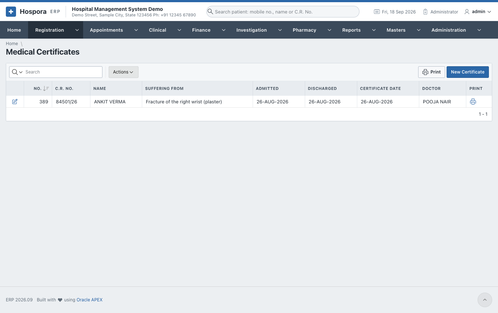
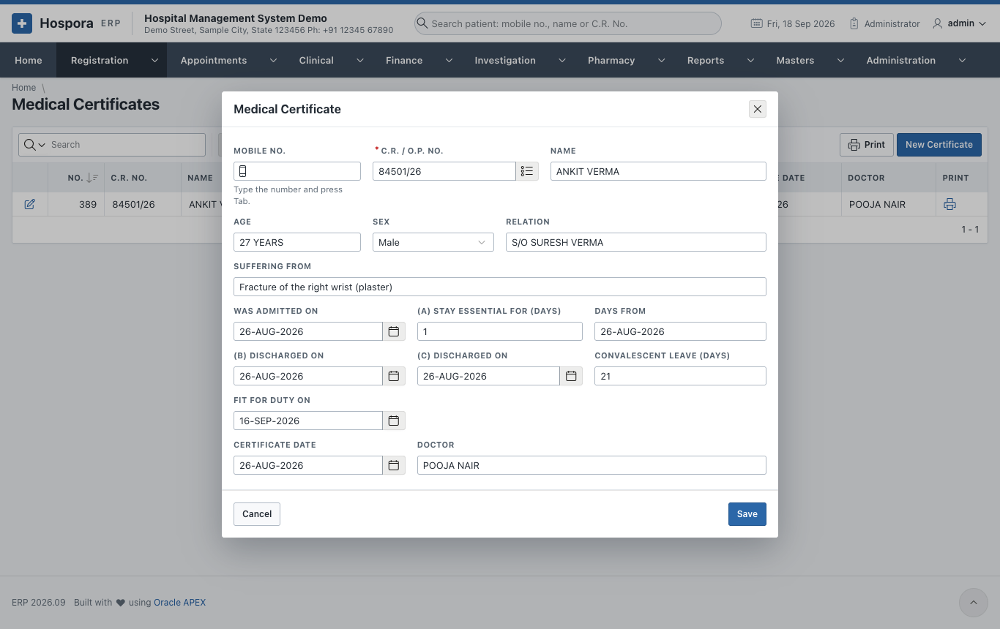

# Certificates

## Discharge Certificates

**Registration > Discharge Certificates** lists the discharge certificates issued. **New Certificate**
opens an empty certificate, and the pencil of a row opens one to correct it.

1. Type the **Mobile No.** and press ++tab++, or search the **C.R. / O.P. No.** The patient's **Name**,
   **Age**, **Sex**, **Relation** and **Address** fill in.
2. **Admitted On** and **Discharged On**.
3. **Treated For**: the illness or operation.
4. **Certificate Date** and **Doctor**.
5. Click **Save**, then the print icon of the row in the list.

## Medical Certificates

**Registration > Medical Certificates** issues the certificate of illness and fitness for duty, e.g. for
an employer.

1. Choose the patient as above.
2. **Suffering From**: the illness.
3. **Was Admitted On**, and the three parts of the certificate as needed:
    - **(a)** the stay was essential for a number of **days from** a date;
    - **(b)** and **(c)** the days of discharge;
    - **Convalescent leave (days)**: the rest advised after discharge.
4. **Fit for duty on**: the day the patient may go back to work.
5. **Certificate Date** and **Doctor**, then **Save** and print from the list.
