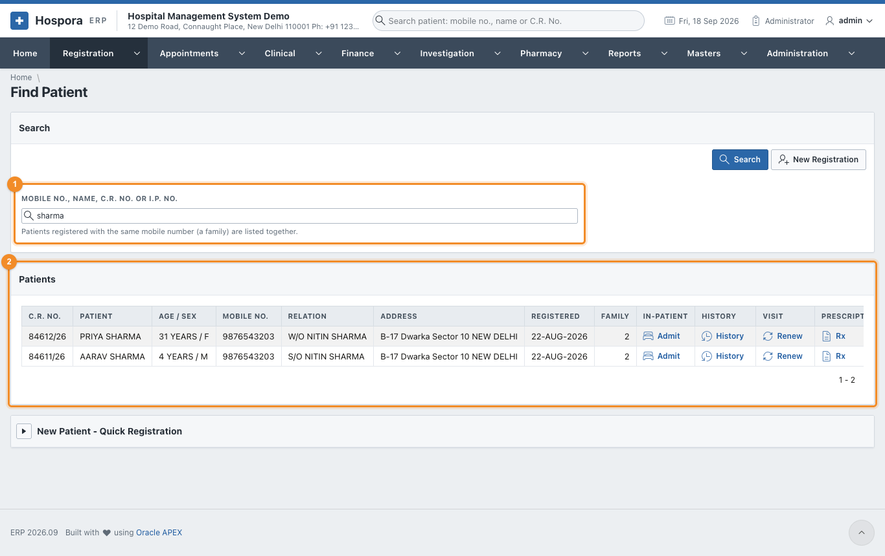
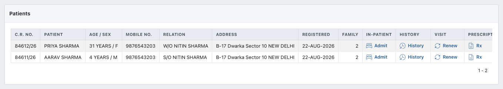
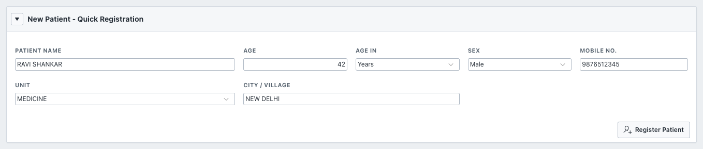

# Find Patient

**Registration > Find Patient** is the quickest way to reach a patient. From the list of results you can
open the patient's history, renew the visit, admit the patient, or write a prescription, all without
typing the patient again.

## Search

1. In 1 **Mobile No., Name, C.R. No. or I.P. No.**, type any of these:
    - a mobile number, e.g. `9876543203`;
    - a part of the name, e.g. `sharma`;
    - a C.R. No., e.g. `84611/26` (or just `84611`);
    - the I.P. No. of an admitted patient.
2. Press ++enter++ or click **Search**.
3. The patients found appear in 2 **Patients**. Patients of one family (the same
   mobile number) are listed together, and **Family** shows how many share the number.

Each row has four links:

| Link | Opens |
|---|---|
| **Admit** | [I.P. Admission](admission.md) with this patient filled in, and the doctor they are registered with |
| **History** | [Patient History](patient-history.md) of this patient |
| **Renew** | [Renew Registration](renewal.md) for a returning visit |
| **Rx** | a [New Prescription](prescriptions.md) for this patient |

A search by mobile number shows the whole family:

## Quick registration of a walk-in

When the patient is not found and there is no time for the full form (for example, in an emergency),
open **New Patient - Quick Registration** at the bottom of the page:

1. Enter the **Patient Name**, **Age**, **Age In**, **Sex**, **Mobile No.**, **Unit** and
   **City / Village**.
2. Click **Register Patient**.

The patient gets a C.R. No. at once, as a *provisional* registration without a fee. Complete the address
and take the fee later from [O.P. Registrations](op-registration.md).

!!! warning "Duplicates"
    If a patient with the same name is already registered with the same mobile number, the quick
    registration stops and shows that patient's C.R. No. Use that number instead of registering twice.
