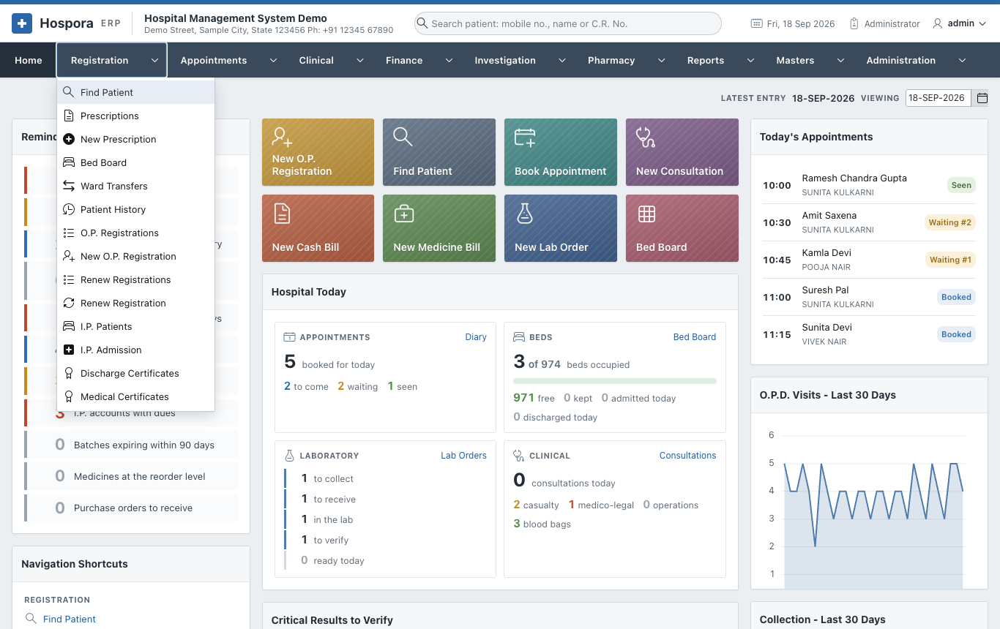

# Registration

The **Registration** menu is the front desk of the hospital. Every patient starts here. Registration gives
the patient a **C.R. No.** (the hospital's patient number, also called the O.P. No.). Every later bill,
test, prescription and admission is filed under that number.

## The options

| Option | Use it to |
|---|---|
| [Find Patient](find-patient.md) | Find a patient by mobile number, name, C.R. No. or I.P. No., and go straight to their admission, history, renewal or prescription. Register a walk-in in a few seconds. |
| Prescriptions / [New Prescription](prescriptions.md) | Write a prescription with medicines, tests and advice, and print it |
| [Bed Board](beds.md) | See which beds are free in every ward, and keep a bed for a patient on the way |
| [Ward Transfers](beds.md#ward-transfers) | See every move of a patient between wards and beds |
| [Patient History](patient-history.md) | See everything that happened to one patient: visits, bills, medicines, renewals |
| O.P. Registrations / [New O.P. Registration](op-registration.md) | Register a new patient and take the registration fee |
| Renew Registrations / [Renew Registration](renewal.md) | Record a returning patient's visit (a renewal), with or without a fee |
| I.P. Patients / [I.P. Admission](admission.md) | Admit a patient to a ward and bed, transfer, discharge |
| [Discharge Certificates](certificates.md) and [Medical Certificates](certificates.md#medical-certificates) | Issue and print the certificates |

Options in the plural (**O.P. Registrations**, **I.P. Patients** ...) open a **list**. The ones that start
with **New** open an empty **form**. From a list, click the pencil in a row to open that record, or use the
button at the top right to start a new one.

## The mobile number finds the patient

Most patients do not remember their C.R. No., but they know their mobile number. On every screen that
asks for a patient, there is a **Mobile No.** field:

1. Type the 10-digit number.
2. Press ++tab++.

If one patient has this number, the screen fills in that patient. If several have it (a family often shares
one phone), a small list opens and you choose the patient. Patients who share a number are shown together
everywhere as a **family**.

!!! tip
    The search box at the top of every page (**Search patient: mobile no., name or C.R. No.**) does the
    same from anywhere in the application.

## Typical journeys

- **A new patient at the O.P.D.**: [New O.P. Registration](op-registration.md), then take the fee.
  The patient goes to the doctor with the printed O.P. slip.
- **A patient who has come before**: [Renew Registration](renewal.md). Within 15 days of the last visit
  it is a free follow-up.
- **A patient to be admitted**: [Find Patient](find-patient.md), then **Admit**. Fill in the ward and
  bed in [I.P. Admission](admission.md), then take an advance in Finance.
