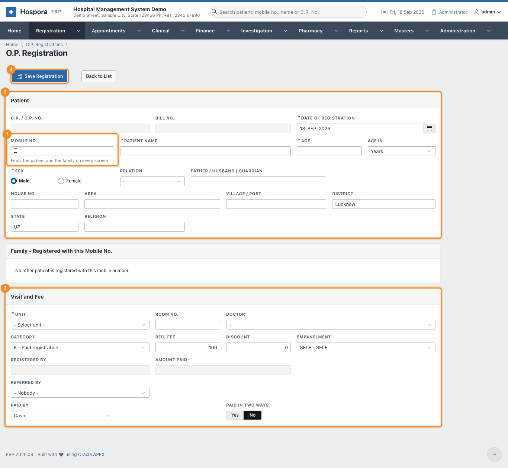
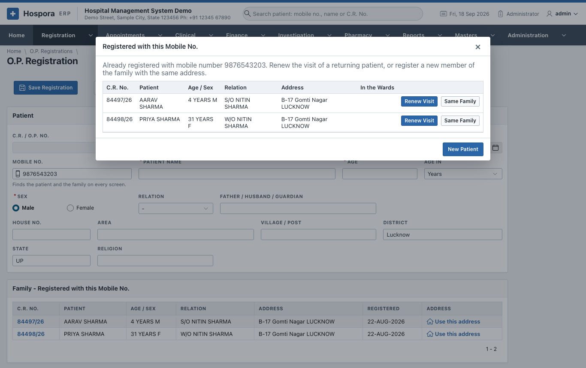
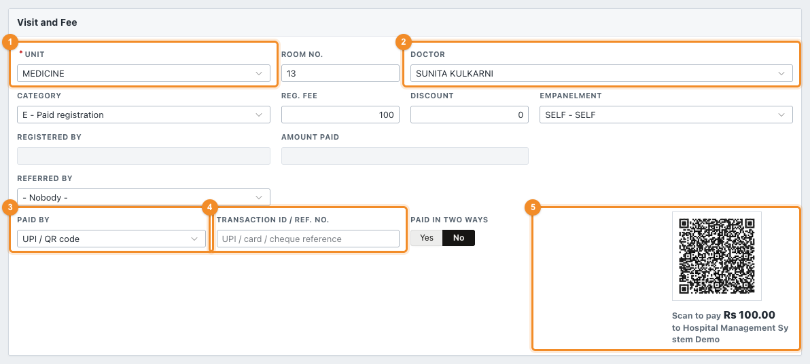
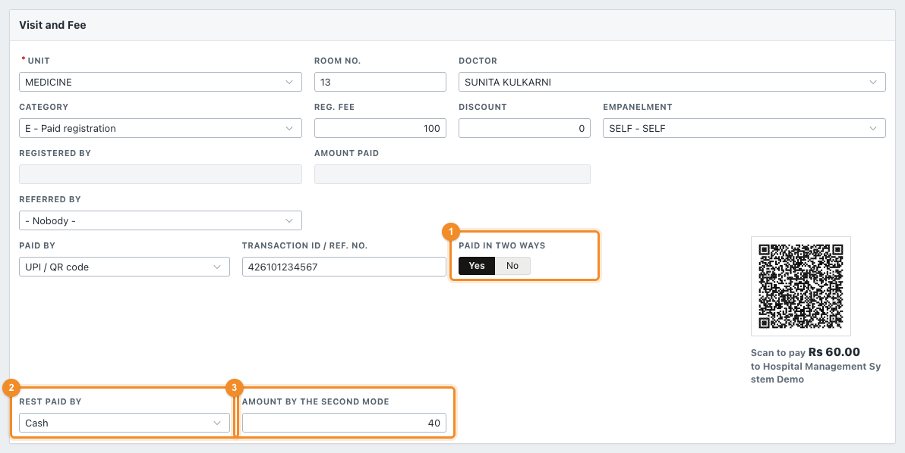
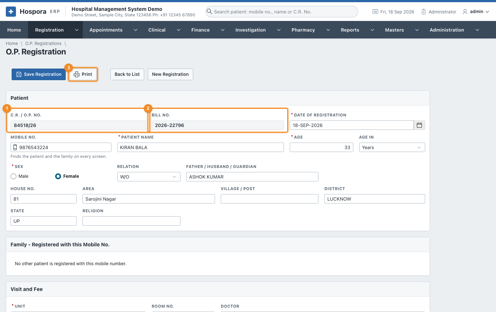
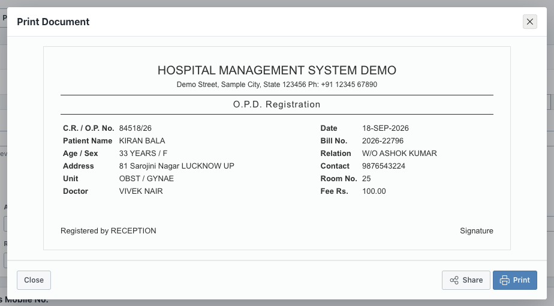
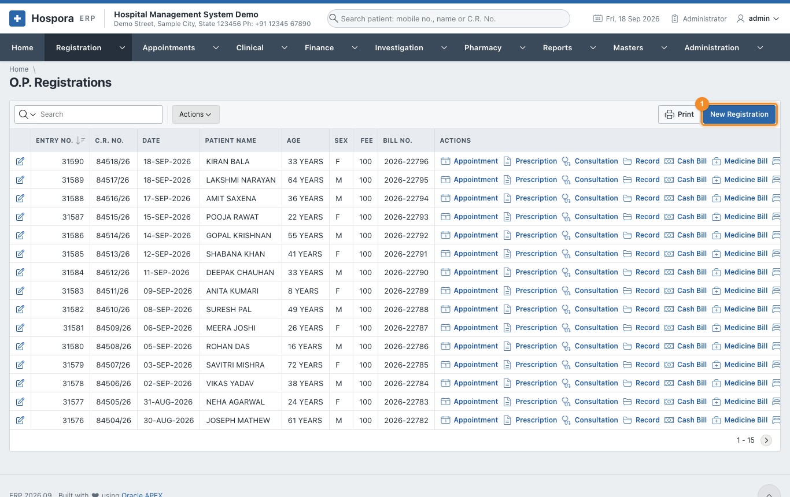

# New O.P. Registration

Register a patient who comes to the hospital for the first time. The patient gets a **C.R. No.** and a
bill for the registration fee.

Open **Registration > New O.P. Registration**, or click the **New O.P. Registration** tile on the Home
page.

The form has three parts:

- 1 **Mobile No.**: start here;
- 2 **Patient**: who the patient is;
- 3 **Visit and Fee**: which unit and doctor the patient sees, and how the fee is paid.

4 **Save Registration** saves the form.

## Step 1 - the mobile number

Type the patient's mobile number in **Mobile No.** and press ++tab++.

- **Nobody has this number yet.** Nothing opens. Go on to step 2.
- **The number is already registered.** A list of the patients with this number opens:

Choose one of three:

| Button | When |
|---|---|
| **Renew Visit** | The patient in this row has come again. You are taken to [Renew Registration](renewal.md). Do **not** register them a second time. |
| **Same Family** | A new member of this family, e.g. a child of a registered mother. The address is copied from this row; fill in the name, age and sex. |
| **New Patient** | Someone else who happens to use the same phone. The form stays empty. |

The **Family - Registered with this Mobile No.** panel under the form keeps showing the family while you
work. Its **Use this address** link copies an address at any time.

## Step 2 - the patient

Fill in:

- **Patient Name**, **Age**, **Age In** (years, months or days) and **Sex** (required);
- **Relation** (S/O, D/O, W/O ...) and **Father / Husband / Guardian**;
- **House No.**, **Area**, **Village / Post**, **District** and **State**. District and State start with the
  hospital's own.

!!! tip "Duplicate check"
    When the name and the guardian are filled in, a warning appears next to the name if a patient with
    the same name and guardian is already registered (*Possible duplicate*). Check the
    [Patient History](patient-history.md) before you save.

## Step 3 - the visit and the fee

1. 1 **Unit**: the department the patient will see (Medicine, Surgery, Obst /
   Gynae ...). Its **Room No.** fills in.
2. 2 **Doctor**: the doctor of the visit. This doctor is filled in automatically on
   the patient's later screens (bills, lab orders, admission), where it can still be changed.
3. **Category**:
    - **E - Paid registration**: the usual case;
    - **F - Free registration**: no fee;
    - **N - Provisional**: a registration completed later;
    - **C - Paid (receipt form)**: paid on the printed receipt form.
4. **Reg. Fee** comes from the hospital's settings. A **Discount** lowers what the patient pays.
5. **Empanelment**: **SELF** for a patient who pays, or the company / scheme that pays for the patient.
6. **Referred By**: the clinic or doctor who sent the patient, if any. It decides the referral share
   (Finance > Doctor and Referral Shares).
7. 3 **Paid By**: cash, UPI / QR code, card, wallet, payment link, bank transfer or
   cheque.
8. 4 **Transaction ID / Ref. No.**: for anything other than cash, the UPI
   reference, the card approval code or the cheque number.
9. 5 **UPI QR Code**: with **UPI / QR code**, a QR code of the exact amount
   appears. The patient scans it with any UPI app; type the UPI reference the patient's app shows into
   **Transaction ID**.

!!! note "The UPI QR code needs the hospital's UPI ID"
    The QR code pays the UPI ID set in **Administration > Hospital Details**. Without one, no code is
    shown.

### Paid in two ways

A patient may pay part by UPI and the rest in cash. Turn **Paid in Two Ways** to **Yes**:

1. 1 **Paid in Two Ways**: **Yes**.
2. 2 **Rest Paid By**: the second mode, e.g. **Cash**.
3. 3 **Amount by the Second Mode**: the part paid that way. The QR code changes to
   the UPI part only.

## Step 4 - save and print

Click **Save Registration**. The patient gets 1 a **C.R. / O.P. No.** and
2 a **Bill No.** for the fee.

3 **Print** shows the O.P. slip with the fee receipt. **Print** in that window sends
it to the printer, and **Share** sends it as a PDF. The patient takes the slip to the doctor.

**New Registration** clears the form for the next patient.

## The list of registrations

**Registration > O.P. Registrations** lists every registration, newest first:

- Click the pencil of a row to open the registration and correct it.
- 1 **New Registration** opens an empty form.
- **Print** prints the list as it is filtered.
- **Actions** filters, sorts and chooses columns, and downloads the list as Excel, CSV or PDF.

!!! question "Something went wrong?"
    - *"Enter the 10-digit mobile number, or leave it empty."*: the number is too short or too long.
      Leave it empty if the patient has no phone.
    - *The patient was registered twice*: open the newer registration and correct it, or ask the
      administrator. Use **Renew Visit** next time the patient comes.
