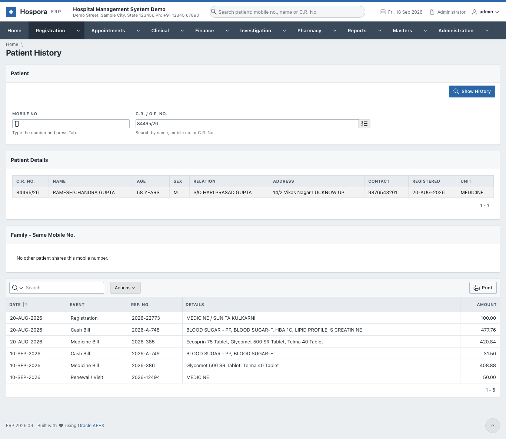

# Patient History

**Registration > Patient History** shows everything recorded about one patient, in date order: the
registration, renewals, cash bills, medicine bills and more, with their numbers and amounts.

Open it from [Find Patient](find-patient.md) with the **History** link, or open the menu option and
choose the patient: type the **Mobile No.** and press ++tab++, or search the **C.R. / O.P. No.**, then click
**Show History**.

- **Patient Details**: the registration: name, age, relation, address, contact, date and unit.
- **Family - Same Mobile No.**: the other patients who share the mobile number.
- The list of events: **Date**, **Event** (registration, cash bill, medicine bill, renewal ...),
  **Ref. No.** (the bill or document number), **Details** (the unit and doctor, or the items of a bill) and
  **Amount**.

Use **Actions** to filter the events or download them, and **Print** to print the history.
