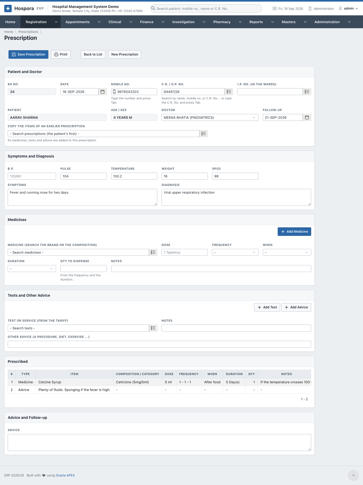
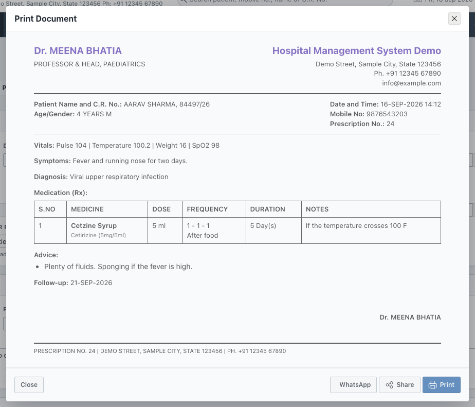
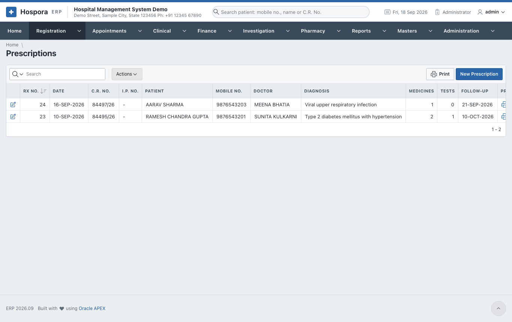

# Prescriptions

Write a prescription with the patient's vitals, symptoms and diagnosis, the medicines, the tests and
the advice, and print it for the patient.

Open **Registration > New Prescription**, or click **Rx** next to the patient in
[Find Patient](find-patient.md). **Registration > Prescriptions** lists the prescriptions already written.

## Steps

1. **Patient and Doctor**
    - Type the **Mobile No.** and press ++tab++, or search the **C.R. / O.P. No.** For a patient in the wards,
      choose the **I.P. No.** instead.
    - The **Doctor** fills in from the patient's registration; change it if needed.
    - **Follow-up**: the day the patient should come back.
    - **Copy the Items of an Earlier Prescription**: for a patient on the same treatment, choose an
      earlier prescription. Its medicines, tests and advice are added to this one.
2. **Symptoms and Diagnosis**: **B.P.**, **Pulse**, **Temperature**, **Weight**, **SpO2**, then the
   **Symptoms** and the **Diagnosis**.
3. **Medicines**, one at a time:
    - **Medicine**: search by the brand or by the composition (e.g. *paracetamol*);
    - **Dose**, **Frequency** (e.g. 1 - 0 - 1), **When** (before or after food) and **Duration**;
    - **Qty to Dispense** is worked out from the frequency and the duration;
    - click **Add Medicine**. The medicine joins the **Prescribed** list.
4. **Tests and Other Advice**:
    - **Test or Service** (from the tariff) and **Add Test**. A billing clerk can later put these tests on a
      bill in one click, and the laboratory can make a lab order from them.
    - **Other Advice** (a procedure, diet, exercise ...) and **Add Advice**.
5. **Advice and Follow-up**: general advice for the patient.
6. Click **Save Prescription**. The prescription gets its **Rx No.**
7. **Print** shows the prescription as it will be printed:

In this window:

- **Print** sends it to the printer, or saves it as a PDF;
- **Share** sends the PDF from a phone or tablet (WhatsApp, e-mail ...);
- **WhatsApp** opens WhatsApp with the patient's mobile number and a short message already typed. Press
  Send in WhatsApp and attach the PDF from **Share** if you want to send the prescription itself. No
  WhatsApp account is needed in the hospital's settings; it uses the WhatsApp of the computer or phone you
  are working on.

To take a line off the **Prescribed** list, use the remove link at the end of the line.

