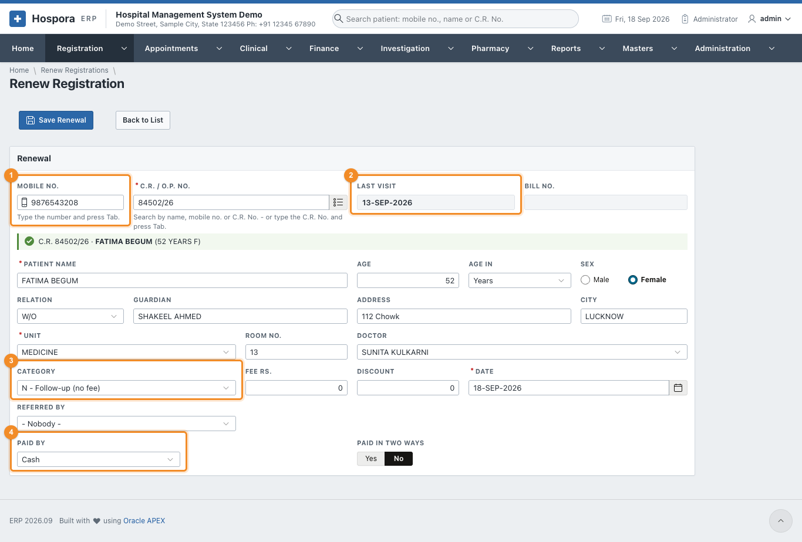
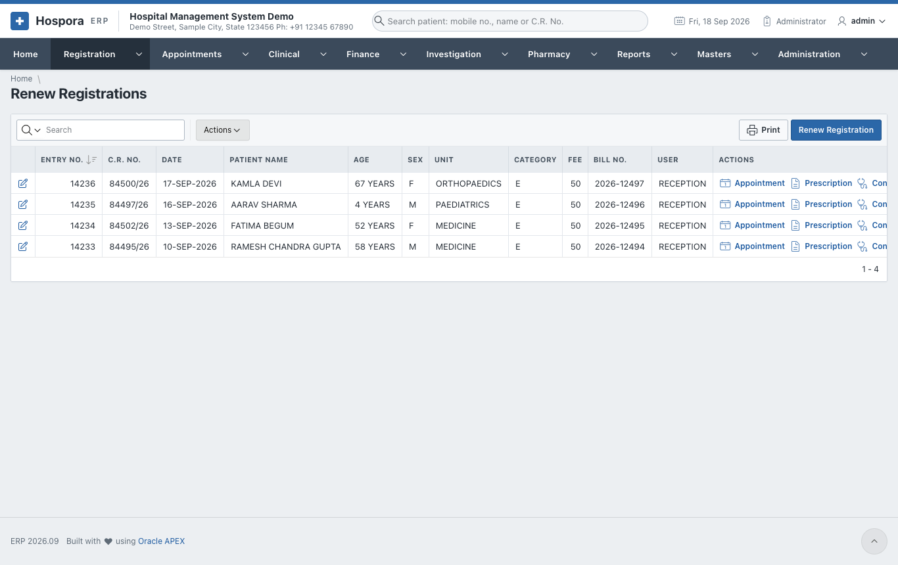

# Renew Registration

A patient who has been registered before does not get a new C.R. No. Record the new visit as a
**renewal**. The patient keeps their number, and the new visit is added to their history.

Open **Registration > Renew Registration**, or click **Renew** next to the patient in
[Find Patient](find-patient.md).

## Steps

1. 1 Type the **Mobile No.** and press ++tab++. (Or type the C.R. No. in
   **C.R. / O.P. No.** and press ++tab++, or search it with the list button.) The patient's details fill in,
   and a green line confirms who was found.
2. 2 **Last Visit** shows when the patient last came.
3. Check the **Unit**, **Room No.** and **Doctor**. They come from the last visit; change them if the
   patient is seeing another department today.
4. 3 **Category** decides the fee:

    | Category | Fee |
    |---|---|
    | **N - Follow-up (no fee)** | nothing: a follow-up within 15 days of the last visit |
    | **E - Paid renewal** | the renewal fee |
    | **P - Paid (print form)** | the fee, on the printed form |
    | **C - Paid (receipt form)** | the fee, on the receipt form |
    | **F - Free** | nothing |

    The fee applies again **15 days after the last visit**. Inside those 15 days the screen suggests a
    free follow-up.

5. 4 If there is a fee, choose **Paid By** and the **Transaction ID**, as on a
   [new registration](op-registration.md#step-3-the-visit-and-the-fee). A UPI payment shows its QR code,
   and **Paid in Two Ways** splits a payment.
6. Click **Save Renewal**. The renewal gets a **Bill No.**, and **Print** prints the slip.
7. **Next Patient** clears the form.

**Registration > Renew Registrations** lists every renewal, with the same pencil, **Print** and
**Actions** as the [list of registrations](op-registration.md#the-list-of-registrations).

!!! question "The patient says they came before, but nothing is found"
    Try the name in [Find Patient](find-patient.md): the patient may have given another mobile number
    last time. Once found, the renewal records today's number, so it is found next time.
