# Money Reports

## Cash Bills Register

**Reports > Cash Bills Register**. Every cash bill, with its total, discount and tax. **Counter** limits it to one counter; the **Counter-wise Summary** totals each counter.

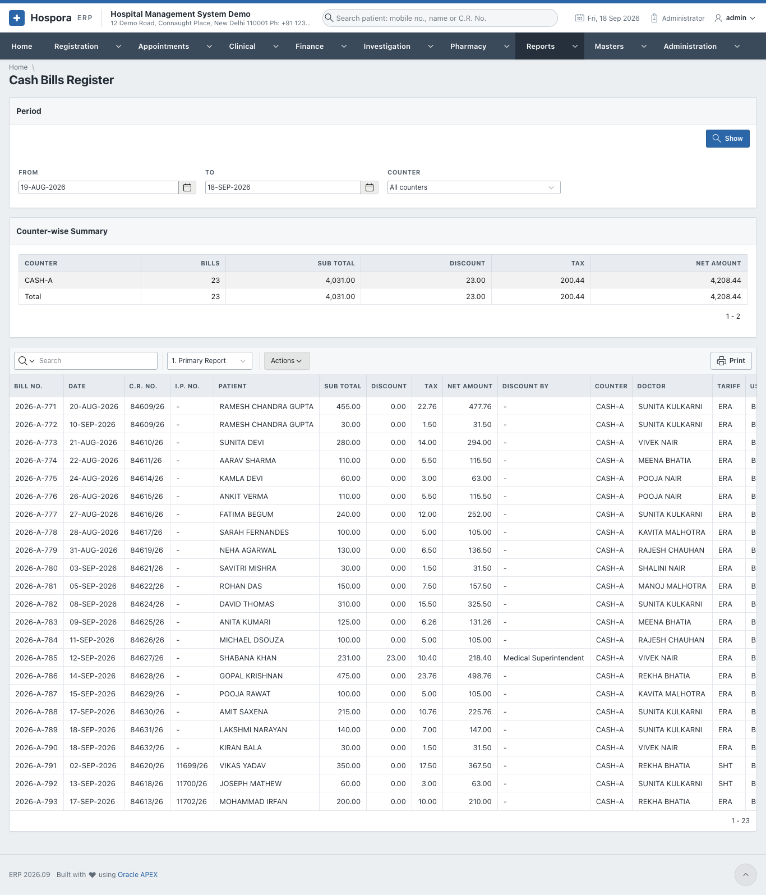

## Cash Collection by Head

**Reports > Cash Collection by Head**. What the cash bills collected, by tariff head, category and group, e.g. how much pathology or X-ray earned.

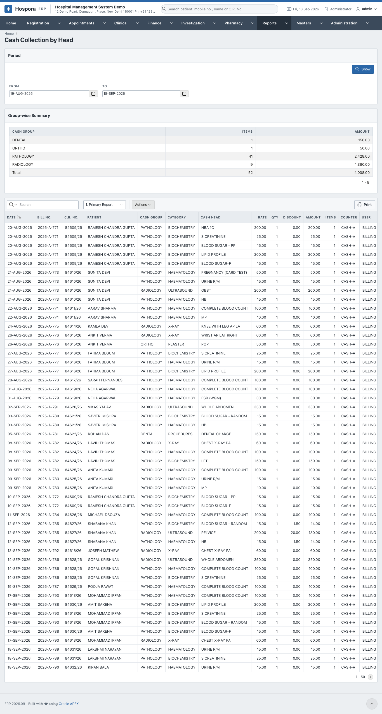

## Credit Bills

**Reports > Credit Bills**. Every credit bill. The **Company-wise Summary** shows what each company owes.

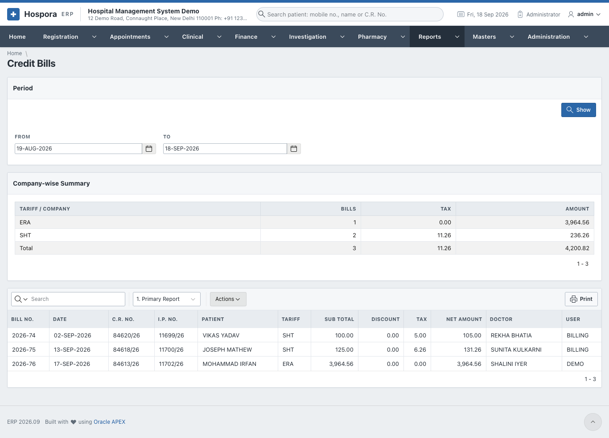

## Credit Statement (I.P.)

**Reports > Credit Statement (I.P.)**. Every credit item of one admission. Choose the patient by **Mobile No.** or **I.P. No.** Useful before the final bill, or for a company that asks for the details.

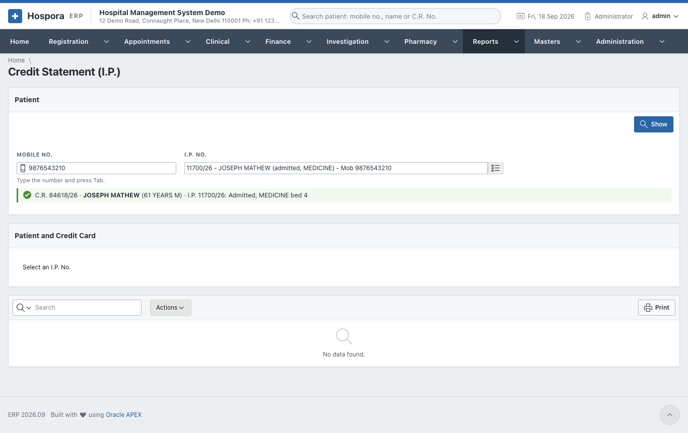

## Advance Receipts

**Reports > Advance Receipts**. Every advance taken, with a summary by mode of payment.

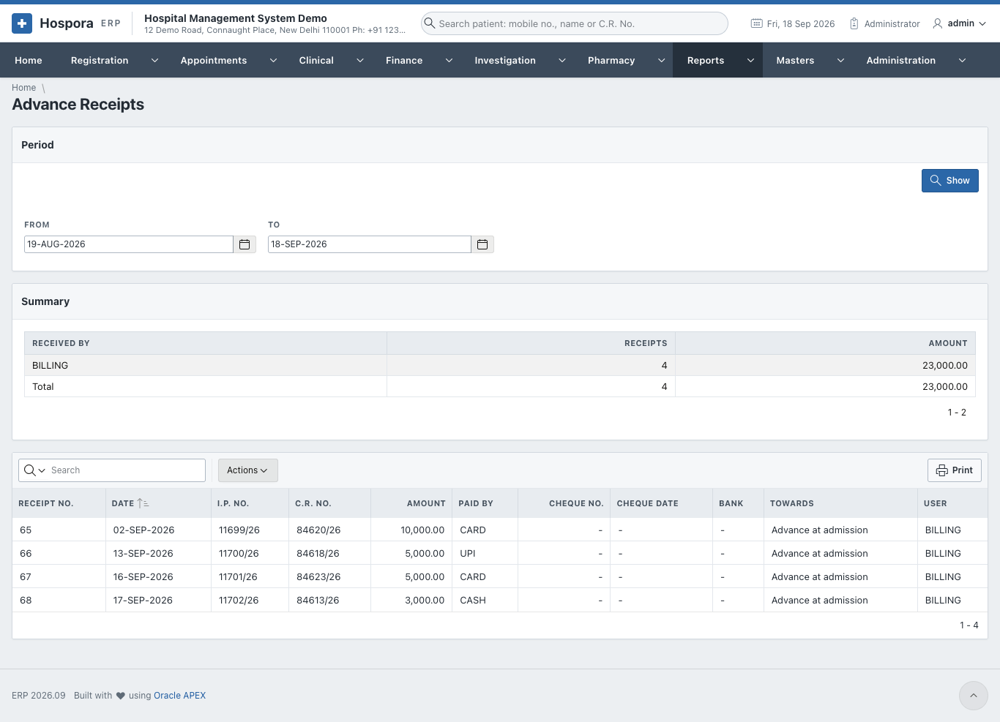

## Refunds / Expenses

**Reports > Refunds / Expenses**. Every refund and expense voucher.

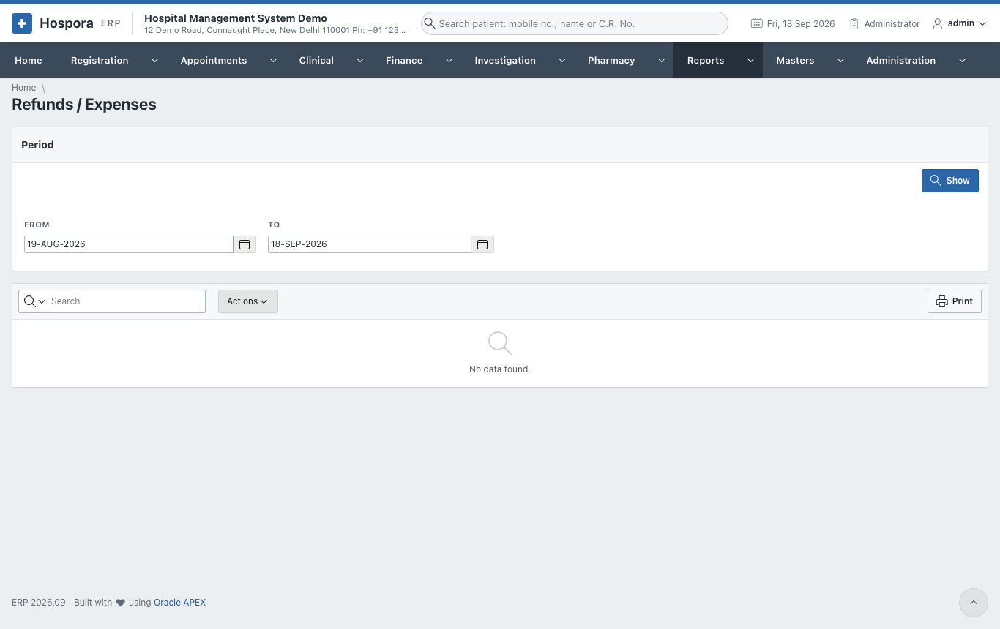

## Miscellaneous Bills

**Reports > Miscellaneous Bills**. Every miscellaneous bill.

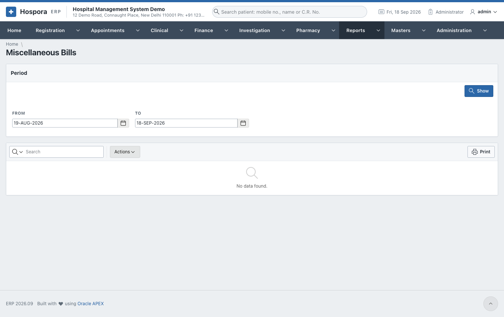

## Cash Summary

**Reports > Cash Summary**. All the money of the period, from every source (registrations, bills, advances, receipts, medicines, refunds): **Collection by Source**, **Collection by User**, and each document.

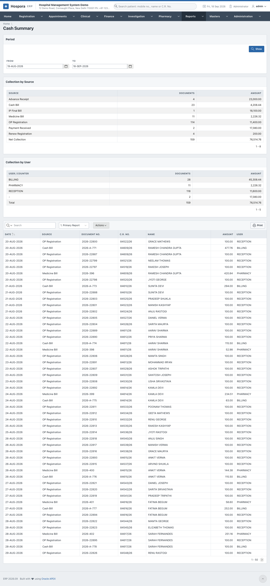

## I.P. Final Bills Register

**Reports > I.P. Final Bills Register**. Every I.P. final bill, with the charges, the advance, the refund, the concession and the net.

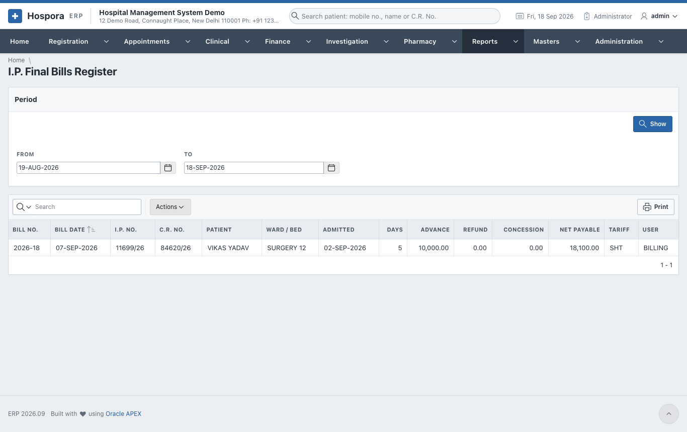

## Payments Received Register

**Reports > Payments Received Register**. Every payment received against dues.

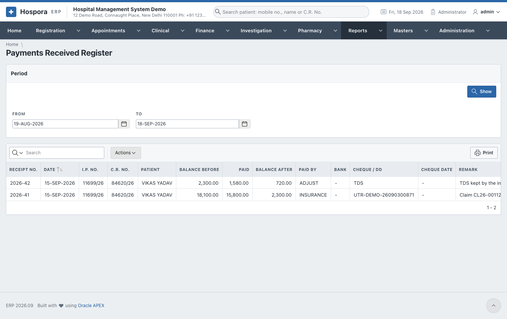

## Discounted Bills

**Reports > Discounted Bills**. Every bill that carried a discount, who allowed it, and the **Discount Summary**.

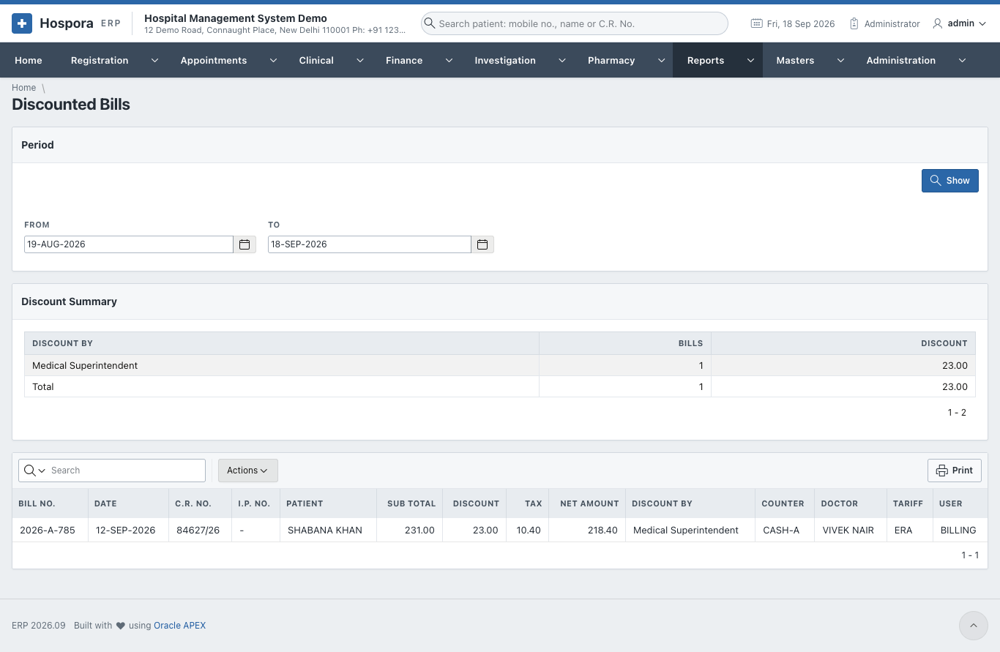

## G.S.T. Collected

**Reports > G.S.T. Collected**. The tax on the bills of the period, by tax (CGST, SGST ...) in the **Tax-wise Summary**, and bill by bill.

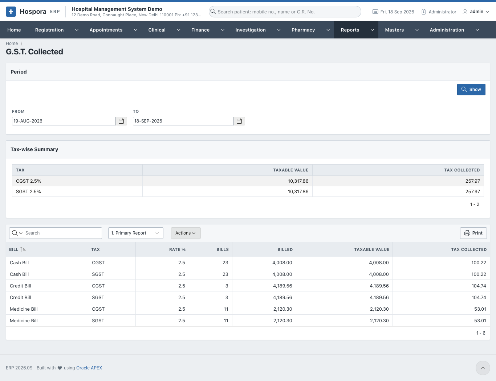
