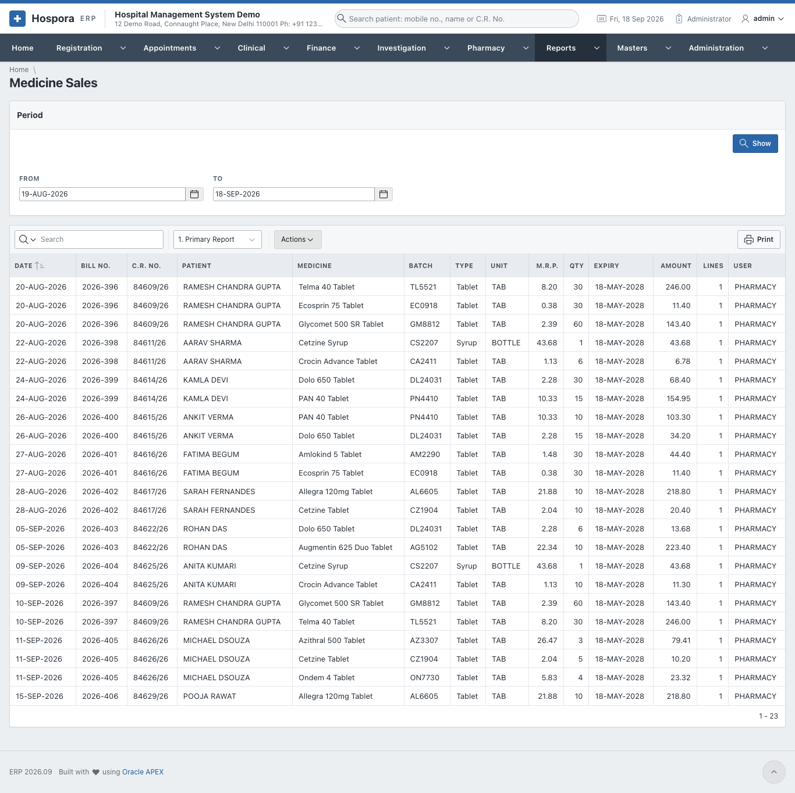
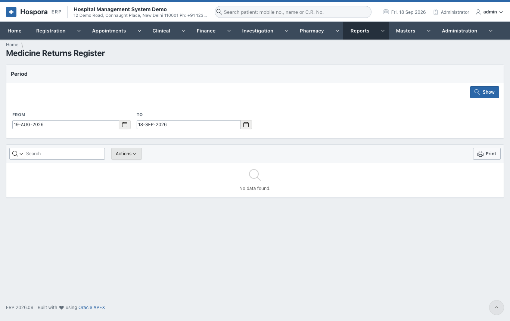
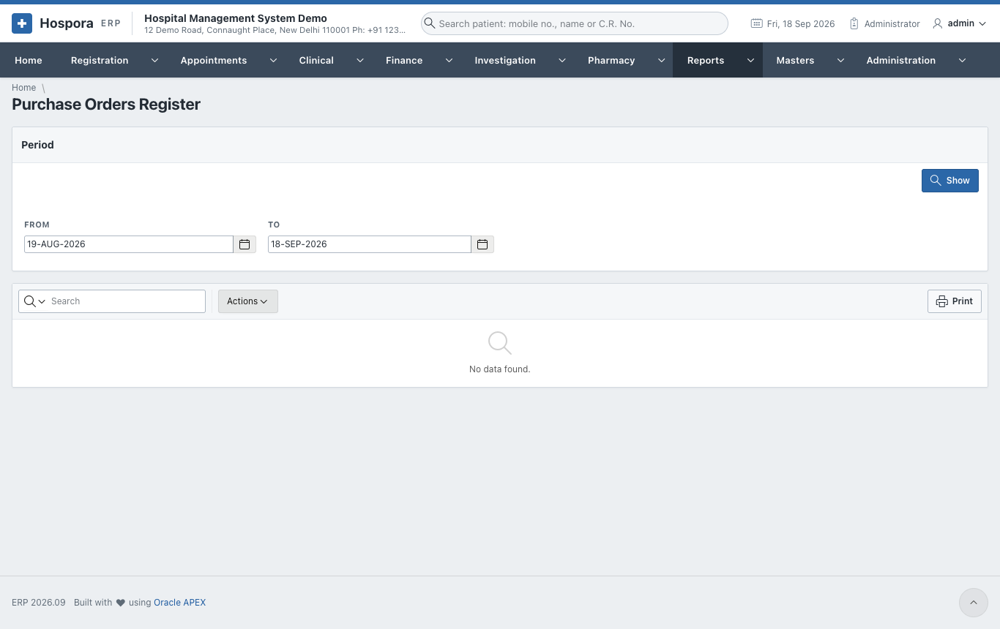
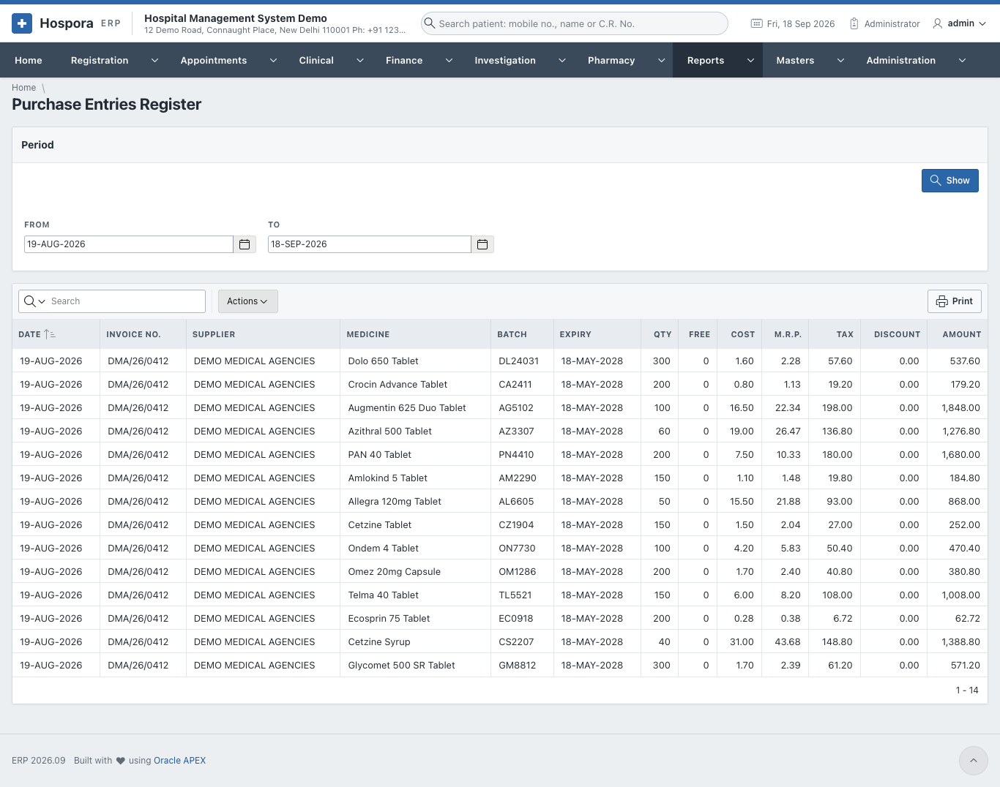
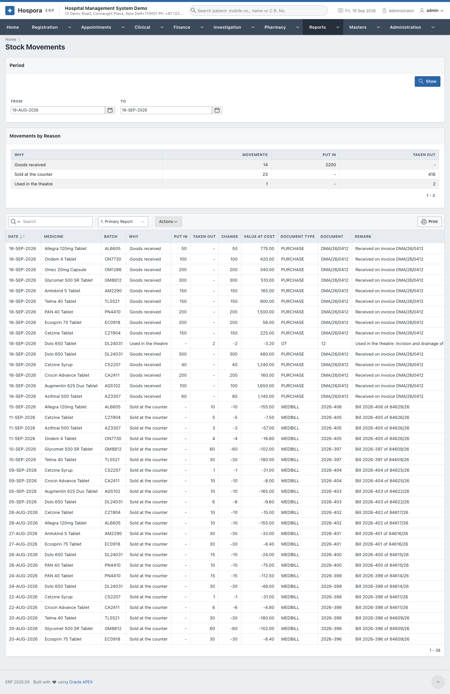

# Pharmacy Reports

## Medicine Sales

**Reports > Medicine Sales**. Every medicine sold, line by line. The saved view **By Medicine** totals each medicine.

## Medicine Returns Register

**Reports > Medicine Returns Register**. Every medicine returned by patients.

## Purchase Orders Register

**Reports > Purchase Orders Register**. Every purchase order sent to suppliers.

## Purchase Entries Register

**Reports > Purchase Entries Register**. Every purchase invoice received into stock.

## Stock Movements

**Reports > Stock Movements**. Every movement of the pharmacy stock: purchases, sales, returns, adjustments. **Movements by Reason** totals them.

