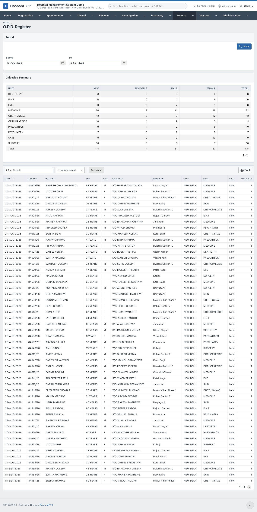
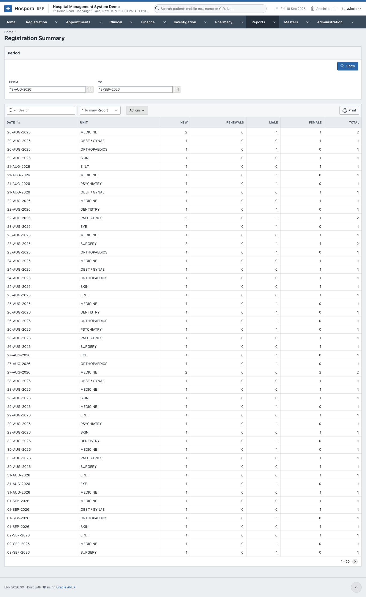
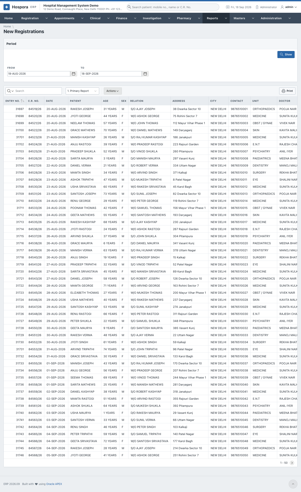
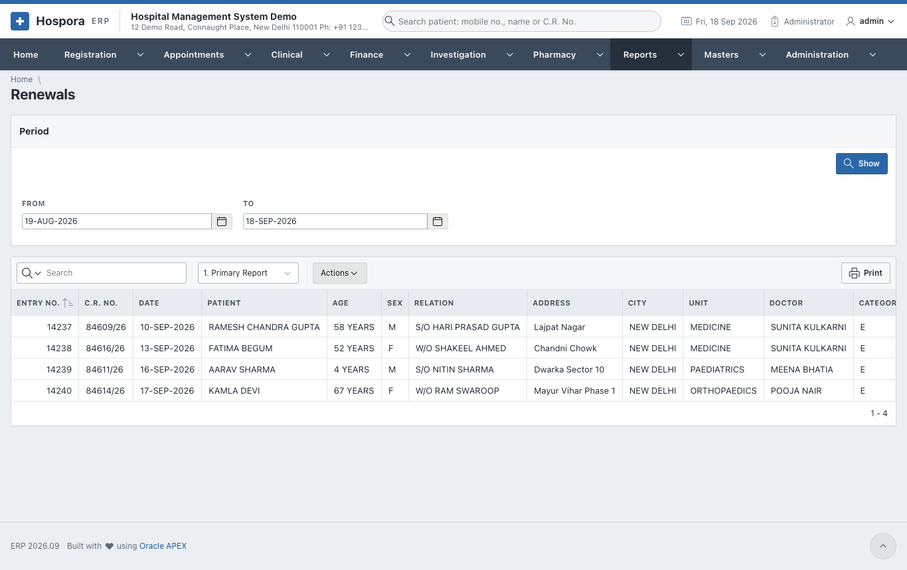
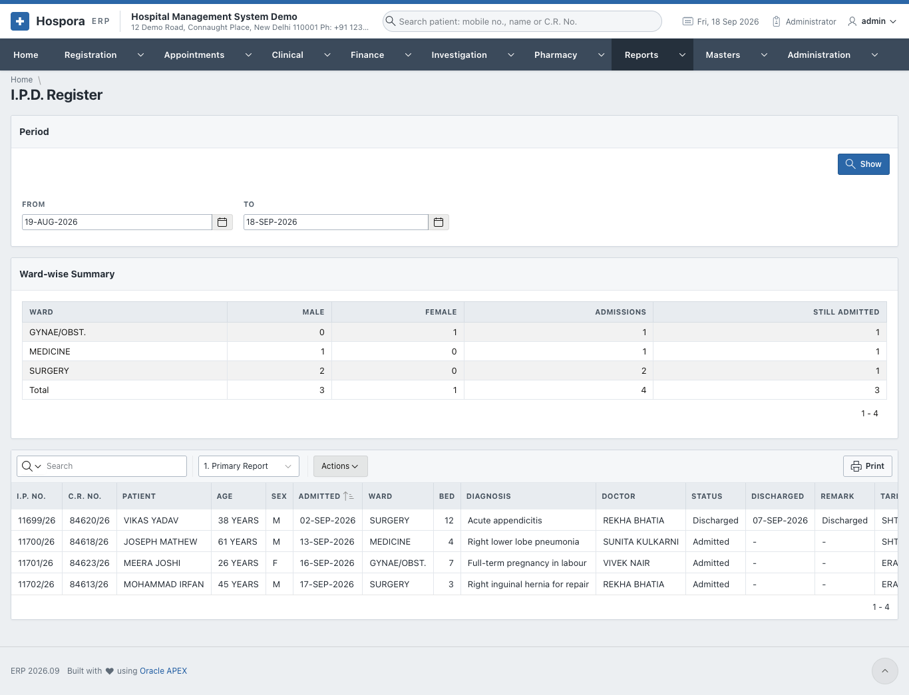
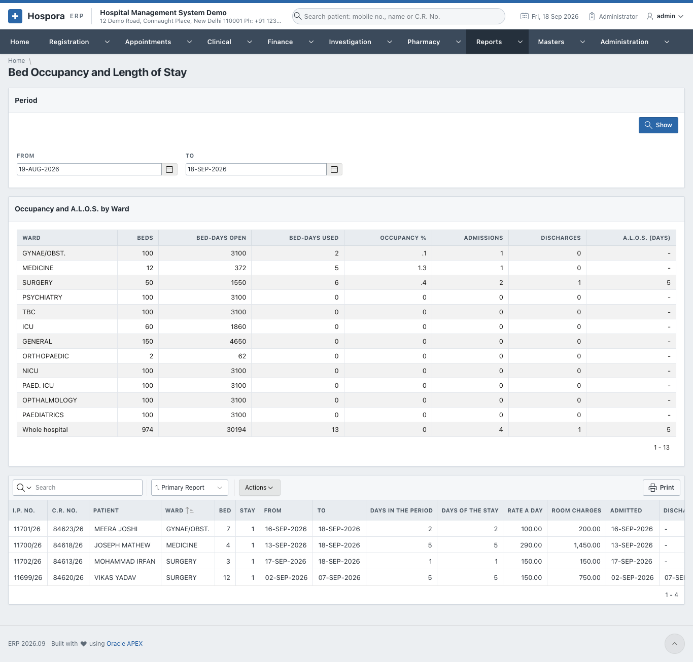

# Registration and Admission Reports

## O.P.D. Register

**Reports > O.P.D. Register**. Every O.P.D. visit of the period, new and renewed. The **Unit-wise Summary** counts new visits, renewals, men and women by unit.

## Registration Summary

**Reports > Registration Summary**. The registrations of the period counted. The saved view **Date wise** groups them by day.

## New Registrations

**Reports > New Registrations**. Every new registration of the period, with its fee and bill number.

## Renewals

**Reports > Renewals**. Every renewal of the period, with its fee.

## I.P.D. Register

**Reports > I.P.D. Register**. Every admission of the period. The **Ward-wise Summary** counts them by ward.

## Bed Occupancy and Length of Stay

**Reports > Bed Occupancy and Length of Stay**. For each ward: the beds, the bed-days used, the **occupancy %**, the admissions and discharges, and the **A.L.O.S.** (average length of stay).

